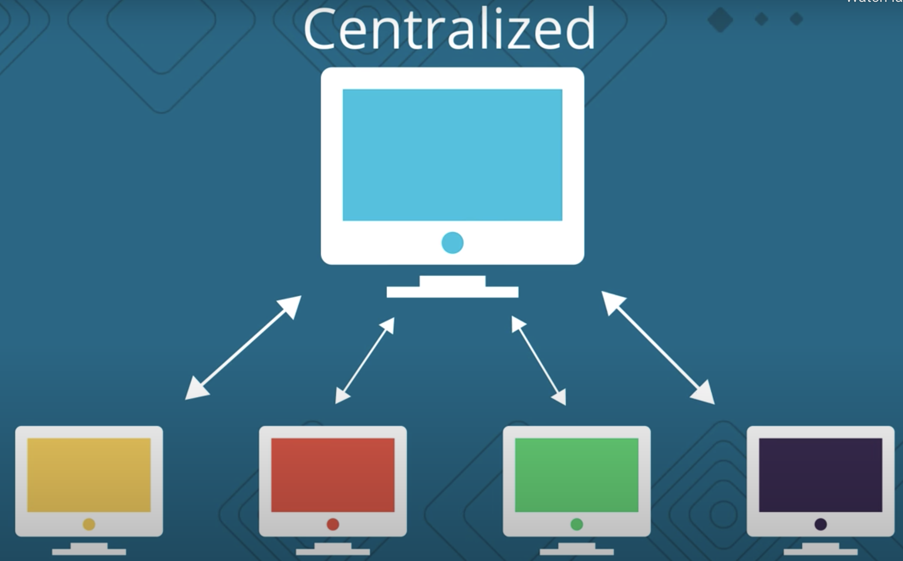
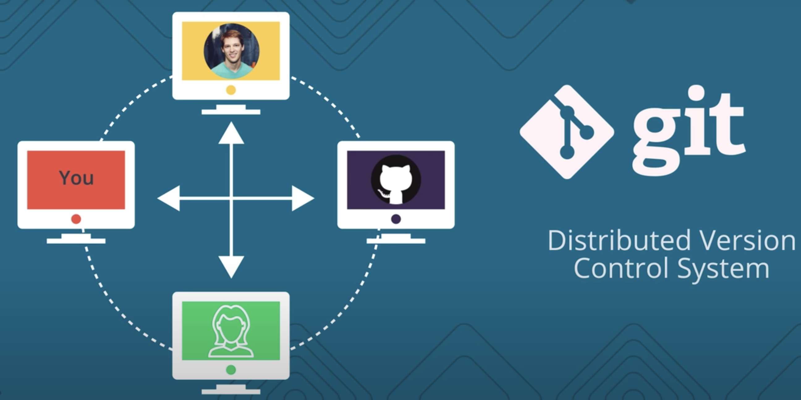
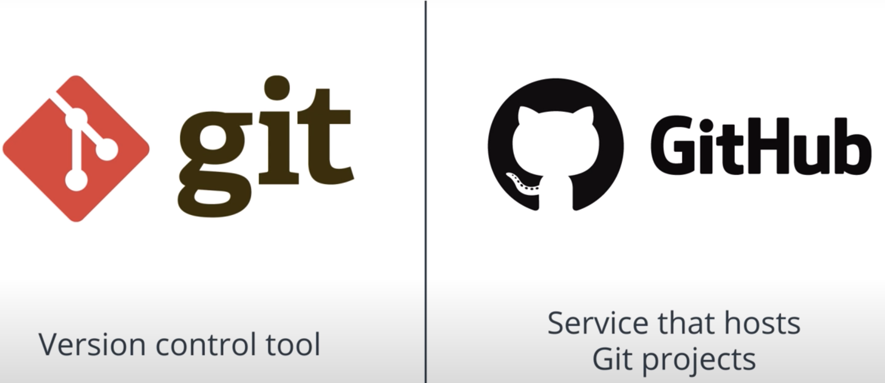

# What is Version Control?

When you use Version Control you create save points that save your project, this lets you have the freedom to change absolutely anything about your project and be confident that nothing will be lost. So a Version Control System is just software that help you control (or manage) the different versions .. of something (typically source code).

## VCS info

There are a number of Version Control Systems out [there](https://en.wikipedia.org/wiki/List_of_version-control_software).This alone should prove that version control is incredibly important. Three of the most popular version control systems are:

- [Git](https://git-scm.com/)
- [Subversion](https://subversion.apache.org/)
- [Mercurial](https://www.mercurial-scm.org/)

There are two main types of version control system models:

- The **centralized model** - all users connect to a central, master repository.
- The **distributed model** - each user has the entire repository on their computer.

In a *centralized model* there's one powerful central computer that hosts the project and every interaction must go through this central computer.

In a *distributed model* there's no central repository of information. Each developer has a complete copy of the project on their computer, which is cool because that means you can also work offline. In this course we'll be using the Version Control System (**VCS**) **Git**, which is a *Distributed Version Control System*.

Now, you might have heard of **GitHub**. **Git** and **GitHub** are quite different.

**Git** is a *Version Control Tool*, while **GitHub** is the service that hosts *git projects*. To work with *git projects* you are not required to use GitHub. For now, you can think of **GitHub** as basically just another computer where you can upload a copy of your project.

## Further research

- [Centralized vs. DVCS from the Atlassian Blog](https://www.atlassian.com/blog/software-teams/version-control-centralized-dvcs)
- [Distributed Version Control System on wikipedia](https://en.wikipedia.org/wiki/Distributed_version_control)

### Recap

Remember that the main point of a version control system is to help you maintain a detailed history of the project as well as the ability to work on different versions of it. Having a detailed history of a project is important because it lets you see the progress of the project over time. If needed, you can also jump back to any point in the project to recover data or files.

In this course, we'll be using Git which is a distributed version control system. You might be surprised to discover that you're already using version control all the time!
