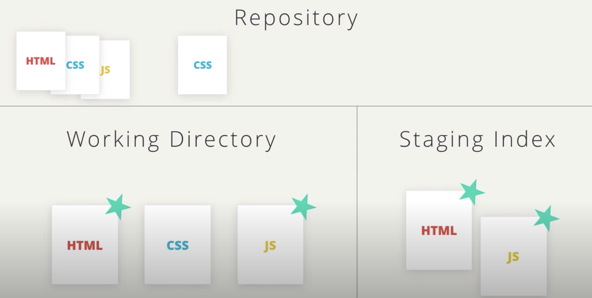
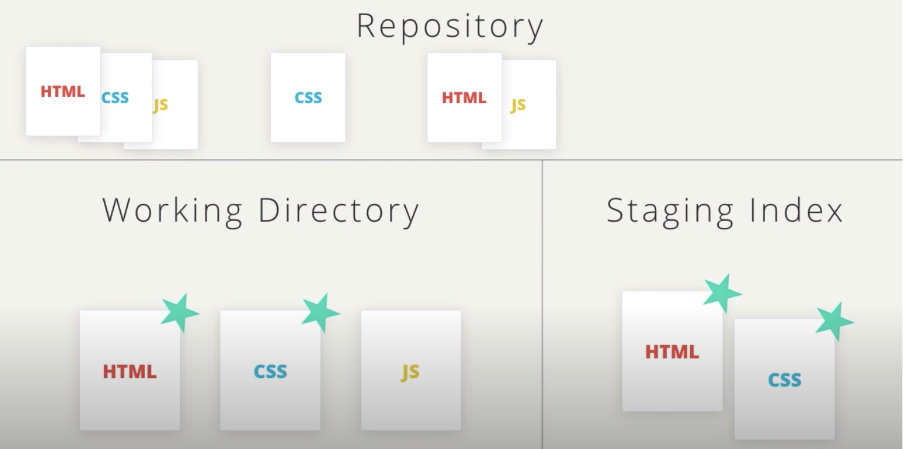

# Git and Version Control Terminology

This file introduces the basic terminology.

## Version Control System or Source Code Manager

A **Version Control System** (abbreviated as **VCS**) is a tool that manages different versions of source code. A **Source code manager** (abbreviated as **SCM**) is another name for a version control system.

A **VCS** allows you to: revert files back to the previous state, revert the entire project back to a previous state, review changes made over time, see who last modified something that might be causing a problem, who introduced an issue and when, and more.

**Git** is an *SCM* (and therefore a **VCS**). The URL for the Git website is [https://git-scm.com/](https://git-scm.com/) (see how it has *SCM* directly in its domain).

## Commit

Git thinks of its data like a set of snapshots of a mini filesystem. Every time you **commit** (save the state of your project in Git), it basically takes a picture of what all your files look like at that moment and stores a reference to that snapshot. You can think of it as a save point in a game - it saves your project's files and any information about them.

Everything you do in Git is to help you make commits, so a commit is the fundamental unit in Git.

## Repository or Repo

A **repository** is a directory which contains your project work, as well as a few files (hidden by default on Mac OS X) which are used to communicate with Git. Repositories can exist either locally on your computer or as a remote copy on another computer. A repository is made up of commits.

## Working Directory

The **Working Directory** is the files that you see in your computer's file system. When you open your project files up on a code editor, you're working with files in the Working Directory.

This is in contrast to the files that have been saved (in commits!) in the repository.

When working with Git, the Working Directory is also different from the command line's concept of the *current working directory* which is the directory that your shell is "looking at" right now.

## Checkout

A **checkout** is when content in the repository has been copied to the Working Directory. It is possible to checkout many things from a repository: a file, a commit, a branch, etc.

## Staging Area / Staging Index / Index

A file in the Git directory that stores information about what will go into your next commit. You can think of the staging area as a prep table where Git will take the next commit. Files on the Staging Index are poised to be added to the repository.

## SHA

A **SHA** is basically an ID number for each commit. It is a 40-character string composed of characters (**0-9** and **a-f**) and calculated based on the contents of a file or directory structure in Git. "SHA" is shorthand for "Secure Hash algorithm". A **SHA** might look like this:

<code>e2adf8ae3e2e4ed40add75cc44cf9d0a869afeb6</code>

## Branch

A **branch** is when a new line of development is created that diverges from the main line of development. This alternative line of development can continue without altering the main line.

Going back to the example of save point in a game, you can think of a branch as where you make a save point in your game and then decide to try out a risky move in the game. If the risky move doesn't pan out, then you can just go back to the save point. The key thing that makes branches incredibly powerful is that you can make save points on one branch, and then switch to a different branch and make save points there, too.

With this terminology in mind, let's take a high-level look at how we'll be using Git by looking at the **typical workflow when working with version control**.

## Git Workflow

Let's say we have a repository that is made up of these 3 files (*HTML*,*CSS*,*JS*). We want to start using version control in this project.

So we create a new git repository. In a git repository, there are three main areas we need to know about.

First, there's the **Working directory**, then there's the **Staging Index**, and last is the **Repository**. So we have these 3 distinct areas in git. When you re first working with git, it can be a bit hard to realise that there are these three distinct areas, because you don't really see any visible change to the files on your computer.

Git manages these 3 different areas though, and we'll be using the git shell command to interact with files and move them from section to section. Ok, we've created this empty repository because the repository section is empty. Git knows about files that it hasn't seen before. Let's indicate that a **file is new** with a green star (it's when we save a file in the working directory).

Git keeps track of files by adding them to the repository. We can't move these files right into the repository though, they have to be moved to the **Staging Index** first. So we'll use git to move the changes to the **Staging Index**. Remember that the Staging Index is where you can place all of the files that are about to be committed.

Now let's commit them, which moves them into the repository. Now the files in the current state are safe.

Let's say we then make some changes to our site's css. **Git sees this change** and makes the file as **modified**.

We take the same steps to move the changes in the CSS file to the STAGING index.

Then commit the CSS file changes. I think you get the idea but let's look at it one more time.

Let's say the HTML and Javascript files have changed. Remember that Git knows what files are new or changed.

We'll move these changes to the Staging Index.

And then commit them. So the process is

1. add a new file or modify an existing file.
2. move the changes to the staging index.
3. commit the changes to the repository.

Now, what about this scenario. Let's say the HTML and CSS files have changed and we staged the changes.

If we then decide to modify the HTML file again, what would happen if we made a commit right now?

When a commit is made, only the changes that are on the Staging Index are moved into the repository.

If we want to include the second set of changes in the commit, then we need to stage the changes.

Now, that the second change to the HTML file has been staged, the two sets of changes to the HTML file are combined into just one set of changes.

And then we can commit like normal to move these changes into the repository. We have all of these changes saved in our repository.

But how do we access these commits? What if we want to look at a specific commit?

When each commit is made, Git creates an ID for it. The ID for the commit is its SHA. The first seven characters what each commits SHA might look like.
