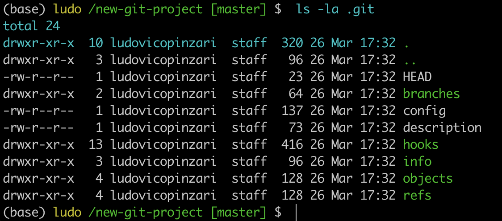

# Create a Repo From Scratch

Before you can make commits or do anything else with a git repository, the repository needs to actually exist. To create a new repository with Git, we'll use the <code>git init</code> command.

The <code>init</code> subcommand is short for "initialize", which is helpful because it's the command that will do all of the initial setup of a repository. We'll look at what it does in just a second.


**Required commands**

We'll be using the following commands;

- <code>ls</code> used to list files and directories
- <code>mkdir</code> used to create a new directory
- <code>cd</code> used to change directory
- <code>rm</code> used to remove files and directories

We'll also be using the idea of the current working directory, the directory that your shell is "looking at" right now. Using cd changes your working directory, and using ls (by itself) lists the files in the working directory. If you lose track of what your shell's working directory is, you can print its name with the pwd command (which stands for "print working directory").


```console
(base) ludo /02_repo  $  mkdir udacity-git-course
(base) ludo /02_repo  $  cd udacity-git-course
(base) ludo /udacity-git-course  $  mkdir new-git-project
(base) ludo /udacity-git-course  $  cd new-git-project
(base) ludo /new-git-project  $
```
I'll be storing all of my work in a directory called **udacity-git-course**.

If you want to follow along with me:

1. create a directory called udacity-git-course
2. inside that, create another directory called new-git-project
3. use the cd command to move into the new-git-project directory

If you're all set, then your terminal should be "inside" the new-git-project directory and look like this:

```console
(base) ludo /new-git-project  $
```

## Git Init
Fantastic work - we're all set up and ready to start using the <code>git init</code> command!

This is one of the easiest commands to run. All you have to do is run git init on the terminal. That's it! Go ahead, why not give it a try right now!

```console
(base) ludo /new-git-project  $  git init
Initialized empty Git repository in /Users/ludovicopinzari/Documents/Udacity/Git_version_control/exercises/02_repo/udacity-git-course/new-git-project/.git/
(base) ludo /new-git-project [master] $
```

The command initializes an empty Git repository in the current directory.

After running git init, the text "Initialized empty Git repository in " followed by a path. should have appeared. The question is, has anything changed with your command prompt? If so, what?

Yes, we see the word **master**.

## Git Init's Effect
Running the **git init** command sets up all of the necessary files and directories that Git will use to keep track of everything. All of these files are stored in a directory called <code>.git</code> (notice the . at the beginning - that means it'll be a hidden directory on Mac/Linux). This <code>.git</code> directory is the "repo"! This is where git records all of the commits and keeps track of everything!

> WARNING: Don't directly edit any files inside the .git directory. This is the heart of the repository. If you change file names and/or file content, git will probably lose track of the files that you're keeping in the repo, and you could lose a lot of work! It's okay to look at those files though, but don't edit or delete them.

```console
(base) ludo /new-git-project [master] $  ls -la
total 0
drwxr-xr-x   3 ludovicopinzari  staff   96 26 Mar 17:32 .
drwxr-xr-x   4 ludovicopinzari  staff  128 26 Mar 17:44 ..
drwxr-xr-x  10 ludovicopinzari  staff  320 26 Mar 17:32 .git
```
Let's take a brief look at the contents of the <code>.git</code> directory.

```console
(base) ludo /new-git-project [master] $  ls -la .git
```



### .Git Directory content

Here's a brief synopsis on each of the items in the <code>.git</code> directory:

- **config file** - where all project specific configuration settings are stored.
From the [Git Book](https://git-scm.com/book/en/v2/Customizing-Git-Git-Configuration):

> Git looks for configuration values in the configuration file in the Git directory (.git/config) of whatever repository you’re currently using. These values are specific to that single repository.

For example, let's say you set that the global configuration for Git uses your personal email address. If you want your work email to be used for a specific project rather than your personal email, that change would be added to this file.

- **description file** - this file is only used by the GitWeb program, so we can ignore it

- **hooks directory** - this is where we could place client-side or server-side scripts that we can use to hook into Git's different lifecycle events
- **info directory** - contains the global excludes file
- **objects directory** - this directory will store all of the commits we make
refs directory - this directory holds pointers to commits (basically the "branches" and "tags")

Remember, other than the "hooks" directory, you shouldn't mess with pretty much any of the content in here. The "hooks" directory can be used to hook into different parts or events of Git's workflow, but that's a more advanced topic that we won't be getting into in this course.

## Further Research
- [Git Internals - Plumbing and Porcelain](https://git-scm.com/book/en/v2/Git-Internals-Plumbing-and-Porcelain) (advanced - bookmark this and check it out later)
- [Customizing Git - Git Hooks](https://git-scm.com/book/en/v2/Customizing-Git-Git-Hooks)


## Git Init Recap
Use the <code>git init</code> command to create a new, empty repository in the current directory.

```console
$ git init
```

Running this command creates a hidden <code>.git</code> directory. This .git directory is the brain/storage center for the repository. It holds all of the configuration files and directories and is where all of the commits are stored.

### Helpful Links
- [Initializing a Repository in an Existing Directory](https://git-scm.com/book/en/v2/Git-Basics-Getting-a-Git-Repository#Initializing-a-Repository-in-an-Existing-Directory)
- [git init docs](https://git-scm.com/docs/git-init)
- [git init Tutorial](https://www.atlassian.com/git/tutorials/setting-up-a-repository)
