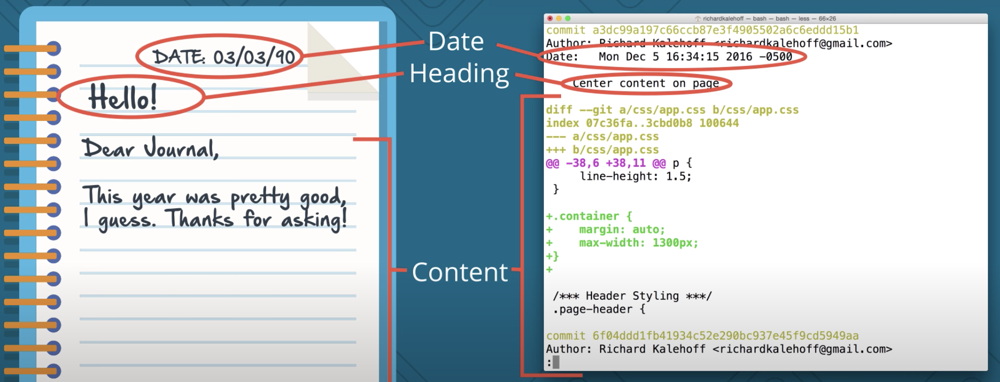
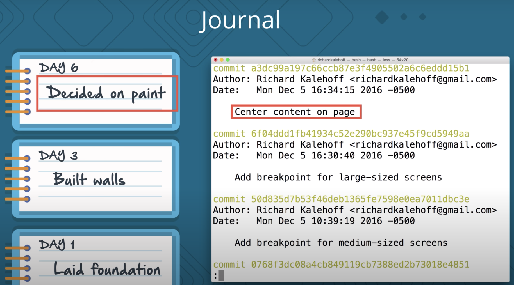

# Review a Git's Repo History

Knowing how to review an existing  Git repository's history of commits is extremely important. We can imagine a Git repository like a Journal.

A good Journal entry should have a **date**, so you know when it occurred, a **header**, so you can give it a short description of that entry and then the **entry** itself that has all of the information. Each time a new entry is made in the Journal, it's like *making a commit in the repository*. And just like your journal entries, you want your commits to be *frequent* and *descriptive*, so you can see the progress of your project over time.

Git automatically records the **date** in the content changes that have been made, when a commit is created, so all you need to do is **provide the descriptive heading or message of the commit**. You want journal commits to be frequent so that you can see the ups and downs in life over time.

Similarly, you want to make **frequent commits with descriptive messages**. This will make it easy to look back at the project and see hoe it has evolved.

We are not making commits just yet, but start getting used to the idea that you should make commits often with descriptive commit messages.

- But a how often is often ?
- How can you know what makes a good commit ?
- How many files or lines of code should be included in the commit ?

One of the best ways to know what makes a good commit is to look at existing commits. The tools we'll be using to review a repository's history are:

- <code>git log</code>
- <code>git show</code>

With <code>git log</code>, you will be able to display information about the existing commits. <code>git log</code> is extremely powerful and you'll be using it all of the time.

The <code>git show</code> command displays info about the given commit. So, with this one, you provide it the commit ID, also known as the **SHA**, and the command displays info about just that one commit.
