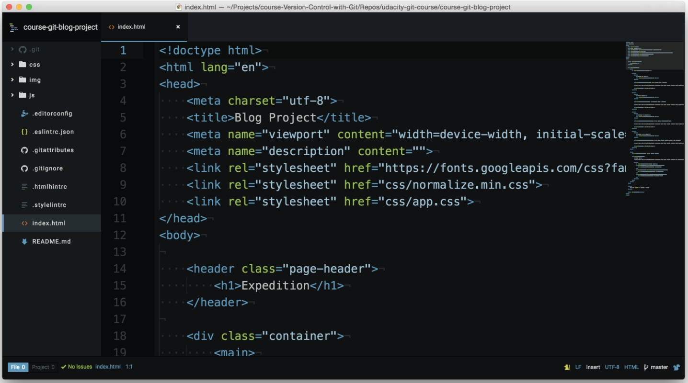
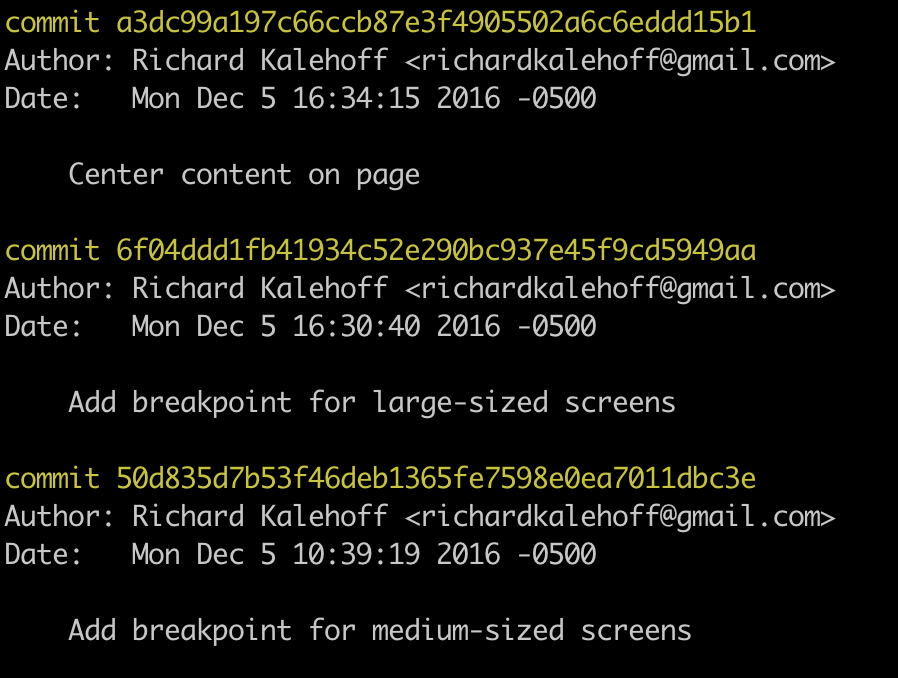

# Display a Repository's commits

After you’ve cloned the blog project repository, navigate to the project’s directory using the command line. Once you’re located inside the blog project, what is the very first thing you should do in a Git repository?

Answer: <code>git status</code>

```console
(base) ludo /course-git-blog-project [master] $  git status
On branch master
Your branch is up to date with 'origin/master'.

nothing to commit, working tree clean
(base) ludo /course-git-blog-project [master] $
```
## Git Status & Opening The Project

You can see that git status tells us that there's "nothing to commit, working directory clean". That means we're good to go ahead and check out the project!

So open the project in your favorite code editor. If you haven't yet, take a minute or two to look at the project – look over the CSS and the JavaScript files, but look particularly at the HTML file.




In the index.html file, take a look at the <h1>Expedition</h1> heading around line 15.

- Based on what you can see here when was that heading added?

Answer: I can't tell that by looking at the code.


Ok, so we're not quite sure when the heading was added. How about an easier question

- who added this heading? Again, what can you tell from just looking at the code?

Answer: I can't tell that by looking at the code.

## The Git Log Command

Finding the answers to these questions is exactly what git log can do for us! Instead of explaining everything that it can do for us, let's experience it! Go ahead and run the <code>git log</code> command in the terminal:

```console
(base) ludo /course-git-blog-project [master] $  git log
```



We're looking at the log commits that have been made in this repository.

Look at all of the information that the log is displaying. It's showing the commits **SHA**, the **person** who made the commit, the **date** the commit was made, and the **message** for the commit. This is just a short description of what changes were made in these commits. Now these are just the first commits that can fit on the screen. There are plenty more.

How do I know that?

There is a colon at the end of the screen, it means that there are more lines of output to be displayed. If you are familiar with the command line, git uses the [Less](https://en.wikipedia.org/wiki/Less_(Unix)) program as its Pager. A **Pager** is used to page through content. This is just the command line e-way of scrolling.

Press either the <code>j</code> key or the down arrow &darr; key to **scroll down** one line at a time.

Press either the <code>k</code>. key or the up arrow &uarr; key to **scroll up** one line at a time.

You'll know you've reached the very last commit when the colon changes to the word <code>(END)</code>. To get out of the pager just press <code>q</code>.

## Navigating The Log

To **scroll down**, press
- <code>j</code> or <code>↓</code> to move down one line at a time
- <code>d</code> to move by half the page screen
- <code>f</code> to move by a whole page screen

To **scroll up**, press
- <code>k</code> or <code>↑</code> to move up one line at a time
- <code>u</code> to move by half the page screen
- <code>b</code> to move by a whole page screen

Press <code>q</code> to **quit out of the log** (returns to the regular command prompt).

## Git Log Recap
Fantastic job! Do you feel your Git-power growing?

Let's do a quick recap of the git log command. The git log command is used to display all of the commits of a repository.

```console
$ git log
```

By *default*, this command displays:

- the SHA
- the author
- the date
- and the message

...of every commit in the repository. I stress the "By default" part of what Git displays because the git log command can display a lot more information than just this.
