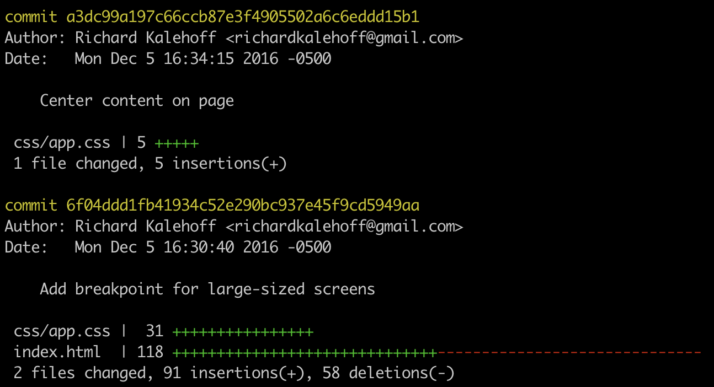

# Viewing modified files

We just looked at the <code>--oneline</code> flag to show one commit per line. That's great for getting an overview of the repository. But what if we want to dig in a little to see what file or files were changed by a commit?

If you look in the repository at commit <code>a3dc99a</code>, it has the message "Center content on page".

What file or files were changed in this commit?

Answer: There's no way to sure to know.

## git log --stat Intro

The <code>git log</code> command has a flag that can be used to display the files that have been changed in the commit, as well as the number of lines that have been added or deleted. The flag is <code>--stat</code> ("stat" is short for "statistics"):

```
$ git log --stat
```

Run this command and check out what it displays.



The result of the <code>git log --stat</code> command lists

- the full **SHA**
- the **author**
- the **date**
- the **message**
- the **files that were changed** as well as
- **the number of added/removed lines**.
- displays a **summary line** with the total number of modified files and lines that have been added/removed

In the second commit two files were modified with a total of 91 insertions and 58 deletions. 31 of the lines were added to the CSS file while 118 lines were either added or deleted in index.html.
