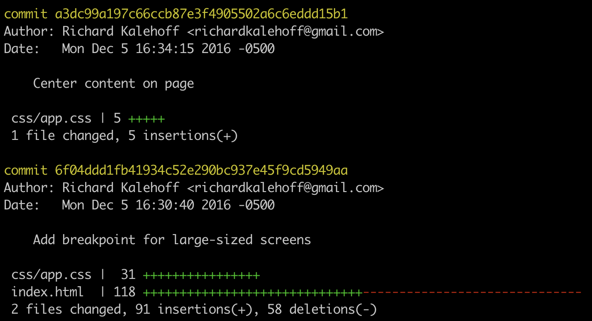

# Viewing files changes

We know that <code>git log</code> will show us the commits in a repository, and if we add the <code>--stat</code> flag, we can see what files were modified and how many lines of code were added or removed.

- Wouldn't it be awesome if we could see exactly what those changes were?

If this isn't the best part of a version control system, I don't know what is! Being able to see the exact changes that were made to a file is incredibly important! Being able to say, "oh, ok, so this commit adds 5 pixels of border-radius to the button!".



For example, in the blog project, the commit <code>a3dc99a</code> has the message "center content on page" and modifies the CSS file by adding 5 lines.

- What are those five lines that were added?
- How can we figure out what those 5 lines are?

## git log -p

The git log command has a flag that can be used to display the actual changes made to a file. The flag is <code>--patch</code> which can be shortened to just <code>-p</code>:

```console
$ git log -p
```

Run this command and check out what it displays.


The first part is the same as the regular <code>git log</code> command. The <code>-p</code> flag will add extra information below the standard commit info.

<code>diff</code> is the start of the patch output. A <code>diff</code> and a **patch** refer to the same thing. The **patch** is **showing the difference between the original version of the file and the changed version of the file**.

The first version of the file <code>a/css/app.css</code> shows up in a directory called **a** because it's the first. That's not a directory you'll actually see in the repo though. And then there's the second version <code>b/css/app.css</code>. It shows up in a **b** directory because it's the second. These two are the same name because we're looking at two different versions of the same file. These could be different if the file was renamed.

This line <code>index 07c36fa..3cbd0b8</code> shows the first 7 characters of the SHA of the file before the change <code>07c36fa</code> and the SHA <code>3cbd0b8</code> after the change.

Then we have the actual code of the css file. The lines that are in green and have the <code>+</code> simbol in front of them mean that these lines have been added in the commit.

The line <code>-38,6 +38,11</code> is telling us where in the file the edits are made.

<code>-38,6</code> says that in the old or original version of the file, this code is from **line 38** and than **,6** that's showing six lines of code. (in this case the 6 lines are the ones without a plus sign).

<code>-38,11</code>, the new version of the file starts on **line 38** as well, but now there are **11** lines of code. The original 6 plus the five new ones. We can see all the 11 lines on the screen.

Now this commit only has additions. What does it look like when lines are removed?


This patch output is of the html file. The lines that have been removed by the commit are in **red** and begin with the <code>-</code> sign. Something to know that's very important **Git tracks edits by lines**, so if an edit is made to a line, it will show the line being removed and then added again.


What happens when <code>git log -p --stat</code> is run?

answer: It displays both with the stats info above the patch info.

What does the -w flag do to the patch information?

answer: it ignores white spaces changes
