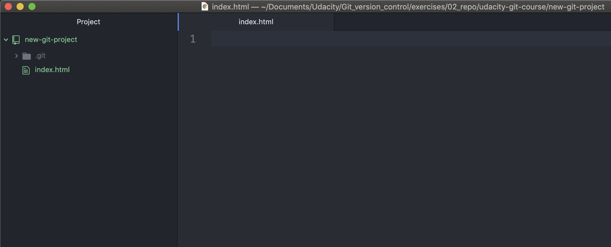
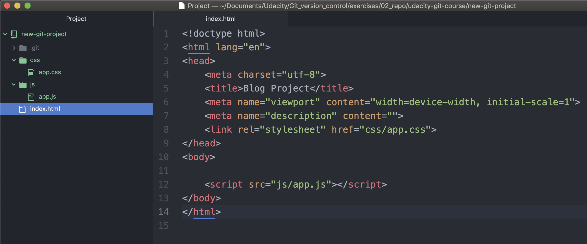
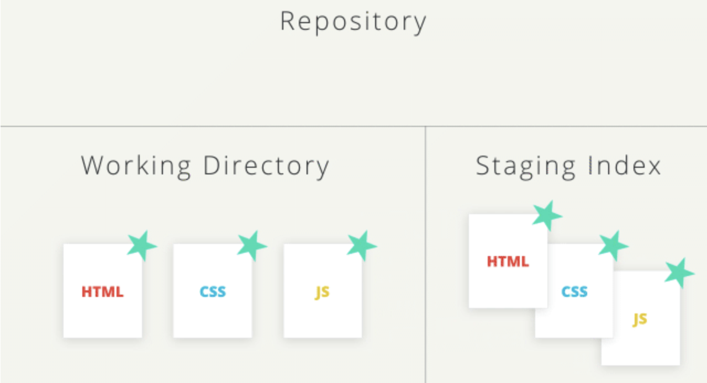
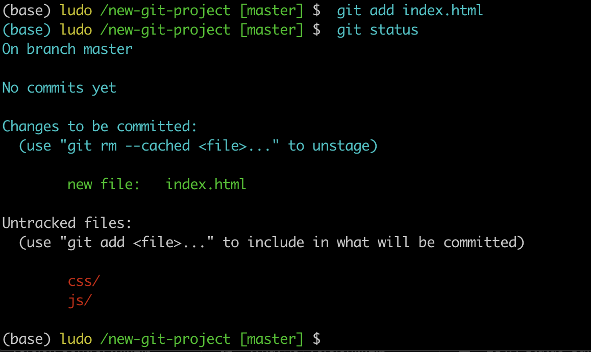

# Git add

**Move to Correct Project**: If you've been following along, you should have two different directories with Git projects on your computer:

- `new-git-project` - an empty directory that you converted to a Git repository using git init
- `course-git-blog-project` - an existing blog project you retrieved using git clone

To avoid any confusion with existing commits, we'll be making our commits to the `new-git-project` Git repository.

On the Terminal, make sure you cd into the `new-git-project` directory. If you don't have a new-git-project directory, create it now. Once you're inside the directory, run the `git init` command. If you've already run git init before it's ok – **running git init multiple times doesn't cause any problems since it just re-initializes the Git directory**.

Time to make sure we both have the same setup, your Terminal should look like this:

```console
(base) ludo /new-git-project [master] $ git status
On branch master

No commits yet

nothing to commit (create/copy files and use "git add" to track)
(base) ludo /new-git-project [master] $
```
*The Terminal application showing the output of the `git status` command.*

Notice that last line – `nothing to commit (create/copy files and use "git add" to track)`. See how it's recommending the git add command? that's super helpful! The git status output will give you advice or hints as to what you should do next.

Let's do what the feedback says and create some files.

## Create an HTML file.

First, create a file named `index.html`, and fill it with some starter code.

So, in the Working directory of your project open up your text editor (e.g. Atom) and create a new file named `index.html`.

```console
(base) ludo /new-git-project [master] $ atom .
```

If your Git's text editor is Atom, the window should look like this.



We fill the file with the following starter code.

**index.html**
```html
<!doctype html>
<html lang="en">
<head>
    <meta charset="utf-8">
    <title>Blog Project</title>
    <meta name="viewport" content="width=device-width, initial-scale=1">
    <meta name="description" content="">
    <link rel="stylesheet" href="css/app.css">
</head>
<body>

    <script src="js/app.js"></script>
</body>
</html>
```

Things to note, the code references a CSS file and a JavaScript file.

Now create the CSS and JavaScript files. You can leave both of these files empty. We'll add content to them in a bit.

**create** a `css` folder and create `app.css` inside git.

```console
(base) ludo /new-git-project [master] $  mkdir css
(base) ludo /new-git-project [master] $  cd css
(base) ludo /css [master] $  touch app.css
(base) ludo /css [master] $  cd ..
(base) ludo /new-git-project [master] $  ls
css        index.html
```

**create** a `js` folder and create `app.js` inside git.

```console
(base) ludo /new-git-project [master] $  mkdir js
(base) ludo /new-git-project [master] $  cd js
(base) ludo /js [master] $  touch app.js
(base) ludo /js [master] $  cd ..
(base) ludo /new-git-project [master] $  ls
css        index.html js
(base) ludo /new-git-project [master] $
```

Now your text editor should look like this;



### Quick Git Status Check

We just made a number of changes to the repository by adding files and content. It's time to do a quick check-in with Git:

`$ git status`

Here's what my Terminal displays:

```console
(base) ludo /new-git-project [master] $  git status
On branch master

No commits yet

Untracked files:
  (use "git add <file>..." to include in what will be committed)

	css/
	index.html
	js/

nothing added to commit but untracked files present (use "git add" to track)
```
*The Terminal application displays the `index.html` file and the `css` and `js` folders in the new "Untracked files" section.*

### Big Picture Review

That's really cool, isn't it! We haven't done anything specific with Git just yet, but it's watching this directory (since it's a Git project), and it knows that we've created a couple of new files. What's also pretty neat about the output of the `git status` command is that it's telling us that the files are **untracked** by Git.

Let's do a quick review of what's going on and what we're about to do:

- we have some new files that we want Git to start tracking
- for Git to track a file, it needs to be committed to the repository
- for a file to be committed, it needs to be in the Staging Index
- the `git add` command is used to move files from the Working Directory to the Staging Index
- there are currently three, untracked files in the Working Directory
  - **index.html**
  - **app.css** in the css directory
  - **app.js** in the js directory

So the first step to getting any files committed to the repository is to add them from the Working Directory to the Staging Index. We will be using the `git add` command to move all three of these files to the Staging Index.



## Staging Files

Alrighty, it's go time! Run the following command on the Terminal which uses `git add` to add **index.html** to the Staging Index:

```
$ git add index.html
```
Note - we are only adding the **index.html** file. We'll add the CSS and JavaScript files in just a second.


*The Terminal application. The command "git add index.html" is being typed out to add the file to the Staging Index*

Running the git add command produces no output (as long as there wasn't an error). So how do we have Git tell us what it did and has happened to the index.html file that was added? That's what git status does. You're probably sick of me stressing the importance of the git status command, but it's an extremely helpful command, especially if you're new to version control and/or the command line.

Let's check out the status of the project:

```
$ git status
```

This is the output I get:

```console
On branch master

No commits yet

Changes to be committed:
  (use "git rm --cached <file>..." to unstage)

	new file:   index.html

Untracked files:
  (use "git add <file>..." to include in what will be committed)

	css/
	js/
```
*The Terminal application showing the result of running the "git status" command. It shows that index.html is now in the "changes to be committed" category.*

## Changes To Be Committed

There's now a new section in the output of `git status` - the **"Changes to be committed"** area! This new "Changes to be committed" section **displays files that are in the Staging Area!** Right now it only displays the `index.html` file, so this file is the only item on the Staging Index. To continue this train of thought, if we made a commit right now, only the `index.html` file would be committed.

> TIP: Did you also notice the helpful text that's located just beneath "Changes to be committed"? It says **(use "git rm --cached <file>..." to unstage)** This is a hint of what you should do if you accidentally ran git add and gave it the wrong file.

> As a side note, **git rm --cached** is not like the shell's rm command. **git rm --cached** will not destroy any of your work; *it just removes it from the Staging Index*.

> Also, this used the word **"unstage"**. The act of moving a file from the Working Directory to the Staging Index is called "staging". If a file has been moved, then it has been "staged". **Moving a file from the Staging Index back to the Working Directory will unstage the file**. If you read documentation that says "stage the following files" that means you should use the git add command.

### Stage Remaining Files
The index.html file has been staged. Let's stage the other two files. Now we could run the following:

```
$ git add css/app.css js/app.js
```

...but that's a lot of extra typing. We could use a special command line character to help:

**The Period** `.`

The period refers to the current directory and can be used as a shortcut to refer to all files and directories (including all nested files and directories!).

```console
$ git add css/app.css js/app.js
# would become
$ git add .
```

And then a quick `git status`:

```console
(base) ludo /new-git-project [master] $  git add .
(base) ludo /new-git-project [master] $  git status
On branch master

No commits yet

Changes to be committed:
  (use "git rm --cached <file>..." to unstage)

	new file:   css/app.css
	new file:   index.html
	new file:   js/app.js

(base) ludo /new-git-project [master] $
```
*The Terminal application showing that index.htm, app.css and app.js have been staged*

## Git Add Recap
The `git add` command is used to **move files from the Working Directory to the Staging Index**.

```
$ git add <file1> <file2> … <fileN>
```

This command:

- takes a space-separated list of file names
- alternatively, the period `.` can be used in place of a list of files to tell Git to add the current directory (and all nested files)
