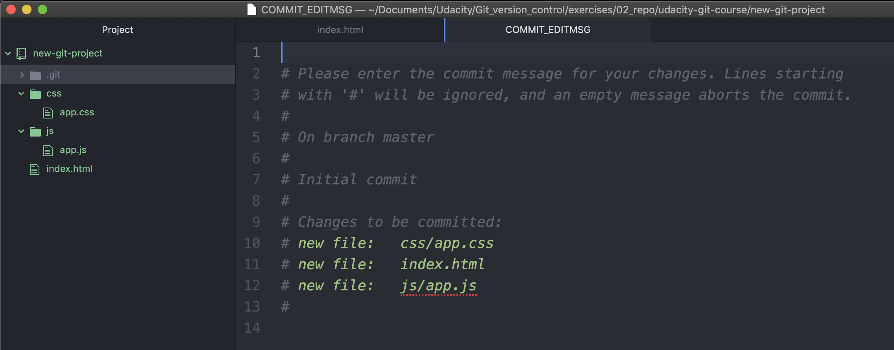
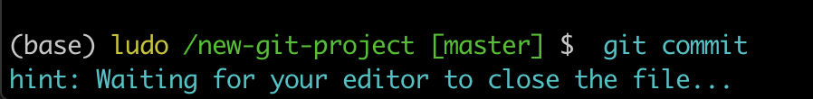
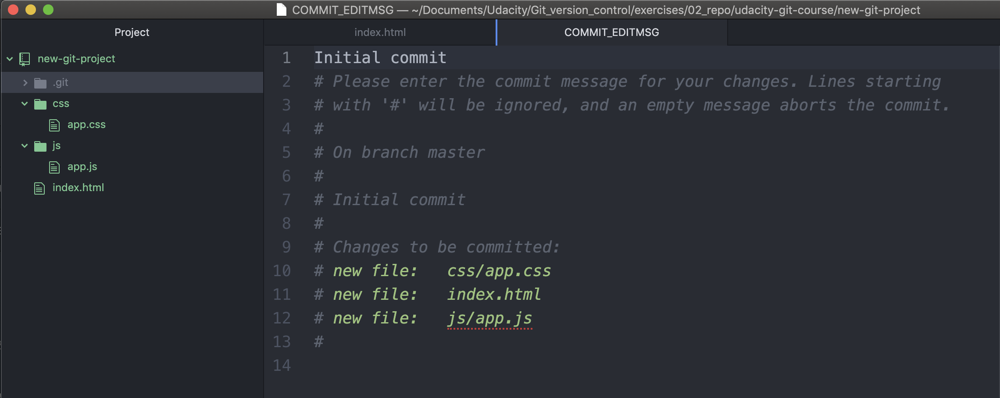
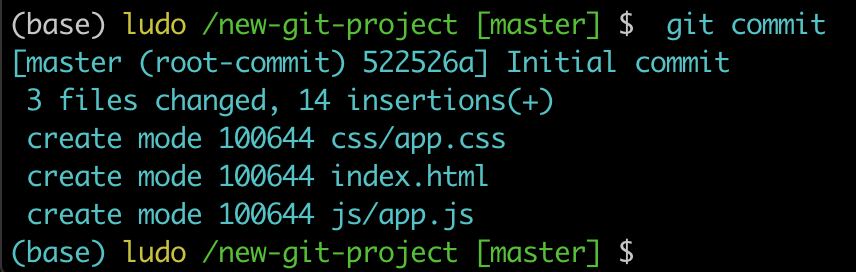

# Git Commit

We're just about to make our first commit, so let's verify that our projects are set up the same way:

Task List:

- the **index.html** file exists and has starter code in it.
- the **app.css** file exists in the **css** folder.
- the **app.js** file exists in the **js** folder.
- all three files have been staged.

## One Last Git Status Check
If you haven't added any new files to the Working Directory or modified any of the existing files, nothing will have changed, but to make sure, let's run a quick `git status` again right before we make the commit just to make *absolutely sure* the project is how we left it.

```console
(base) ludo /new-git-project [master] $  git status
On branch master

No commits yet

Changes to be committed:
  (use "git rm --cached <file>..." to unstage)

	new file:   css/app.css
	new file:   index.html
	new file:   js/app.js

(base) ludo /new-git-project [master] $
```

## Make A Commit
Ok, let's do it!

To make a commit in Git you use the `git commit` command, but don't run it just yet. Running this command will open the code editor that you configured way back in the first lesson. If you haven't run this command yet:

`$ git config --global core.editor <your-editor's-config-went-here>`

...go back to the Git configuration step and configure Git to use your chosen editor.

If you didn't do this step and you already ran `git commit`, then Git probably defaulted to using the "Vim" editor. Vim is a popular editor for people who have been using Unix or Linux systems forever, but it's not the friendliest for new users. It's definitely not in the scope of this course. Check out this [Stack Overflow post](https://stackoverflow.com/questions/11828270/how-do-i-exit-the-vim-editor) on how to get out of Vim and return to the regular command prompt.

If you did **configure your editor**, then go ahead and make a commit using the git commit command:

```
$ git commit
```

Remember, your editor should pop open and you should see something like this:


*Code editor displaying the default commit edit message content and is waiting for a commit message to be supplied*


## Terminal Hangs


*The Terminal application showing `git commit`, but it appears to be hanging and waiting for something*

If you switch back to the Terminal for a quick second, you'll see that the Terminal is chillin' out just waiting for you to finish with the code editor that popped up. You don't need to worry about this, though. Once we add the necessary content to the code editor and finally *close the code editor window*, the Terminal will unfreeze and return to normal.

## Code Editor Commit Message Explanation

Ok, switch back to the code editor. Here's what's showing in my editor:

```
# Please enter the commit message for your changes. Lines starting
# with '#' will be ignored, and an empty message aborts the commit.
# On branch master
#
# Initial commit
#
# Changes to be committed:
#    new file:   css/app.css
#    new file:   index.html
#    new file:   js/app.js
#
```

The first paragraph is telling us exactly what we need to do - we need to supply a message for this commit. Also, any line that begins with the `#` character will be ignored. Farther down it says that this will be the initial commit. Lastly, it's giving us a list of the files that will be committed.

Since this is the very first commit of the repository, we'll use the commit message **"Initial commit"**. The text "Initial commit" isn't special, but it's the de facto commit message for the very first commit. If you want to use something else, feel free!

Type out your commit message on the first line of the code editor:


*Code editor with the commit message entered on the first line*

## Finish Committing
Now **save the file** and **close the editor window**

Note: (**closing just the pane/tab isn't enough, you need to close the code editor window that the git commit command opened**).

Awesome, now switch back to the Terminal and you should see something like the following:


*The Terminal application after closing the editor. It displays the SHA for the new commit as well as information about the commit like the files that were added and how many lines of code were added*

## Bypass The Editor With The -m Flag

**TIP**: If the commit message you're writing is short and you don't want to wait for your code editor to open up to type it out, you can pass your message directly on the command line with the `-m` flag:

```
$ git commit -m "Initial commit"
```

In the example above, the text "Initial commit" is used as the commit message. Be aware that you can't provide a description for the commit, only the message part.

## 2nd Commit - Add Changes
We've had a short breather, so let's make a second commit! Here, add this just inside the body tag in index.html:

```html
<header>
    <h1>Expedition</h1>
</header>
```

Ok, now what do you do next? That's right, it's our good old friend `git status`!

```console
(base) ludo /new-git-project [master] $  git status
On branch master
Changes not staged for commit:
  (use "git add <file>..." to update what will be committed)
  (use "git checkout -- <file>..." to discard changes in working directory)

	modified:   index.html

no changes added to commit (use "git add" and/or "git commit -a")
```
*The Terminal application showing the result of the git status command. It displays a "Changes not staged for commit" section that includes the modified "index.html"*

> TIP: If you run `git status` but don't see that `index.html` has changed, make sure to save the file. I modify a file and then forget to save it - all - the - time! I like to think that forgetting to save a file after editing it is the mark of a true professional.

## Multipurpose Git Add
So we've modified our file. Git sees that it's been modified. So we're doing well so far. Now remember, to make a commit, the file or files we want committed need to be on the Staging Index. What command do we use to move files from the Working Directory to the Staging Index? You got it - `git add`!

Even though we used git add to **add newly created files to the Staging Index**, we use the same command to **move modified files to the Staging Index**.

Use the `git add` command to move the file over to the Staging Index, now. Verify that it's there with git status.

```console
(base) ludo /new-git-project [master] $  git add .
(base) ludo /new-git-project [master] $  git status
On branch master
Changes to be committed:
  (use "git reset HEAD <file>..." to unstage)

	modified:   index.html

(base) ludo /new-git-project [master] $
```

## Second Commit
Now that we have a file with changes we can commit, let's make our second commit! Use the git commit command to make a commit. Use the commit message `Add header to blog`.

```console
(base) ludo /new-git-project [master] $  git commit -m "Add header to blog"
[master fb8b8a5] Add header to blog
 1 file changed, 4 insertions(+), 1 deletion(-)
(base) ludo /new-git-project [master] $
```

Now you might be asking yourself, "Why did Richard pick that as the commit message to use?" or "What makes a good commit message?". These are fantastic questions that we'll be looking at in the next concept!

## What To Include In A Commit
I've been telling you what files to create, giving you the content to include, and telling you when you should make commits. But when you're on your own, how do you know what you should include in a commit and when/how often you should make commits?

**The goal is that each commit has a single focus**. Each commit should record a single-unit change. Now this can be a bit subjective (which is totally fine), but each commit should make a change to just one aspect of the project.

Now this isn't limiting the number of lines of code that are added/removed or the number of files that are added/removed/modified. Let's say you want to change your sidebar to add a new image. You'll probably:

- add a new image to the project files
- alter the HTML
- add/modify CSS to incorporate the new image

A commit that records all of these changes would be totally fine!

Conversely, a commit shouldn't include unrelated changes - changes to the sidebar and rewording content in the footer. These two aren't related to each other and shouldn't be included in the same commit. Work on one change first, commit that, and then change the second one. That way, if it turns out that one change had a bug and you have to undo it, you don't have to undo the other change too.

The best way that I've found to think about what should be in a commit is to think, **"What if all changes introduced in this commit were erased?". If a commit were erased, it should only remove one thing**.

> Don't worry, commits don't get randomly erased.

> In a later lesson, we'll look at using Git to undo changes made in commits and how to manually, carefully remove the last commit that was made.


## Git Commit Recap
The git commit command takes files from the Staging Index and saves them in the repository.

`$ git commit`

This command:

- will open the code editor that is specified in your configuration
  - (check out the Git configuration step from the first lesson to configure your editor)


Inside the code editor:

- a commit message must be supplied
- lines that start with a `#` are comments and will not be recorded
- save the file after adding a commit message
- close the editor to make the commit
- Then, use `git log` to review the commit you just made!

## Further Research

- [Associating text editors with Git](https://docs.github.com/en/get-started/getting-started-with-git/associating-text-editors-with-git) from GitHub helps doc.
- [Getting started -First time Git setup](https://git-scm.com/book/en/v2/Getting-Started-First-Time-Git-Setup) from Git book.
