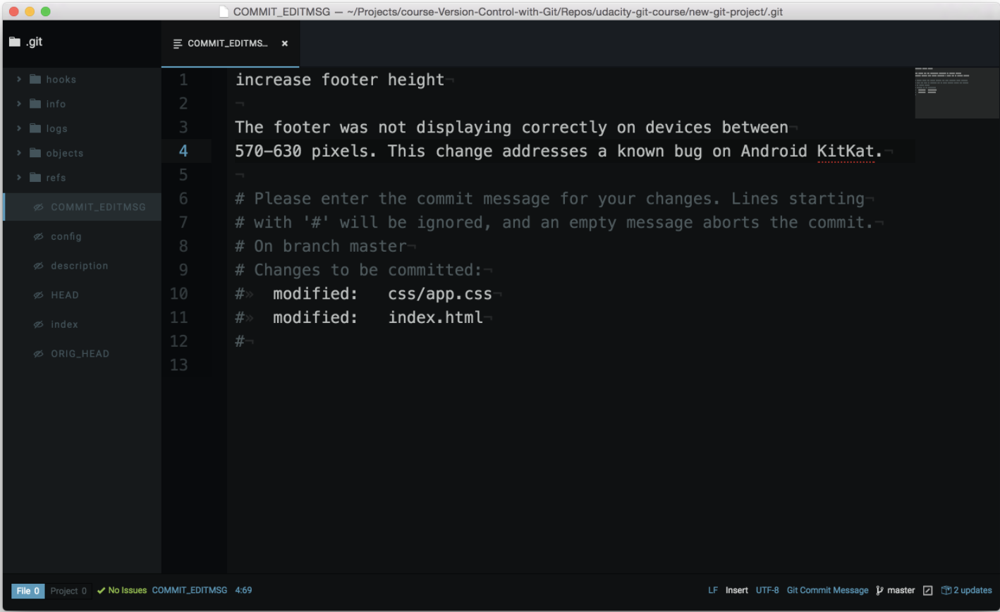

# Git commit messages

**Good commit messages**

> How do I write a good commit message? And why should I care?

These are *fantastic* questions! I can't stress enough how important it is to spend some time writing a good commit message.

Now, what makes a "good" commit message? That's a great question and has been [written](https://cbea.ms/git-commit/) about a [number](https://p5v.medium.com/what-s-with-the-50-72-rule-8a906f61f09c#.jwprsco0n) of [times](https://tbaggery.com/2008/04/19/a-note-about-git-commit-messages.html). Here are some important things to think about when crafting a good commit message:

**Do**:

- do keep the message short (less than 60-ish characters)
- do explain what the commit does (not how or why!)

**Do not**:

- do not explain why the changes are made (more on this below)
- do not explain how the changes are made (that's what git log -p is for!)
- do not use the word "and"
  - if you have to use "and", your commit message is probably doing too many changes - break the changes into separate commits
e.g. "make the background color pink and increase the size of the sidebar"

The best way that I've found to come up with a commit message is to finish this phrase, "This commit will...". However, you finish that phrase, use that as your commit message.

Above all, be **consistent** in how you write your commit messages!

## Explain the Why
If you need to explain why a commit needs to be made, you can!

When you're writing the commit message, the first line is the message itself. After the message, leave a blank line, and then type out the body or explanation including details about why the commit is needed (e.g. URL links).

Here's what a commit message edit screen might look like:


*Code Editor showing the commit message edit window. A message has been typed, followed by a blank line, followed by the body of the commit*

This details section of a commit message is included in the `git log`. To see a commit message with a body, check out the Blog project repo and look at commit `8a11b3f`.

```console
(base) ludo /course-git-blog-project [master] $  git log 8a11b3f
commit 8a11b3f5f807d3bf415174358758206ac224f33c
Author: Richard Kalehoff <richardkalehoff@gmail.com>
Date:   Fri Dec 2 13:23:51 2016 -0500

    Update article dates

    Oops - the articles weren't posted all at the same time! This change
    makes sure they're set to reasonable dates/times.

    Easter Egg! These dates are the birthdays of:

    * my brother
    * my dad
    * my twin sister
    * and me!
```

Only the message (the first line) is included in `git log --oneline`, though!

```console
(base) ludo /course-git-blog-project [master] $  git log --oneline 8a11b3f
8a11b3f Update article dates
4e16c7e Add article content
b4521d7 Add starting HTML structure
40e2199 Add starter files
9362088 Initial commit
```

## Git Commit Message Style Guide

As I've mentioned, there are a number of ways to write commit messages. If you're working on a team, they might already have a predetermined way of writing commit messages. Here at Udacity, we have our own standard for commit messages. You can check it out on our [Git Commit Message Style Guide](https://udacity.github.io/git-styleguide/).

### Commit Messages

**Message Structure**

A commit messages consists of three distinct parts separated by a blank line: the title, an optional body and an optional footer. The layout looks like this:

```console
type: Subject

body

footer
```

The title consists of the type of the message and subject.

**The Type**

The type is contained within the title and can be one of these types:

- **feat**: A new feature
- **fix**: A bug fix
- **docs**: Changes to documentation
- **style**: Formatting, missing semi colons, etc; no code change
- **refactor**: Refactoring production code
- **test**: Adding tests, refactoring test; no production code change
- **chore**: Updating build tasks, package manager configs, etc; no production code change

**The Subject**

Subjects should be no greater than 50 characters, should begin with a capital letter and do not end with a period.

Use an imperative tone to describe what a commit does, rather than what it did. For example, use `change`; not changed or changes.

**The Body**

Not all commits are complex enough to warrant a body, therefore it is optional and only used when a commit requires a bit of explanation and context. Use the body to explain the **what** and **why** of a commit, not the how.

When writing a body, the blank line between the title and the body is required and you should limit the length of each line to no more than 72 characters.

**The Footer**

The footer is optional and is used to reference issue tracker IDs.

## Example Commit Message

```
feat: Summarize changes in around 50 characters or less

More detailed explanatory text, if necessary. Wrap it to about 72
characters or so. In some contexts, the first line is treated as the
subject of the commit and the rest of the text as the body. The
blank line separating the summary from the body is critical (unless
you omit the body entirely); various tools like `log`, `shortlog`
and `rebase` can get confused if you run the two together.

Explain the problem that this commit is solving. Focus on why you
are making this change as opposed to how (the code explains that).
Are there side effects or other unintuitive consequences of this
change? Here's the place to explain them.

Further paragraphs come after blank lines.

 - Bullet points are okay, too

 - Typically a hyphen or asterisk is used for the bullet, preceded
   by a single space, with blank lines in between, but conventions
   vary here

If you use an issue tracker, put references to them at the bottom,
like this:

Resolves: #123
See also: #456, #789
```

## Git Diff Up Next!

In the next section, we'll look at a new tool (with a familiar output!). This tool will tell us what changes we've made to files before the files have been committed!
