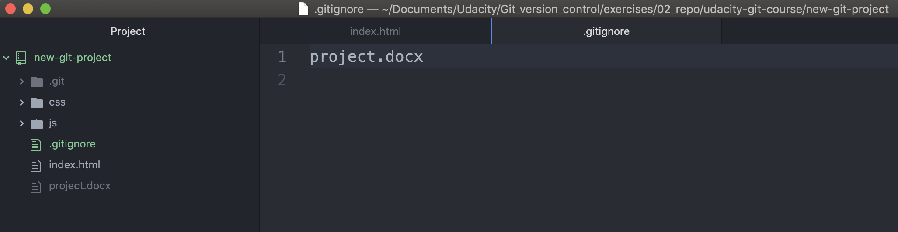

# Having git ignore files

**Why Files should be ignored?**

Remember a couple sections back when we were learning about git add? Instead of adding the files one by one, there was a special character that we could use to indicate the current directory and all subdirectories. Do you remember what that character is?

That's right, the period (`.`)!

## The Problem

Let's say you add a file like a Word document to the directory where your project is stored but don't want it added to the repository. (You can simulate adding a Word document by running `touch project.docx`) Git will see this new file, so if you run `git status` it'll show up in the list of files.

```console
(base) ludo /new-git-project [master] $  touch project.docx
(base) ludo /new-git-project [master] $  git status
On branch master
Untracked files:
  (use "git add <file>..." to include in what will be committed)

	project.docx

nothing added to commit but untracked files present (use "git add" to track)
```
*The Terminal application showing the output of `git status`. The output shows a new Word document that is in Git's "Untracked files" section.*

The potential problem with having this file in your project is that, because `git add .` adds all files, the Word document might get accidentally committed to the repository.


## Git Ignore

If you want to keep a file in your project's directory structure but make sure it isn't accidentally committed to the project, you can use the specially named file, **.gitignore** (note the dot at the front, it's important!).

- Add this file to your project in the same directory that the hidden `.git` directory is located.
- All you have to do is **list the names of files** that you want Git to ignore (not track) and it will ignore them.

Let's try it with the "project.docx" file. Add the following line inside the .gitignore file:

`project.docx`



Now run git status and check its output:

```console
(base) ludo /new-git-project [master] $  git status
On branch master
Untracked files:
  (use "git add <file>..." to include in what will be committed)

	.gitignore

nothing added to commit but untracked files present (use "git add" to track)
```
*The Terminal application showing the output of `git status`. The Word document is no longer listed as "Untracked file". The new ".gitignore" file is listed, though*

Git knows to look at the contents of a file with the name `.gitignore`. Since it saw "`project.docx`" in it, it ignored that file and doesn't show it in the output of `git status`.

## Globbing Crash Course
Let's say that you add 50 images to your project, but want Git to ignore all of them. Does this mean you have to list each and every filename in the `.gitignore` file? Oh gosh no, that would be crazy! Instead, you can use a concept called [globbing](https://en.wikipedia.org/wiki/Glob_(programming)).

Globbing lets you use special characters to match patterns/characters. In the `.gitignore` file, you can use the following:

blank lines can be used for spacing
- `#` - marks line as a comment
- `*` - matches 0 or more characters
- `?` - matches 1 character
- `[abc]` - matches a, b, or c
- `**` - matches nested directories - a/**/z matches
  - a/z
  - a/b/z
  - a/b/c/z

So if all of the 50 images are JPEG images in the "samples" folder, we could add the following line to `.gitignore` to have Git ignore all 50 images.

`samples/*.jpg`

### Git Ignore Recap
To recap, the `.gitignore` file is used to tell Git about the files that Git should not track. This file should be placed in the same directory that the `.git` directory is in.

### Further Research
- [Ignoring files](https://git-scm.com/book/en/v2/Git-Basics-Recording-Changes-to-the-Repository#Ignoring-Files) from the Git Book
- [gitignore](https://git-scm.com/docs/gitignore#_pattern_format) from the Git Docs
- [Ignoring files](https://docs.github.com/en/get-started/getting-started-with-git/ignoring-files) from the GitHub Docs
- [gitignore.io](https://www.toptal.com/developers/gitignore)
