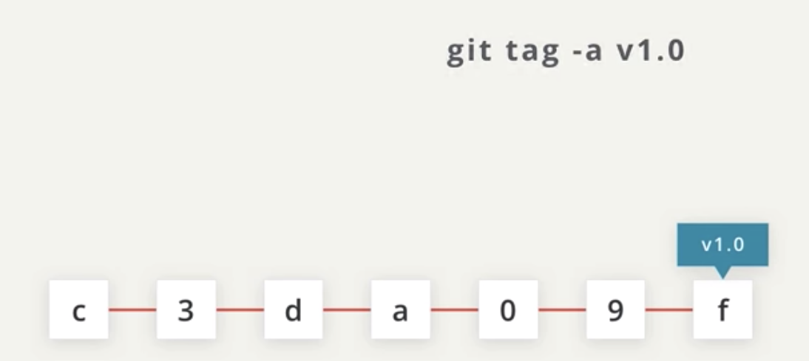
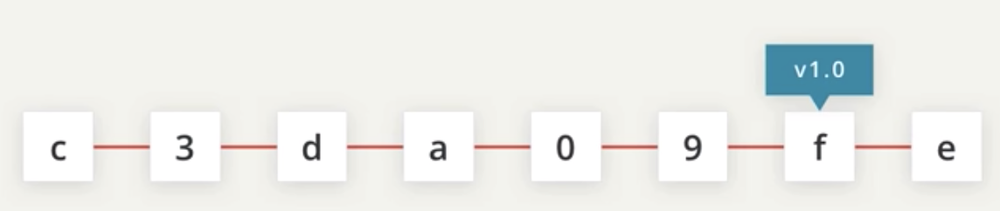
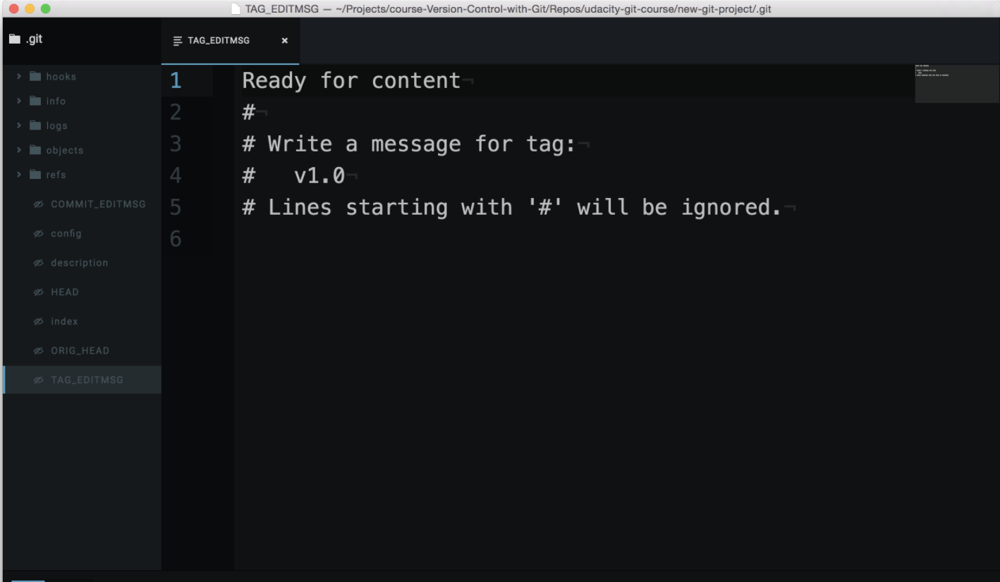

# Tagging



Let's say we've one commit `c` as the first commit of the project and then a few more commits. So, let's say the most recent commit that starts with the `f` is where our project is at version `1.0`.

How would we indicate this in git?

We don't want to write this in the commit message. Perhaps we can list this in the body of the commit message, but that's not ideal either. We can use a **tag** to indicate this.

**Tags** let you point out particular commits to make them stand out from others, and we can label the tag with something like: `git tag -a v1.0`.



Let's add another commit. See how the tag stays locked to a commit? A tag **stays locked to a commit even as more commits are added to the repository**.

## Where Are We?
You can do these steps in either project, but I'll be doing them in the `new-git-project project`.

Let's take a look at the log of the project so far:

```console
(base) ludo /new-git-project [master] $  git status
On branch master
Untracked files:
  (use "git add <file>..." to include in what will be committed)

	.gitignore

nothing added to commit but untracked files present (use "git add" to track)
(base) ludo /new-git-project [master] $  git add .
(base) ludo /new-git-project [master] $  git commit -m "Add .gitignore file"
[master 74dd0d2] Add .gitignore file
 1 file changed, 1 insertion(+)
 create mode 100644 .gitignore
(base) ludo /new-git-project [master] $
```

Now let's view the repo.

```console
(base) ludo /new-git-project [master] $  git log --oneline
74dd0d2 (HEAD -> master) Add .gitignore file
fb8b8a5 Add header to blog
522526a Initial commit
(base) ludo /new-git-project [master] $
```

## Git Tag Command
Pay attention to what's shown (just the SHA and the commit message)

The command we'll be using to interact with the repository's tags is the git tag command:
```
$ git tag -a v1.0
```

This will open your code editor and wait for you to supply a message for the tag. How about the message "Ready for content"?



> CAREFUL: In the command above (`git tag -a v1.0`) the `-a` flag is used. This flag tells Git to create an annotated flag. If you don't provide the flag (i.e. `git tag v1.0`) then it'll create what's called a lightweight tag.

> Annotated tags are recommended because they include a lot of extra information such as:

> - the person who made the tag
- the date the tag was made
- a message for the tag

Because of this, you should always use annotated tags.

## Verify Tag

After saving and quitting the editor, nothing is displayed on the command line. So how do we know that a tag was actually added to the project? If you type out just `git tag`, it will display all tags that are in the repository.

```console
(base) ludo /new-git-project [master] $  git tag
v1.0
(base) ludo /new-git-project [master] $
```
*The Terminal application showing the output of the `git tag` command. The tag `v1.0` is listed*

So we've verified that it's in the repository, but let's actually see where it is inside the repository. To do that, we'll go back to our good old friend, `git log`!

```console
(base) ludo /new-git-project [master] $  git log
commit 74dd0d232bc8c58dc8b038acb5cb318773228f92 (HEAD -> master, tag: v1.0)
Author: Ludovico Pinzari <ludovico.pinzari@gmail.com>
Date:   Mon Mar 28 14:40:50 2022 +0200

    Add .gitignore file

commit fb8b8a5e70cbe615638497fa738d90d9b640e0fe
Author: Ludovico Pinzari <ludovico.pinzari@gmail.com>
Date:   Mon Mar 28 10:42:48 2022 +0200

    Add header to blog

commit 522526afdb4bdddeda7e9add5d7885a9ec6261de
Author: Ludovico Pinzari <ludovico.pinzari@gmail.com>
Date:   Mon Mar 28 09:50:16 2022 +0200

    Initial commit
```
See how it says tag: v1.0?

`commit 74dd0d232bc8c58dc8b038acb5cb318773228f92 (HEAD -> master, tag: v1.0)`

That's the tag! Remember that tags are associated with a specific commit. This is why the tag is on the same line as the commit's SHA.

## Deleting A Tag
What if you accidentally misspelled something in the tag's message, or mistyped the actual tag name (v0.1 instead of v1.0). How could you fix this? The easiest way is just to delete the tag and make a new one.

A Git tag can be deleted with the -d flag (for delete!) and the name of the tag:

`$ git tag -d v1.0`

```console
(base) ludo /new-git-project [master] $  git tag
v1.0
(base) ludo /new-git-project [master] $  git tag -d v1.0
Deleted tag 'v1.0' (was 6f51d1a)
```

## Adding A Tag To A Past Commit
Running `git tag -a v1.0` will tag the most recent commit. But what if you wanted to tag a commit that occurred farther back in the repo's history?

All you have to do is provide the SHA of the commit you want to tag!

`$ git tag -a v1.0 a87984`

(after popping open a code editor to let you supply the tag's message) this command will tag the commit with the SHA **a87084** with the tag **v1.0**. Using this technique, you can tag any commit in the entire git repository! Pretty neat, right?...and it's just a simple addition to add the SHA of a commit to the Git tagging command you already know.

## Git Tag Recap
To recap, the git tag command is used to add a marker on a specific commit. The tag does not move around as new commits are added.

`$ git tag -a beta`

This command will:

- add a tag to the most recent commit

`$ git tag -a beta a87984`

- add a tag to a specific commit if a SHA is passed
