# Branching

It's time to delve into the wonderful world of branches! Branches in Git are flexible and let you do some really powerful things. Before we get into the nitty gritty details of the commands, let's take another step back and look at the big picture of what branches are and how they function.

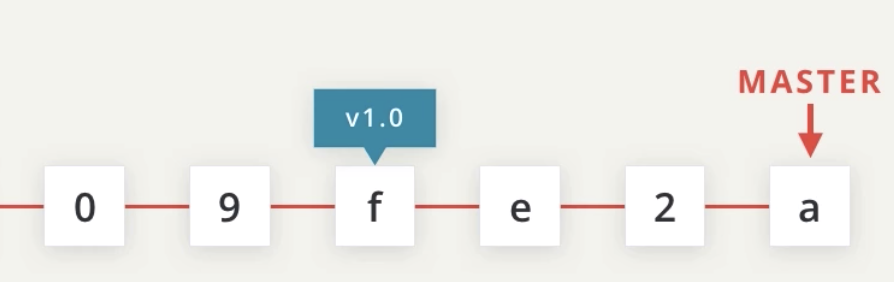

There are just a number of commits in the repo and there's a tag on one of the commits. In addition to the tag, there's also a **branch**. It's been hidden all this time, but let's show it. **By default, the first branch name is "master"** but that's not a special name. It's just the **default** name that's provided by git. Now, here's the cool part.

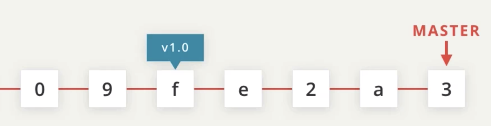

When a commit is made in the repository it's added to the branch and the **branch pointer moves to point to it**. If you remember, a `tag` is a **permanent pointer to a commit**, but a `branch` **does move when a new commit is added**.

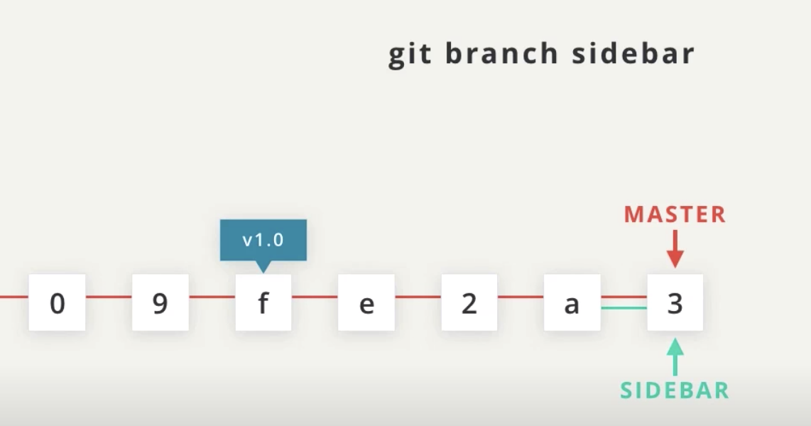

Let's add another branch to the repository and call it "sidebar". Now, why would we want to do this? Well, branches are incredibly powerful because they let us work on the same project in different isolated environments.

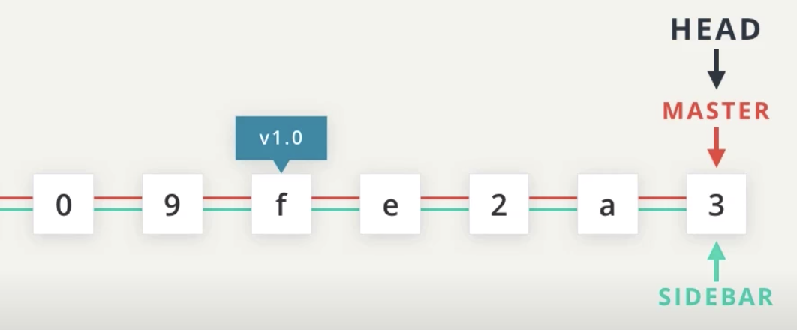

A question you might be asking is, "If we make a commit now, which branch will move?" Will it be "`master`" or "`sidebar`"?

Well, there's another hidden thing we need to reveal. It's the oddly named "`head`" **pointer**, and it **points to the branch that's active**. Right now, it's pointing to the "`master`" branch. So "`master`" is the **active branch**.

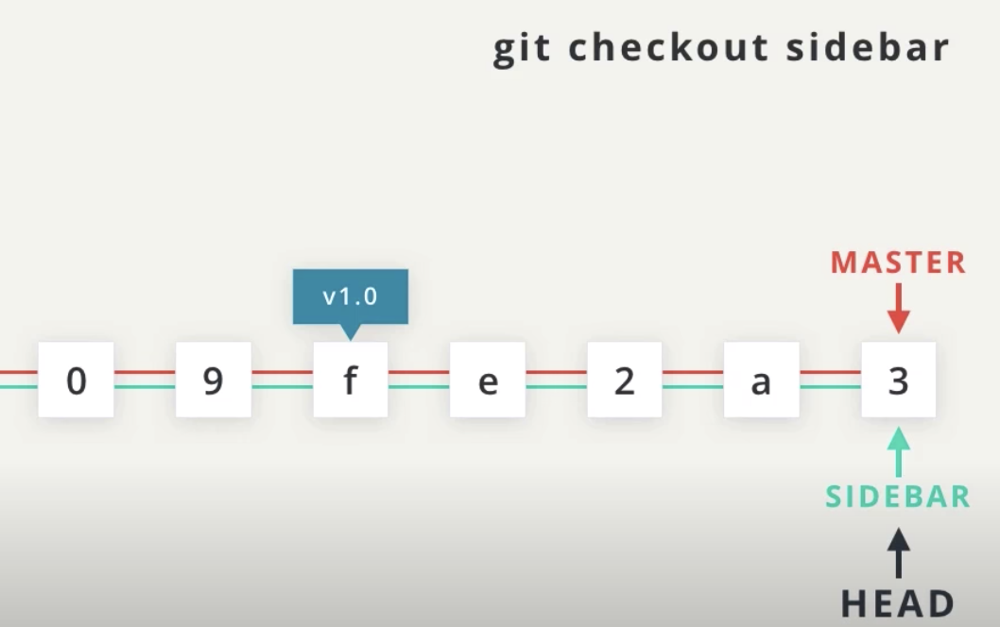

We can use the `checkout` command to switch which branch it's pointing to. To switch to the `sidebar` branch, we'd use the command `git checkout sidebar`.

Let's switch back with **git checkout master**.


If we make a commit right now.

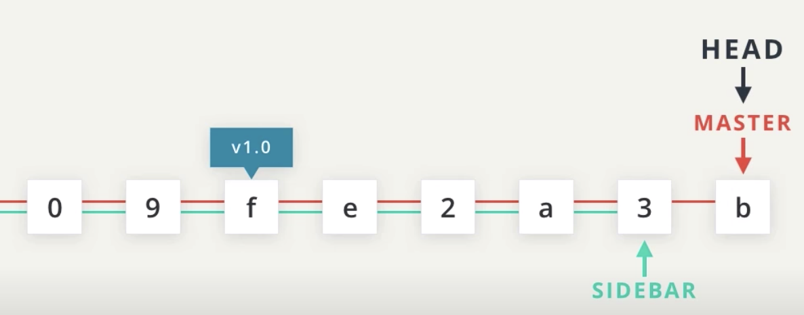

The commit is added to the branch that "**head**" points to, because "**head**" indicates the current or **active branch**. The picture above shows that the last commit belongs to the "`master`" branch.

Now, let's switch over to the "`sidebar`" branch.
**git checkout sidebar**

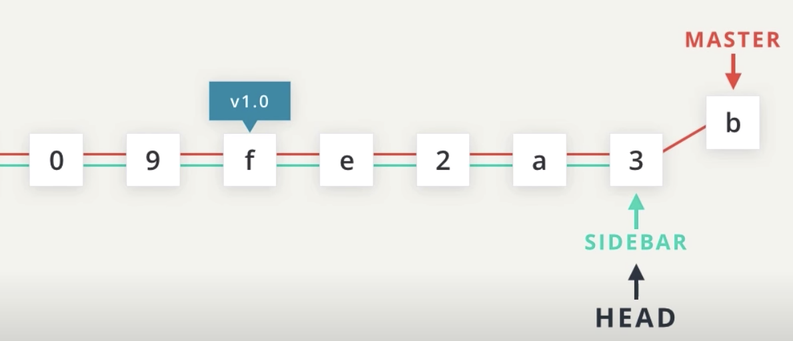

Let's add a commit to this branch.

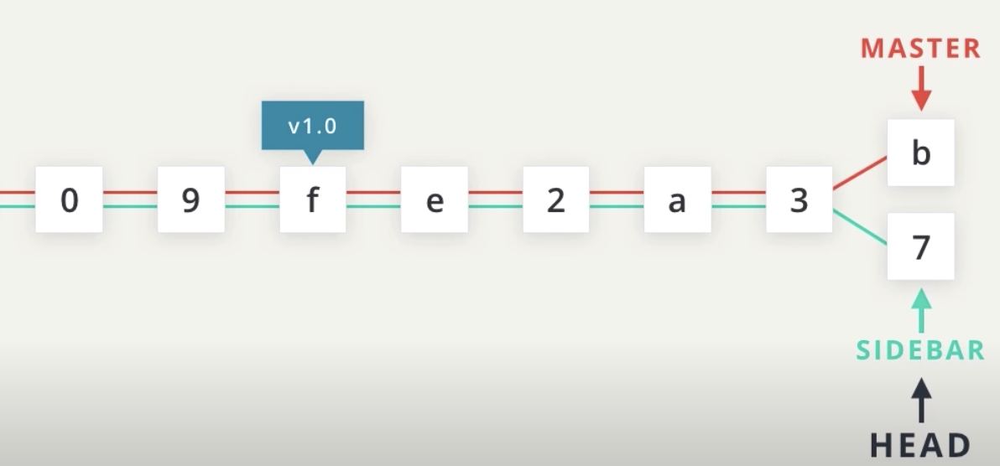

Now that "head" points to `sidebar`, making a commit now will add this commit to the `sidebar` branch.

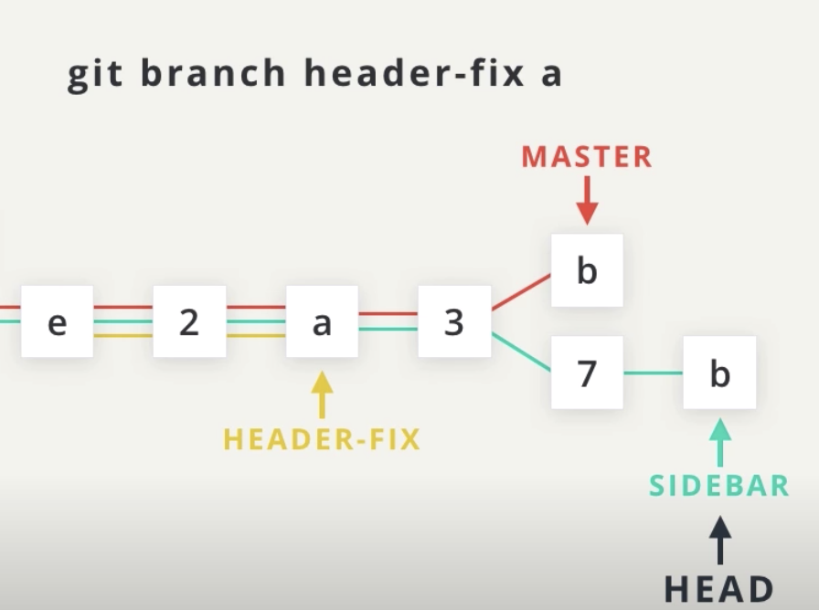

Not only can we have as many branches as we want, but we can choose **where it starts from**. Let's say there's a problem with our header that was introduced back on commit `a`. We can create a new branch right there with the branch command `git branch header-fix a`.

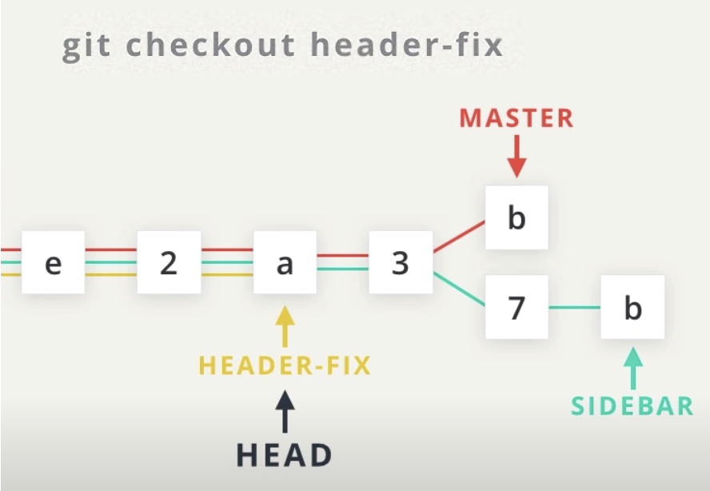

Switch to it with the `checkout` command.

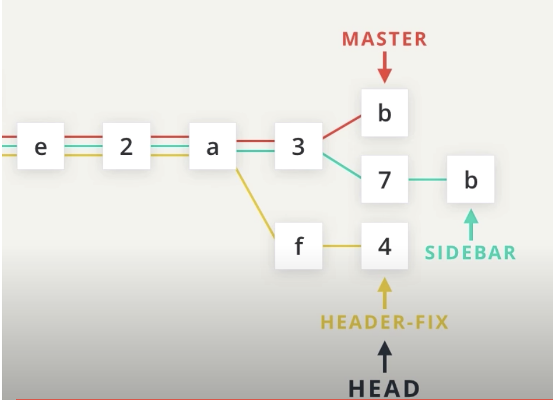

Make the necessary changes to fix the problem.

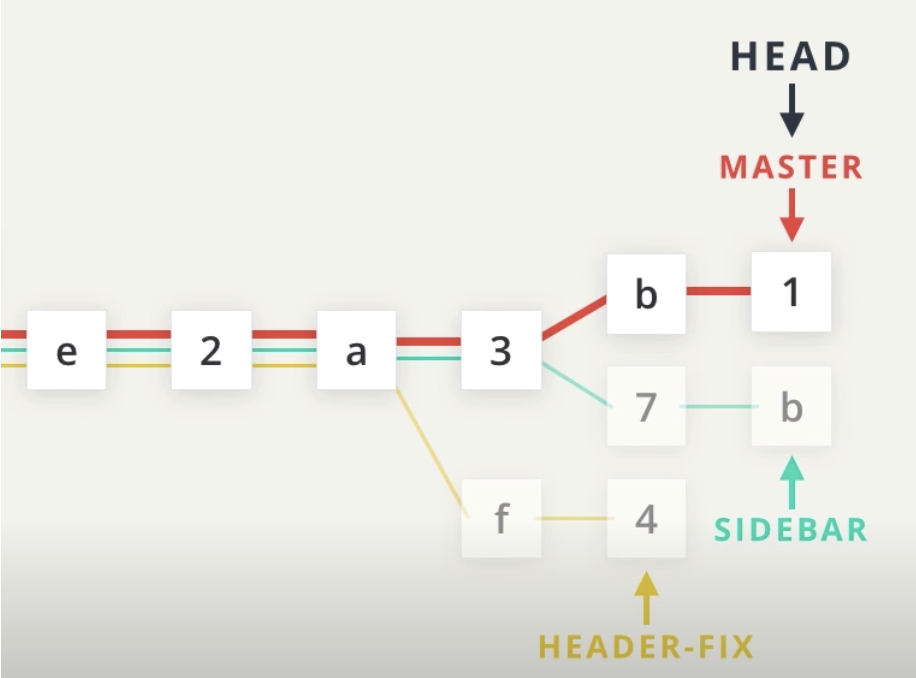

There's one quick but very important thing that I need to point out. Let's switch back to the `master` branch for a second and make a commit. The word `master` here indicates **the tip of the entire branch**, but this **most recent commit is connected to past commits**. The red line indicates all of the commits that are in the `master` branch. So the commits `7` and `b` are not included into the `master` branch, and the commit `f` and `4` are not in the `master` branch either.

So if we open up our code editor right now, the changes that we made on commit `f,4,7` and `b` will not appear in any of the files because git is only showing changes that are in the `master` branch. Don't worry though. These commits are stored safely in the repository. To get those commits out of the repo, we just need to switch to the branch that has the commits we are looking for.

```console
(base) ludo /new-git-project [master] $
```

So that's the big picture of how branches work and how to switch between branches. Did you know that you've already seen the master branch on the command line? Because of the setup files you added in the first lesson, the current branch is displayed right in the command prompt.

## The git branch command

The git branch command is used to interact with Git's branches:

```
$ git branch
```
It can be used to:

- list all branch names in the repository
- create new branches
- delete branches

If we type out just `git branch` it will list out the branches in a repository:

```console
(base) ludo /new-git-project [master] $  git branch
* master
(base) ludo /new-git-project [master] $
```
*The Terminal application showing the output of the `git branch` command. The master branch is displayed.*

## Create A Branch
To create a branch, all you have to do is use git branch and provide it the name of the branch you want it to create. So if you want a branch called "sidebar", you'd run this command:


`$ git branch sidebar`

```console
(base) ludo /new-git-project [master] $  git branch sidebar
(base) ludo /new-git-project [master] $  git branch
* master
  sidebar
(base) ludo /new-git-project [master] $
```

## The git checkout Command
Remember that when a commit is made that it will be added to the current branch. So even though we created the new `sidebar`, no new commits will be added to it since we haven't switched to it, yet. If we made a commit right now, that commit would be added to the `master` branch, not the sidebar branch. We've already seen this in the demo, but to switch between branches, we need to use Git's checkout command.

`$ git checkout sidebar`

It's important to understand how this command works. Running this command will:

- remove all files and directories from the Working Directory that Git is tracking
  - (files that Git tracks are stored in the repository, so nothing is lost)
- go into the repository and pull out all of the files and directories of the commit that the branch points to.

So this will remove all of the files that are referenced by commits in the master branch. It will replace them with the files that are referenced by the commits in the sidebar branch. This is very important to understand, so go back and read these last two sentences.

The funny thing, though, is that both `sidebar` and `master` are pointing at the same commit, so it will look like nothing changes when you switch between them. But the command prompt will show "sidebar", now:

```console
(base) ludo /new-git-project [master] $  git checkout sidebar
Switched to branch 'sidebar'
(base) ludo /new-git-project [sidebar] $
```
*The Terminal application showing the sidebar branch in the command prompt*

## Branches In The Log
The branch information in the command prompt is helpful, but the clearest way to see it is by looking at the output of git log.

```
$ git log --oneline
```
This is what my log output displays (yours might look different depending on what commits you've made):

```console
(base) ludo /new-git-project [sidebar] $  git log --oneline
74dd0d2 (HEAD -> sidebar, master) Add .gitignore file
fb8b8a5 Add header to blog
522526a Initial commit
(base) ludo /new-git-project [sidebar] $
```
*The word HEAD has an arrow pointing to the "sidebar" which is the active branch*

In the output above, notice how the special "HEAD" indicator we saw earlier has an arrow pointing to the sidebar branch. It's pointing to sidebar because the sidebar branch is the current branch, and any commits made right now will be added to the sidebar branch.

## The Active Branch
The command prompt will display the active branch. But this is a special customization we made to our prompt. If you find yourself on a different computer, the fastest way to determine the active branch is to look at the output of the git branch command. An asterisk will appear next to the name of the active branch.

```console
(base) ludo /new-git-project [sidebar] $  git branch
  master
* sidebar
(base) ludo /new-git-project [sidebar] $
```

From what you know about both the git branch and git tag commands, what do you think the following command will do?

```
$ git branch alt-sidebar-loc 42a69f
```

Answer: Will create the `alt-sidebar-loc` branch and have it point to the commit with SHA `42a69f`.

## Delete A Branch
A branch is used to do development or make a fix to the project that won't affect the project (since the changes are made on a branch). **Once you make the change on the branch, you can combine that branch into the master branch** (this "`combining of branches`" is called "`merging`" and we'll look at it shortly).

Now after a branch's changes have been merged, you probably won't need the branch anymore. If you want to **delete the branch**, you'd use the `-d` flag. The command below includes the `-d` flag which tells Git to delete the provided branch (in this case, the "sidebar" branch).

```
$ git branch -d sidebar
```

One thing to note is that **you can't delete a branch that you're currently on**. So to delete the sidebar branch, **you'd have to switch to either the master branch or create and switch to a new branch**.

Deleting something can be quite nerve-wracking. Don't worry, though. **Git won't let you delete a branch if it has commits on it that aren't on any other branch (meaning the commits are unique to the branch that's about to be deleted)**.

If you created the `sidebar` branch, added commits to it, and then tried to delete it with the `git branch -d sidebar`, Git wouldn't let you delete the branch because you can't delete a branch that you're currently on.

If you switched to the `master` branch and tried to delete the `sidebar` branch, Git also wouldn't let you do that because those new commits on the sidebar branch would be lost! To force deletion, you need to use a **capital** `D` flag -

```
$ git branch -D sidebar
```

So let's delete the sidebar branch
```console
(base) ludo /new-git-project [sidebar] $  git checkout master
Switched to branch 'master'
(base) ludo /new-git-project [master] $  git branch -D sidebar
Deleted branch sidebar (was 74dd0d2).
(base) ludo /new-git-project [master] $  git branch
* master
(base) ludo /new-git-project [master] $ 
```

## Git Branch Recap
To recap, the git branch command is used to manage branches in Git:


- to list all branches

`$ git branch`

- to create a new "footer-fix" branch

`$ git branch footer-fix`

- to delete the "footer-fix" branch

`$ git branch -d footer-fix`

This command is used to:

- list out local branches
- create new branches
- remove branches

## Further Research

- [Git Branching - Basic Branching and Merging](https://git-scm.com/book/en/v2/Git-Branching-Basic-Branching-and-Merging) from the Git Docs
- [Learn Git Branching](https://learngitbranching.js.org/)
- [Git Branching Tutorial](https://www.atlassian.com/git/tutorials/using-branches) from the Atlassian Blog
