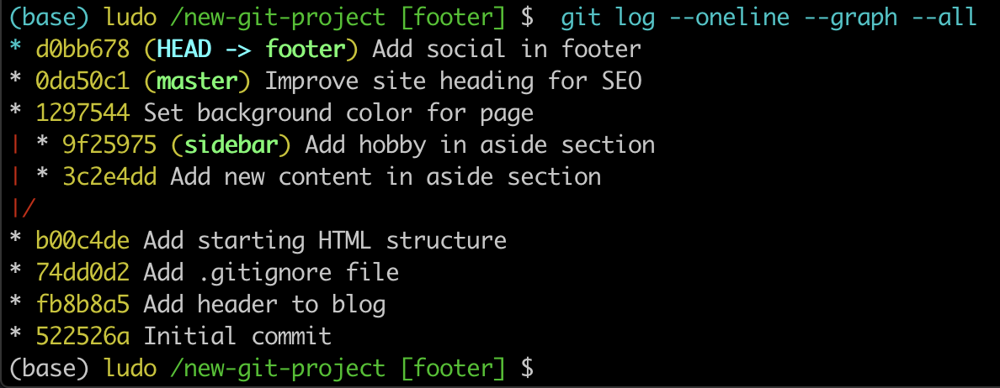

# Branching effectively

Alright! Now that you've learned how to create, list, and delete branches, let's put that knowledge to use!

First, make sure we're on the same page and have the same starter code. We're going to be working in the `new-git-project` project. The project has the following files:

- `index.html`
- `css/app.css` (empty)
- `js/app.js` (empty)

The CSS and JavaScript files are empty. Make sure the index file has the following content:

```html
<!doctype html>
<html lang="en">
<head>
    <meta charset="utf-8">
    <title>Blog Project</title>
    <meta name="viewport" content="width=device-width, initial-scale=1">
    <meta name="description" content="">
    <link rel="stylesheet" href="css/app.css">
</head>
<body>

    <header>
        <h1>Expedition</h1>
    </header>

    <div class="container">
        <main>

        </main>
    </div>

    <footer>
        Made with ♥ @ Udacity
    </footer>
    <script src="js/app.js"></script>
</body>
</html>
```
Let's add the new content.
```console
(base) ludo /new-git-project [master] $  git status
On branch master
Changes not staged for commit:
  (use "git add <file>..." to update what will be committed)
  (use "git checkout -- <file>..." to discard changes in working directory)

	modified:   index.html

no changes added to commit (use "git add" and/or "git commit -a")
(base) ludo /new-git-project [master] $  git add .
(base) ludo /new-git-project [master] $  git commit -m "Add starting HTML structure"
[master b00c4de] Add starting HTML structure
 1 file changed, 10 insertions(+)
(base) ludo /new-git-project [master] $
```
Check the git status.

```console
(base) ludo /new-git-project [master] $  git status
On branch master
nothing to commit, working tree clean
(base) ludo /new-git-project [master] $  git log --oneline
b00c4de (HEAD -> master) Add starting HTML structure
74dd0d2 Add .gitignore file
fb8b8a5 Add header to blog
522526a Initial commit
```

## The Game Plan
Right now we have all of our code on the master branch (which is the default branch). We're about to work with branches, by:

- adding content to them
- creating new branches
- switching back and forth between them

Let's use branches to make the following changes:

- on the `master` branch - add a default color to the page
- create a `sidebar` branch - create a sidebar for the page
- on the `master` branch - change the heading of the page
- on the `sidebar` branch - add more content to the sidebar
- create a `footer` branch - add social links to the footer

### Change 1 - Add Page Color
Make sure you're on the master branch and add the following content to **css/app.css**:

```css
body {
    background-color: #00cae4;
}
```
Save the file. Then add the file to the staging index and commit it to the repository.

```console
(base) ludo /new-git-project [master] $  git add .
(base) ludo /new-git-project [master] $  git commit -m "Set background color for page"
[master 1297544] Set background color for page
 1 file changed, 3 insertions(+)
(base) ludo /new-git-project [master] $  git log --oneline
1297544 (HEAD -> master) Set background color for page
b00c4de Add starting HTML structure
74dd0d2 Add .gitignore file
fb8b8a5 Add header to blog
522526a Initial commit
```

## Change 2 - Add Sidebar
Let's add a sidebar to the page. But let's say that we're not really sure if we like the new background color. So we'll place the `sidebar` branch on the commit *before* **the one that sets the page's color**. Your SHAs will be different, but, for me, the commit that's before the one that adds the color has a SHA of `b00c4de`. So adding the branch to that commit would look like:

```
$ git branch sidebar b00c4de
```
Now use the git checkout command to switch to the new sidebar branch. Running a `git log --oneline` shows me:

```console
(base) ludo /new-git-project [master] $  git branch sidebar b00c4de
(base) ludo /new-git-project [master] $  git checkout sidebar
Switched to branch 'sidebar'
(base) ludo /new-git-project [sidebar] $  git log --oneline
b00c4de (HEAD -> sidebar) Add starting HTML structure
74dd0d2 Add .gitignore file
fb8b8a5 Add header to blog
522526a Initial commit
```

Did you notice that the master branch does not display in the output? Where did it go!?! Is it lost? Don't worry, it's still there, we'll see how to get it to display in just a second.

But first, in your code editor, switch to the `app.css` file. Notice that it does not have the CSS we previously entered! **app.css** is now empty file. Because of this, if you load the project up in the browser, the page won't have a colored background. This makes sense since the CSS file is empty, but do you know why?

Answer: The content is stored safely on another branch.

If content is stored on one branch and their commits on another branch, those other commits are invisible until we switch to that other branch. When we switch, than we'll see those commits. But the original commits will no longer appear in our code editor. They aren't lost. They're just not displaying since we've checked out a different branch.

Create a sidebar by adding the following <aside> code to the **index.html** file:

```html
<div class="container">
    <main>

    </main>
</div>

<!-- start of new content -->
<aside>
    <h2>About Me</h2>

    <p>Lorem ipsum dolor sit amet, consectetur adipisicing elit. Eos, debitis earum molestias veniam suscipit aliquam totam exercitationem tempore neque vitae. Minima, corporis pariatur facere at quo porro beatae similique! Odit.</p>
</aside>
<!-- end of new content -->

<footer>
    Made with ♥ @ Udacity
</footer>
```

I added my `<aside>` content next to the `<main>` element as a fellow child of the `<div class="container">` element.

> WARNING: It's very important that you do not change the CSS file.

> We'll change it later, but if you make a change right now, we'll end up having what's known as a "merge conflict". We'll manually cause a merge conflict in a bit, but we don't want to have one right now, so just don't make any changes to the CSS file, yet.

```console
(base) ludo /new-git-project [sidebar] $  git add .
(base) ludo /new-git-project [sidebar] $  git commit -m "Add new content in aside section"
[sidebar 3c2e4dd] Add new content in aside section
 1 file changed, 8 insertions(+)
```

## Change 3 - Change Heading On Master
Let's switch back to the `master` branch and update the page heading.

Use the `git checkout` command to switch back to the master branch. (Notice that the HTML for the new sidebar is no longer there(!) because all that code is stored safely on the sidebar branch.)

Now change the `<h1>` heading of the page from "Expedition" to something else. How about something exciting like the word "Adventure"!?!

**index.html**
```html
<header>
    <h1>Adventure</h1>
</header>
```
How do you have Git show you the changes you've saved, but not yet committed?
`git diff`

```console
(base) ludo /new-git-project [master] $  git diff
diff --git a/index.html b/index.html
index f6e821c..bf24504 100644
--- a/index.html
+++ b/index.html
@@ -9,7 +9,7 @@
 </head>
 <body>
   <header>
-    <h1>Expedition</h1>
+    <h1>Adventure</h1>
   </header>

   <div class="container">
```

### Heading Change Have Been Saved And Committed
Now it's time to save the index.html file and make a commit to add this change to the repository. (I used the commit message "Improve site heading for SEO", but see if you can think of a better one)

```console
(base) ludo /new-git-project [master] $  git add index.html
(base) ludo /new-git-project [master] $  git commit -m "Improve site heading for SEO"
[master 0da50c1] Improve site heading for SEO
 1 file changed, 1 insertion(+), 1 deletion(-)
```

## Change 4 - Add More Content To Sidebar
Switch back to the sidebar branch (notice, again, that content we've added to the master branch isn't visible on the sidebar branch).

Now just add some content inside the `<aside>` element. Add something about yourself - your favorite movie or book (my favorite is LOTR!). Anything will work, you just need to add some content.

Again, make sure that you do not make changes to the CSS file.

Now save the index.html file and make a commit.

```console
(base) ludo /new-git-project [sidebar] $  git add index.html
(base) ludo /new-git-project [sidebar] $  git commit -m "Add hobby in aside section"
[sidebar 9f25975] Add hobby in aside section
 1 file changed, 4 insertions(+)
```

## Change 5 - Add Social Links To Footer
We've made a number of changes, and we're about to make our last one. Let's add some social icons to the page's footer. For grins and giggles, let's make this change on a new footer branch that's based off the `master` branch. So we need to **create** a new `footer` branch, first.

### Switch and create branch in one command

> The way we currently work with branches is to create a branch with the git branch command and then switch to that newly created branch with the git checkout command.

> But did you know that the git checkout command can actually create a new branch, too? If you provide the -b flag, you can create a branch and switch to it all in one command.

Let's use this new feature of the git checkout command to create our new `footer` branch and have this footer branch start at the same location as the master branch:

`$ git checkout -b footer master`

```console
(base) ludo /new-git-project [sidebar] $  git checkout -b footer master
Switched to a new branch 'footer'
(base) ludo /new-git-project [footer] $  git log --oneline
0da50c1 (HEAD -> footer, master) Improve site heading for SEO
1297544 Set background color for page
b00c4de Add starting HTML structure
74dd0d2 Add .gitignore file
fb8b8a5 Add header to blog
522526a Initial commit
```

## Add Social Links
Now that we're on a new branch, let's add some social links to the page's footer. I've added the following content:

```html
<footer>
    <!-- start of new content -->
    <section>
        <h3 class="visuallyhidden">Social Links</h3>
        <a class="social-link" href="https://twitter.com/udacity">
            
        </a>
        <a class="social-link" href="https://www.instagram.com/udacity/">
            
        </a>
        <a class="social-link" href="https://plus.google.com/+Udacity">
            
        </a>
    </section>
    <!-- end of new content -->
</footer>
```

Now save the file **index.html**, then stage it and commit the file to the repository.

```console
(base) ludo /new-git-project [footer] $  git add index.html
(base) ludo /new-git-project [footer] $  git commit -m "Add social in footer"
[footer d0bb678] Add social in footer
 1 file changed, 14 insertions(+), 1 deletion(-)
```

## See All Branches At Once
We've made it to the end of all the changes we needed to make! Awesome job!

Now we have multiple sets of changes on three different branches. We can't see other branches in the git log output unless we switch to a branch. Wouldn't it be nice if we could see all branches at once in the git log output.

As you've hopefully learned by now, the `git log` command is pretty powerful and can show us this information. We'll use the new `--graph` and `--all` flags:

`$ git log --oneline --graph --all`

The `--graph` flag adds the bullets and lines to the leftmost part of the output. This shows the actual branching that's happening. The `--all` flag is what **displays all of the branches in the repository**.

Running this command will show all branches and commits in the repository:



## Recap Of Changes
We've made the following changes:

1. on the master branch, we added a default color to the page
2. we created a sidebar branch and added code for a sidebar
3. on the master branch, we changed the heading of the page
4. on the sidebar branch, we added more content to the sidebar
5. we created a footer branch and added social links to the footer

These changes are all on their own, separate branches. Let's have Git combine these changes together. Combining branches together is called `merging`.
