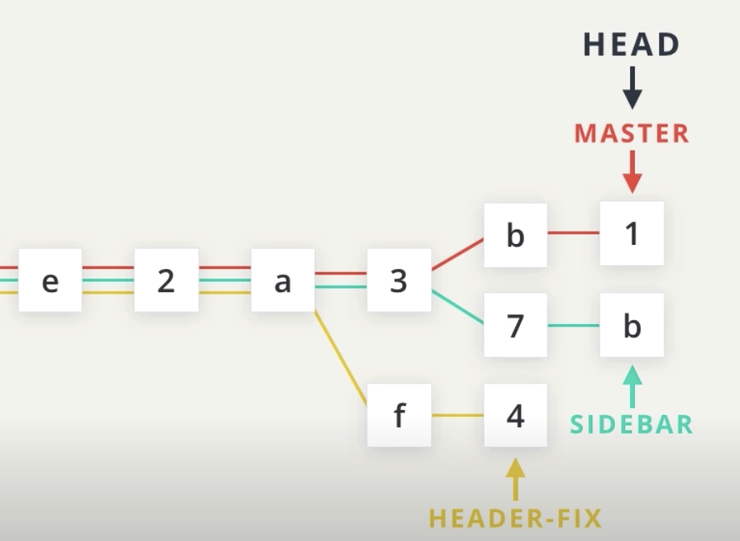
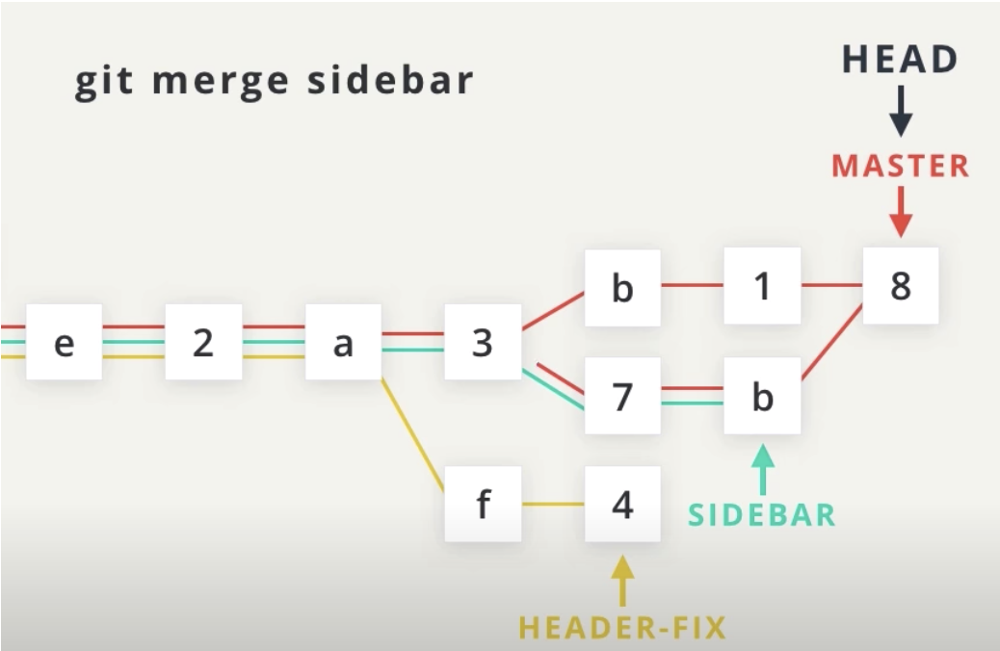
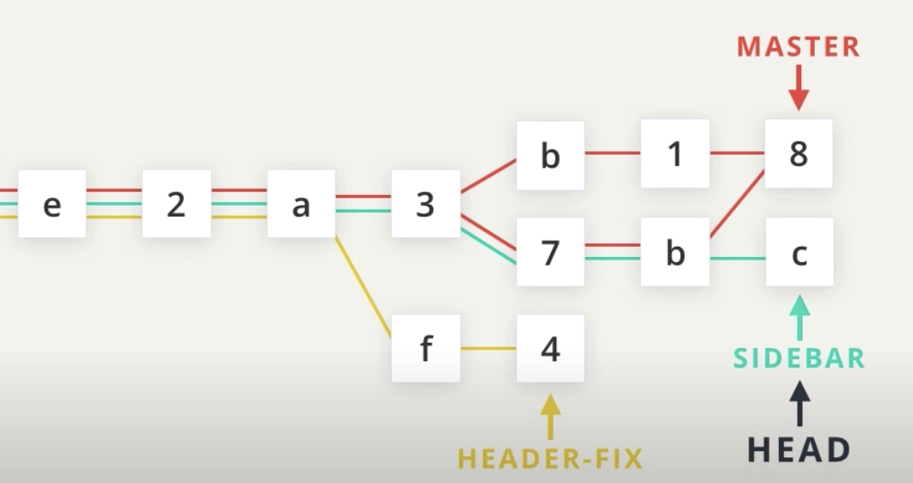
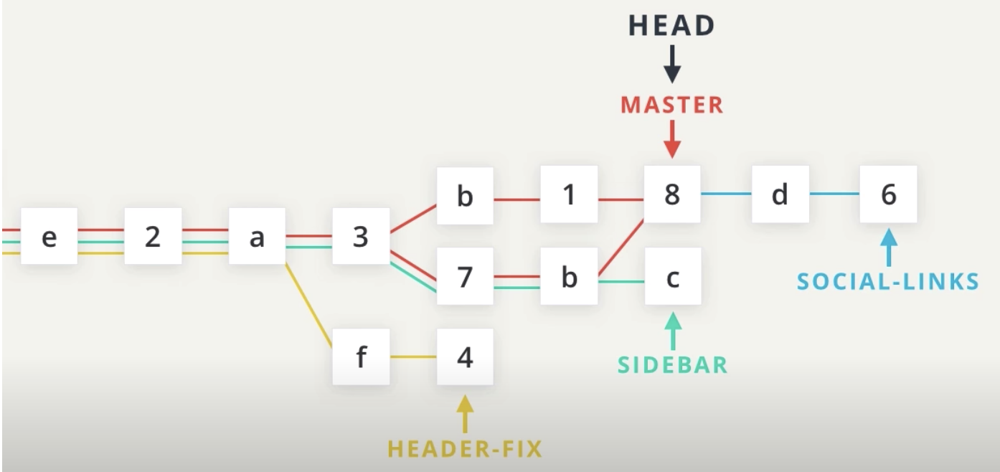
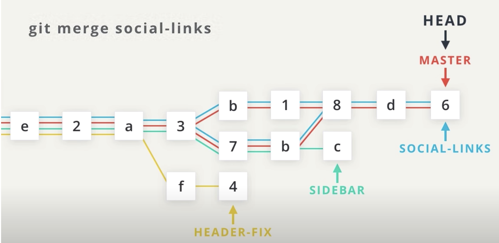
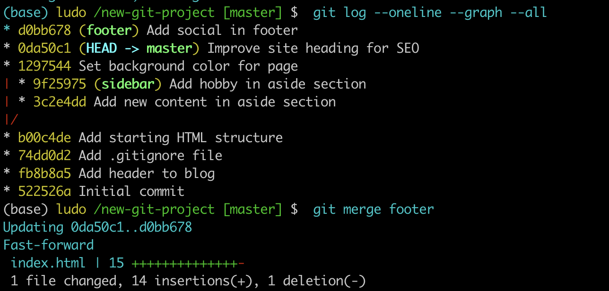
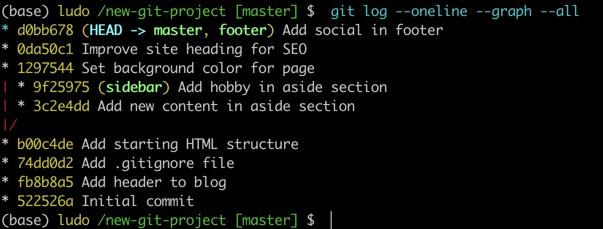
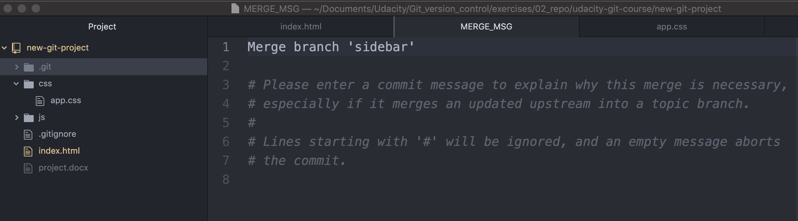
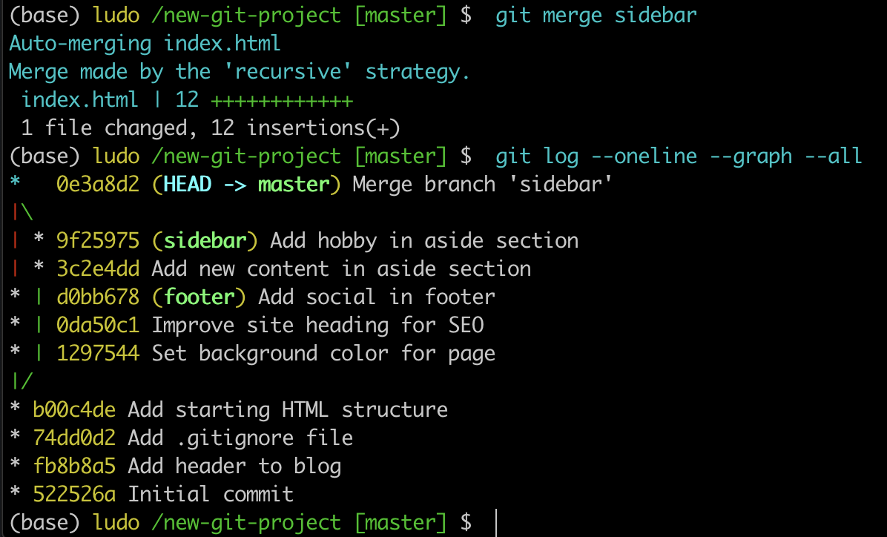

# Merging

Remember that the purpose of a topic branch (like `sidebar`) is that it lets you make changes that do not affect the `master` branch. Once you make changes on the topic branch, you can either decide that you don't like the changes on the branch and you can just delete that branch, or you can decide that you want to keep the changes on the topic branch and combine those changes in with those on another branch.

**Combining branches together** is called `merging`.

Git can automatically merge the changes on different branches together. This branching and merging ability is what makes Git *incredibly powerful*! You can make small or extensive changes on branches, and then just use Git to combine those changes together.

Let's see how this works, in theory. Pay attention to the two main types of merges in Git, a **regular merge** and a **Fast-forward merge**.



Here's our imaginary project that's got the different branches. Let's say we want to **merge the master and sidebar branches** together. When a **merge happens**, **it makes a commit**. Since `HEAD` is pointing to the master branch, the **merge commit** will **be placed on the master branch** and it **will move forward**.



Let's merge `sidebar` into `master`. Notice that a **merge commit links to two different earlier commits**. So commit `8` has a reference to the last commit of the `sidebar` branch.



This doesn't affect the `sidebar` branch. We can switch back to it `git checkout sidebar` and still make commits on it. No problem. Let's switch back to master.
`git checkout master`.



Let's say we had a `social links` branch that's a bit ahead of the `master` branch.



The master branch doesn't have the `social links` commits in it yet. If we want those commits in the master branch, we would merge the `social links` branch into the `master` branch. Since `HEAD` is pointing to `master`, the `master` branch will move when a merge is made `git merge social-links`. Now, because the `social links` branch is just ahead of `master`, we'll do what's called a **fast forward merge**. Also, the order of the coloured lines doesn't matter here. We can move the red line to the top and nothing changes. The lines are just there to **connects commits together**.

### Quick check in

Let's do a quick check-in to make sure we're both starting at the same point. Check off each of the following:

- I am in the `new-git-project` project
- I have checked out the `master` branch.
- The output of `git status` includes the text `working directory clean`.

```console
(base) ludo /new-git-project [footer] $  git checkout master
Switched to branch 'master'
(base) ludo /new-git-project [master] $  git status
On branch master
nothing to commit, working tree clean
(base) ludo /new-git-project [master] $
```

:warning: **Know the Branch** :warning:

> It's very important to know which branch you're on when you're about to merge branches together. Remember that making a merge makes a commit.

> As of right now, we do not know how to undo changes. We'll go over it in the next lesson, but if you make a merge on the wrong branch, use this command to undo the merge:

`git reset --hard HEAD^`

> (Make sure to include the `^` character! It's a known as a "Relative Commit Reference" and indicates "the parent commit". We'll look at Relative Commit References in the next lesson.)

## The Merge Command
The `git merge` command is used to combine Git branches:


`$ git merge <name-of-branch-to-merge-in>`

When a merge happens, Git will:

- look at the branches that it's going to merge
- look back along the branch's history to find a single commit that both branches have in their commit history
- combine the lines of code that were changed on the separate branches together
makes a commit to record the merge.

## Fast-forward Merge
In our project, I've checked out the `master` branch and I want it to have the changes that are on the `footer` branch. If I wanted to verbalize this, I could say this is - "I want to merge in the `footer` branch". That "merge in" is important; when a merge is performed, **the other branch's changes are brought into the branch that's currently checked out**.

Let me stress that again - **When we merge, we're merging some other branch into the current (checked-out) branch**. We're not merging two branches into a new branch. We're not merging the current branch into the other branch.

Now, since footer is directly ahead of master, this merge is one of the easiest merges to do. **Merging footer into master will cause a Fast-forward merge**. A Fast-forward merge will just move the currently checked out branch forward until it points to the same commit that the other branch (in this case, footer) is pointing to.




To merge in the footer branch, run:

`git merge footer`



Take a look at the repository, again, now that you've merged the two branches together. The master branch and the footer branch point to the same commit.

## Perform A Regular Merge
Fantastic work doing a Fast-forward merge! That wasn't too hard, was it?

But you might say - "Of course that was easy, all of the commits are already there and the branch pointer just moved forward!"...and you'd be right. It's the simplest of merges.

So let's do the more common kind of merge where **two divergent branches are combined**. You'll be surprised that to merge in a divergent branch like sidebar is actually no different!

To merge in the sidebar branch, make sure you're on the master branch and run:

`$ git merge sidebar`

Because **this combines two divergent branches**, a commit is going to be made. And when a commit is made, a commit message needs to be supplied.



**Since this is a merge commit a default message is already supplied**. You can change the message if you want, but **it's common practice to use the default merge commit message**. So when your code editor opens with the message, just close it again and accept that commit message.

This is what my Terminal shows after using the default commit message:



## What If A Merge Fails?
The merges we just did were able to merge successfully. Git is able to intelligently combine lots of work on different branches. However, there are times when it can't combine branches together. When a merge is performed and fails, that is called a **merge conflict**. We'll look at merge conflicts, what causes them, and how to resolve them in the next lesson.

## Merge Recap
To recap, the git merge command is used to combine branches in Git:

`$ git merge <other-branch>`

There are two types of merges:

- **Fast-forward merge** – the branch being merged in must be ahead of the checked out branch. The checked out branch's pointer will just be moved forward to point to the same commit as the other branch.

- **the regular type of merge**
  - two divergent branches are combined
  - a merge commit is created

### Further Research
- [Basic Merging](https://git-scm.com/book/en/v2/Git-Branching-Basic-Branching-and-Merging#Basic-Merging) from Git Book
- [git-merge](https://git-scm.com/docs/git-merge) from Git Docs
- [git merge](https://www.atlassian.com/git/tutorials/using-branches/git-merge) from Atlassian blog
