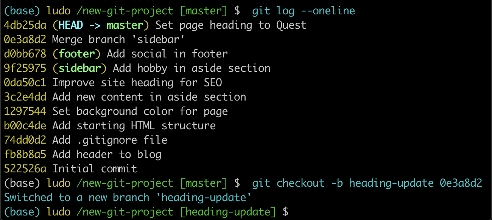

# Merge conflicts

**Sometimes Merges Fails**

Most of the time Git will be able to merge branches together without any problem. However, there are instances when a merge cannot be fully performed automatically. When a merge fails, it's called a **merge conflict**.

If a merge conflict does occur, Git will try to combine as much as it can, but then it will leave special markers (e.g. `>>>` and `<<<`) that tell you where you (yep, you the programmer!) **needs to manually fix**.

## What Causes A Merge Conflict

As you've learned, Git tracks lines in files. **A merge conflict will happen when the exact same line(s) are changed in separate branches**. For example, if you're on a `alternate-sidebar-style` branch and change the sidebar's heading to `"About Me"` but then on a different branch and change the sidebar's heading to `"Information About Me"`, which heading should Git choose? **You've changed the heading on both branches, so there's no way Git will know which one you actually want to keep**. And it sure isn't going to just randomly pick for you!

Let's force a merge conflict so we can learn to resolve it. Trust me, it's simple once you get the hang of it! **Remember that a merge conflict occurs when Git isn't sure which line(s) you want to use from the branches that are being merged**. So we need to edit the same line on two different branches...and then try to merge them.

## Forcing A Merge Conflict!

Remember that a merge conflict occurs when the exact same line(s) are changed in separate branches. Let's alter the page's heading on two different branches. So Let's:

- change the heading on the `master` branch
- create a `heading-update` branch that's located on the commit right before the recently modified master branch
- change the same heading
- switch back to the `master` branch
- merge in the `heading-update` branch

### Change Heading On Branch 1

Since the `master` branch is just a regular branch like all the rest, let's just alter the heading while we're on the master branch. So change the `<h1>` heading from whatever you have it to something else. For me, the heading is currently "Adventure" on line 13, and I'm changing it to `"Quest"`.

**index.html**
```html
<header>
    <h1>Quest</h1>
</header>
```
In the Terminal
```console
(base) ludo /new-git-project [master] $  git status
On branch master
Changes not staged for commit:
  (use "git add <file>..." to update what will be committed)
  (use "git checkout -- <file>..." to discard changes in working directory)

	modified:   index.html

no changes added to commit (use "git add" and/or "git commit -a")
```

Now, commit the changes.

```
(base) ludo /new-git-project [master] $  git add index.html
(base) ludo /new-git-project [master] $  git commit -m "Set page heading to "Quest" "
[master 4db25da] Set page heading to Quest
 1 file changed, 1 insertion(+), 1 deletion(-)
```
Once you've made the change, save the file and commit it to the repository.

### Change Heading On Branch 2
Now we need to create a different branch and update the heading on that branch.

Now this is important, we need to create a branch that's not branching *from the master branch*. If we make a change that branches off of the master branch, then that change will be "ahead" of this one and Git will just use that change instead of the one we just made on master. **So we need to put the branch "in the past"**.



Let's just **create a branch that's on the commit right before the most recent one**.

So use Git log to get the previous commit's SHA and create a branch on that commit.

```console
(base) ludo /new-git-project [master] $  git checkout -b heading-update 0e3a8d2
Switched to a new branch 'heading-update'
```

Here's what my Git log looks like after creating a heading-update branch:


Ok, now that we've got our branch created, we just need to update the heading, again. Now make sure you change the *exact same line that you changed on the master branch*. I'm changing `"Adventure"` on line 13 to `"Crusade"`.

**index.html**
```html
<header>
    <h1>Crusade</h1>
</header>
```

Then save the file and commit it to the repository.

```console
(base) ludo /new-git-project [heading-update] $  git add index.html
(base) ludo /new-git-project [heading-update] $  git commit -m "Set page heading to  "Crusade" "
[heading-update 9c4d80e] Set page heading to  Crusade
 1 file changed, 1 insertion(+), 1 deletion(-)
```

Here's what my Git log looks like:


*Both the `master` branch and the `heading-update` branch alter the same line of the same file*

Ok, we're just about to cause a merge conflict, make sure you're at the same place I am:

- I've made a commit on the `master` branch that changes the heading
- I've made a commit on the `heading-update` branch that **also** changes the heading
- I'm currently on the `master` branch

Make sure you're on the `master` branch (we could really do this on either branch, but **I just have a habit of keeping the master branch the main one that other topic branches get merged into**) and merge in the heading-update branch:

`$ git merge heading-update`

You should see the following:


*The Terminal application showing the output of a merge that resulted in a merge conflict. The word "CONFLICT" appears and says that the conflict occurred in the index.html*

## Merge Conflict Output Explained
The output that shows in the Terminal is:

```
$ git merge heading-update
Auto-merging index.html
CONFLICT (content): Merge conflict in index.html
Automatic merge failed; fix conflicts and then commit the result.
```

Notice that right after the `git merge heading-update` command, it tries merging the file that was changed on both branches (index.html), but that there was a conflict. Also, notice that it tells you what happened - "Automatic merge failed; fix conflicts and then commit the result".

Remember our good friend git status? Well he'll come in really handy when working with merge conflicts.

```console
(base) ludo /new-git-project [master|MERGING] $  git status
On branch master
You have unmerged paths.
  (fix conflicts and run "git commit")
  (use "git merge --abort" to abort the merge)

Unmerged paths:
  (use "git add <file>..." to mark resolution)

	both modified:   index.html

no changes added to commit (use "git add" and/or "git commit -a")
```

The git status output tells us to that the merge conflict is inside index.html. So check out that file in your code editor!


*Code editor showing the merge conflict indicator*

## Merge Conflict Indicators Explanation
The editor has the following merge conflict indicators:

- `<<<<<<< HEAD` everything below this line (until the next indicator) shows you what's on the current branch
- `||||||| merged common ancestors` everything below this line (until the next indicator) shows you what the original lines were
- `=======` is the end of the original lines, everything that follows (until the next indicator) is what's on the branch that's being merged in
- `>>>>>>> heading-update` is the ending indicator of what's on the branch that's being merged in (in this case, the heading-update branch)

## Resolving A Merge Conflict
Git is using the merge conflict indicators to show you what lines caused the merge conflict on the two different branches as well as what the original line used to have. So to resolve a merge conflict, you need to:

- choose which line(s) to keep
- remove all lines with indicators

What are these magical boxes appearing in Atom?
Atom ships with a Git package installed, which is what is working this magic for us. It highlights the conflicts and offers handy `Use me` boxes to easily pick one or the other option, along with a `...` icon to see more options for resolving the conflict.
The text editor provides shortcuts to use in case we select one of the three versions. If you want to use a different edit than we need to change it manually. So, in the `...` button choose the option `dismiss`. Therefore, we remove all lines with indicators.

```html
<header>
    <h1>Quest</h1>
    <h1>Adventure</h1>
    <h1>Crusade</h1>
</header>
```

For some reason, I'm not happy with the word "Crusade" right now, but "Quest" isn't all that exciting either. How about `"Adventurous Quest"` as a heading?!?

```html
<header>
    <h1>Adventurous Quest</h1>
</header>
```


## Commit Merge Conflict

Once you've removed all lines with merge conflict indicators and have selected what heading you want to use, just save the file, add it to the staging index, and commit it! Just like with a regular merge,


So let's do that, let's do git add `index.html`. Now it's added. Better git status again. **Changes to be committed. And it tells me all conflicts are fixed but you're still merging**. This was a merge in a single file. **It's possible that I could have had conflicts in five or six different files**. I could have had conflicts in 20 files. **I need to go through and fix each one in turn**. And that can take a little while.


Now, let's commit the only change.


this will pop open your code editor for you to supply a commit message. Just like before, it's common to use the provided merge commit message, so after the editor opens, just close it to use the provided commit message.

```console
(base) ludo /new-git-project [master|MERGING] $  git commit
[master f0a49be] Merge branch 'heading-update'
(base) ludo /new-git-project [master] $
```

And that's it! Merge conflicts really aren't all that challenging once you understand what the merge conflict indicators are showing you.


## Merge Conflict Recap
A merge conflict happens when the same line or lines have been changed on different branches that are being merged. Git will pause mid-merge telling you that there is a conflict and will tell you in what file or files the conflict occurred. To resolve the conflict in a file:

- locate and remove all lines with merge conflict indicators
- determine what to keep
- save the file(s)
- stage the file(s)
- make a commit

Be careful that a file might have merge conflicts in multiple parts of the file, so make sure you check the entire file for merge conflict indicators - a quick search for `<<<` should help you locate all of them.

## Further Research

- [Basic Merge Conflicts](https://git-scm.com/book/en/v2/Git-Branching-Basic-Branching-and-Merging#Basic-Merge-Conflicts) from the Git book
- [How Conflicts Are Presented](https://git-scm.com/docs/git-merge#_how_conflicts_are_presented) from the Git docs
