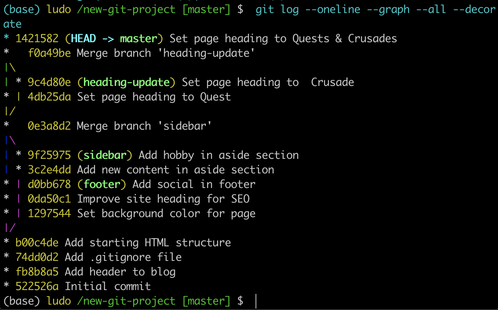

# Reverting A Commit

**What is a Revert?**

When you tell Git to **revert** a specific commit, Git takes the changes that were made in commit and does the exact opposite of them. Let's break that down a bit.

If a character is added in commit A, if Git reverts commit A, then Git will make a new commit where that character is deleted.

It also works the other way where if a character/line is removed, then reverting that commit will add that content back!

We ended the previous lesson with a merge conflict and resolved that conflict by setting the heading to `Adventurous Quest`. Let's say that there's a commit in your repository that changes the heading now to `Quests & Crusades`.


*The most-recent commit changes the heading from "Adventurous Quest" to "Quests & Crusades".*

## The git revert Command
Now that I've made a commit with some changes, I can revert it with the git revert command

`$ git revert <SHA-of-commit-to-revert>`

Since the SHA of the most-recent commit is `1421582`, to revert it: I'll just run git revert `1421582` (this will pop open my code editor to edit/accept the provided commit message)

I'll get the following output:

```console
(base) ludo /new-git-project [master] $  git revert 1421582
[master 62dced9] Revert "Set page heading to Quests & Crusades"
 1 file changed, 1 insertion(+), 1 deletion(-)
(base) ludo /new-git-project [master] $
```

It creates a new commit.

```console
(base) ludo /new-git-project [master] $  git log --oneline --graph --all --decorate
* 62dced9 (HEAD -> master) Revert "Set page heading to Quests & Crusades"
* 1421582 Set page heading to Quests & Crusades
```

Did you see how the output of the git revert command tells us what it reverted? It uses the commit message of the commit that I told it to revert. Something that's also important is that it creates a *new commit*.

## Revert Recap
To recap, the git revert command is used to reverse a previously made commit:

`$ git revert <SHA-of-commit-to-revert>`

This command:

- will undo the changes that were made by the provided commit
- creates a new commit to record the change

## Further Research
- [git-revert](https://git-scm.com/docs/git-revert) from Git Docs
- [git revert](https://www.atlassian.com/git/tutorials/undoing-changes) Atlassian tutorial
