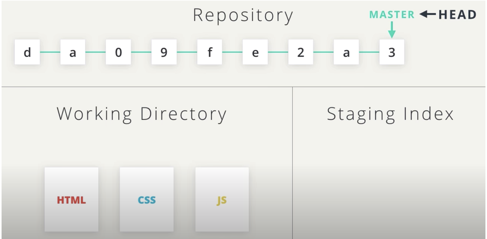

# Resetting Commits

**Reset vs Revert**
At first glance, resetting might seem coincidentally close to reverting, but they are actually quite different.

- **Reverting**: creates a new commit that reverts or undos a previous commit.
- **Resetting**, on the other hand, erases commits!

:warning: Resetting is Dangerous :warning:

> You've got to be careful with Git's resetting capabilities. This is one of the few commands that lets you erase commits from the repository. If a commit is no longer in the repository, then its content is gone.

> To alleviate the stress a bit, Git does keep track of everything for about 30 days before it completely erases anything. To access this content, you'll need to use the `git reflog` command. Check out these links for more info:

- [git-reflog](https://git-scm.com/docs/git-reflog)
- [Rewriting History](https://www.atlassian.com/git/tutorials/rewriting-history)
- [reflog](https://gitready.com/intermediate/2009/02/09/reflog-your-safety-net.html), your safety net

## Relative Commit References
You already know that you can reference commits by their SHA, by tags, branches, and the special HEAD pointer. Sometimes that's not enough, though. There will be times when you'll want to reference a commit relative to another commit. For example, there will be times where you'll want to tell Git about the commit that's one before the current commit...or two before the current commit. There are special characters called "Ancestry References" that we can use to tell Git about these relative references. Those characters are:

- `^` – indicates the parent commit
- `~` – indicates the first parent commit

Here's how we can refer to previous commits:

- the **parent commit** – the following indicate the parent commit of the current commit
  - `HEAD^`
  - `HEAD~`
  - `HEAD~1`

- the **grandparent commit** – the following indicate the grandparent commit of the current commit
  - `HEAD^^`
  - `HEAD~2`

- the **great-grandparent commit** – the following indicate the great-grandparent commit of the current commit
  - `HEAD^^^`
  - `HEAD~3`

The main difference between the `^` and the `~` is when a commit is created from a merge. A merge commit has two parents. With a merge commit, the `^` reference is used to indicate the first parent of the commit while `^2` indicates the second parent. The first parent is the branch you were on when you ran git merge while the second parent is the branch that was merged in.

It's easier if we look at an example. This what my git log currently shows:


Let's look at how we'd refer to some of the previous commits. Since `HEAD` points to the `9ec05ca` commit:

commit:

- `HEAD^` is the `db7e87a` commit
- `HEAD~1` is also the `db7e87a` commit
- `HEAD^^` is the `796ddb0` commit
- `HEAD~2` is also the `796ddb0` commit
- `HEAD^^^` is the `0c5975a` commit
- `HEAD~3` is also the `0c5975a` commit
- `HEAD^^^2` is the `4c9749e` commit (this is the grandparent's (HEAD^^) second parent (^2))
- `HEAD~4^2` is the `f69811c` commit

## The git reset Command
The git reset command is used to reset (erase) commits:

`$ git reset <reference-to-commit>`

It can be used to:

- move the HEAD and current branch pointer to the referenced commit
- erase commits
- move committed changes to the staging index
- unstage committed changes

## Git Reset's Flags
The way that Git determines if it erases, stages previously committed changes, or unstages previously committed changes is by the flag that's used. The flags are:

- `--mixed`
- `--soft`
- `--hard`

### Example



We've got here the three sections of our repository. The *Working Directory*, *Staging index*, and the *Repository* up at the top.

Let's say our repo currently has those commits in it, with master currently pointing at the most recent commit. We have `HEAD` pointing at `master` branch and our files are in the *Working Directory*.


Let's shifts things around a second. **These are the three places content from a reset commit will go**:

- Working Directory
- The Staging Index
- Trash, meaning it'll be erased.

Running `git reset HEAD~1` will move `HEAD` and master to the previous commit. But what happens to the commit with the number `3`? The changes that were made could be moved to the *Working Directory*, or the *Staging Index*, or they could just be thrown out in *Trash*. **It all depends on the** `flag` that's used with the reset command.

## --Mixed


If we run `git reset HEAD~1` without any `flags`, then the changes that were made in the commit with SHA `3` are applied to the files in the *Working Directory*.
This is because `--mixed` is the **default**. So running `git reset` without a flag is the same as running it with `--mixed`.

**Equivalent commands**
- `git reset HEAD~1`
- `git reset --mixed HEAD~1`

So, if we stage the files and commit again, we'll get the same commit content, but we'll get a different commit SHA, just because the `time stamp` of the commit will be different from the original one, but the commit content will be exactly the same.

## --Soft


Using the `--soft` flag will have the changes that were made in the commit with SHA `3` to the *Staging Index*. It's the same changes and now they're even staged for you. All you have to do is run `git commit` to get the commit back.
Again, since the `time stamp` is different, the new commit SHA will be different.

## --HARD


The last is the `--hard` flag. `git reset --hard HEAD~1`. This one will throw out all of the changes that were made in the commit with SHA `3`.

:bulb: **Back up Branch** :bulb:

> Remember that using the git reset command will erase commits from the current branch. So if you want to follow along with all the resetting stuff that's coming up, you'll need to create a branch on the current commit that you can use as a backup.

> Before I do any resetting, I usually create a backup branch on the most-recent commit so that I can get back to the commits if I make a mistake:

`$ git branch backup`


Let's look at each one of these flags.

## Reset's --mixed Flag

```console
(base) ludo /new-git-project [master] $  git log --oneline --graph --all --decorate
* 62dced9 (HEAD -> master) Revert "Set page heading to Quests & Crusades"
* 1421582 Set page heading to Quests & Crusades
*   f0a49be Merge branch 'heading-update'
```

Using the sample repo above with `HEAD` pointing to master on commit `62dced9`, running `git reset --mixed HEAD^` will take the changes made in commit `62dced9` and move them to the *working directory*.

Before resetting the commit, let's give a look at the **index.html** file.

```html
<header>
    <h1>Adventurous Quest</h1>
  </header>
```

The commit `62dced9` reverted the header of the `index.html` file  (`Quests & Crusade` in commit `1421582`) to the heading of commit `f0a49be` (`Adventurous Quest`). Before I do any resetting, I usually create a backup branch on the most-recent commit so that I can get back to the commits if I make a mistake: Now let's create a `backup` branch first.

```console
(base) ludo /new-git-project [master] $  git branch backup
(base) ludo /new-git-project [master] $  git branch
  backup
  footer
  heading-update
* master
  sidebar
```

This is the branching in the repo.

```console
(base) ludo /new-git-project [master] $  git log --oneline --graph --all --decorate
* 62dced9 (HEAD -> master, backup) Revert "Set page heading to Quests & Crusades"
* 1421582 Set page heading to Quests & Crusades
```

Now, let's reset the commit.

```console
(base) ludo /new-git-project [master] $  git reset --mixed HEAD^
Unstaged changes after reset:
M	index.html
```
Running `git reset --mixed HEAD~1` will move `HEAD` and master to the previous commit.

```console
(base) ludo /new-git-project [master] $  git log --oneline --graph --all --decorate
* 62dced9 (backup) Revert "Set page heading to Quests & Crusades"
* 1421582 (HEAD -> master) Set page heading to Quests & Crusades
```

Now, `HEAD` is pointing to the previous commit `1421582`.


If we open up the text editor, we see the modified files. If you want to compare the modified `index.html` file in the *working directory* to the unmodified file in the current commit `1421582`, then use the `git diff` command. I remind you that the `git diff` command is used to **get changes that have been made but haven't been committed yet**.

```console
(base) ludo /new-git-project [master] $  git diff
diff --git a/index.html b/index.html
index f338e81..1373ad8 100644
--- a/index.html
+++ b/index.html
@@ -9,7 +9,7 @@
 </head>
 <body>
   <header>
-    <h1>Quests & Crusades</h1>
+    <h1>Adventurous Quest</h1>
   </header>

   <div class="container">
```

Clearly, the header of the unmodified *index.html* file is `Quests & Crusades`.

:bulb: **Back To Normal** :bulb:

So if you want to go back to `Normal`, then you can easily get back to having the `master` branch point to the same commit as the `backup` branch. You'll just need to:

1. Remove the uncommitted changes from the working directory and restore the `unmodified` **index.html** file.
2. Merge `backup` into master.

Let's start with the first step **1**.

By looking at the output of the `git diff` command is possible to recover the previous status.

```html
<header>
    <h1>Quests & Crusades</h1>
</header>
```
Now see the git status.

```console
(base) ludo /new-git-project [master] $  git status
On branch master
nothing to commit, working tree clean
```

Let's move to the second step **2**.

```console
(base) ludo /new-git-project [master] $  git merge backup
Updating 1421582..62dced9
Fast-forward
 index.html | 2 +-
 1 file changed, 1 insertion(+), 1 deletion(-)
```

We did a *fast-forward* merge.

```console
(base) ludo /new-git-project [master] $  git log --oneline --graph --decorate --all
* 62dced9 (HEAD -> master, backup) Revert "Set page heading to Quests & Crusades"
* 1421582 Set page heading to Quests & Crusades
```

Now if we open up the editor and check the **index.html** file we should see the header section back to `Adventurous Quest`.

```html
<header>
    <h1>Adventurous Quest</h1>
</header>
```

## Reset's --soft Flag

Let's use the same few commits and look at how the `--soft` flag works:

```console
(base) ludo /new-git-project [master] $  git reset --soft HEAD^
(base) ludo /new-git-project [master] $  git status
On branch master
Changes to be committed:
  (use "git reset HEAD <file>..." to unstage)

	modified:   index.html
```
Now if we look at the repo's tree.

```console
(base) ludo /new-git-project [master] $  git log --oneline --graph --decorate --all
* 62dced9 (backup) Revert "Set page heading to Quests & Crusades"
* 1421582 (HEAD -> master) Set page heading to Quests & Crusades
```
The scenario is similar to the output of the `--mixed` flag, but the changes are now in the `staging index` area.

So now they're in our staging index. **What if we want to undo that change?** What if we say, oh, wait a minute, I don't want that, **I want to pull those back out again?**

Well it tells you right here.

- **(use "git reset HEAD <file>..." to unstage)**

Use `git reset HEAD` and then `<file>` the filename to unstage it.

```console
(base) ludo /new-git-project [master] $  git reset HEAD index.html
Unstaged changes after reset:
M	index.html
(base) ludo /new-git-project [master] $  git status
On branch master
Changes not staged for commit:
  (use "git add <file>..." to update what will be committed)
  (use "git checkout -- <file>..." to discard changes in working directory)

	modified:   index.html

no changes added to commit (use "git add" and/or "git commit -a")
```

Now, we are in the same scenario as the output of `--mixed` command. The changes are in the *Working Directory*. If we run the command `git diff`, we are able to see the changes.

```console
(base) ludo /new-git-project [master] $  git diff
diff --git a/index.html b/index.html
index f338e81..1373ad8 100644
--- a/index.html
+++ b/index.html
@@ -9,7 +9,7 @@
 </head>
 <body>
   <header>
-    <h1>Quests & Crusades</h1>
+    <h1>Adventurous Quest</h1>
   </header>

   <div class="container">
```

:bulb: **Back To Normal** :bulb:

In the previous example, we removed the changes manually. What if we have many lines or files to edit? Is there another way to **undo changes in the working directory**?

```console
(base) ludo /new-git-project [master] $  git status
On branch master
Changes not staged for commit:
  (use "git add <file>..." to update what will be committed)
  (use "git checkout -- <file>..." to discard changes in working directory)

	modified:   index.html

no changes added to commit (use "git add" and/or "git commit -a")
```

**(use "git checkout -- <file>..." to discard changes in working directory)**


Notice it tells you right here

- `git checkout --` and then the
- **name of the file to discard changes in the working directory**.

That's what we want to do. Now git checkout is a flexible command.

- `git checkout --`: we want to checkout a file on the current branch.

```console
(base) ludo /new-git-project [master] $  git checkout index.html
Updated 1 path from the index
(base) ludo /new-git-project [master] $  git status
On branch master
nothing to commit, working tree clean
```

And what it does is it goes to the repository and it checks it out. Just like it's checking out a library book. It checks it out and it replaces whatever we had in our directory with it. It discards the changes that are there. So it is powerful because it will remove any changes that were there and restores back to the version the repository has.

Now if we open the **index.html** file we should get back:

```html
<header>
    <h1>Quests & Crusades</h1>
</header>
```
Now, let's merge the `backup` into master again.

```console
(base) ludo /new-git-project [master] $  git merge backup
Updating 1421582..62dced9
Fast-forward
 index.html | 2 +-
 1 file changed, 1 insertion(+), 1 deletion(-)
(base) ludo /new-git-project [master] $  git log --oneline --graph --decorate --all
* 62dced9 (HEAD -> master, backup) Revert "Set page heading to Quests & Crusades"
* 1421582 Set page heading to Quests & Crusades
```

We restored the initial state of the repo.

## Reset's --hard Flag

Last but not least, let's look at the `--hard` flag:

```console
(base) ludo /new-git-project [master] $  git reset --hard HEAD^
HEAD is now at 1421582 Set page heading to Quests & Crusades
(base) ludo /new-git-project [master] $  git status
On branch master
nothing to commit, working tree clean
```

The changes are now **erased**. Now if we open the **index.html** file:

```html
<header>
    <h1>Quests & Crusades</h1>
</header>
```
Now, let's merge the `backup` into master again.

```console
(base) ludo /new-git-project [master] $  git merge backup
Updating 1421582..62dced9
Fast-forward
 index.html | 2 +-
 1 file changed, 1 insertion(+), 1 deletion(-)
```

## Reset Recap
To recap, the git reset command is used erase commits:

`$ git reset <reference-to-commit>`

It can be used to:

- move the `HEAD` and **current branch pointer** to the referenced commit
- **erase** commits with the `--hard` flag
- **moves committed changes to the staging index** with the `--soft` flag
- **moves committed changes to the working directory** with the `--mixed` flag
Typically, ancestry references are used to indicate previous commits. The ancestry references are:

- `^` – indicates the parent commit
- `~` – indicates the first parent commit

## Further Research
- [git-reset](https://git-scm.com/docs/git-reset) from Git docs
- [Reset Demystified](https://git-scm.com/book/en/v2/Git-Tools-Reset-Demystified) from Git Blog
- [Ancestry References](https://git-scm.com/book/en/v2/Git-Tools-Revision-Selection#Ancestry-References) from Git Book
