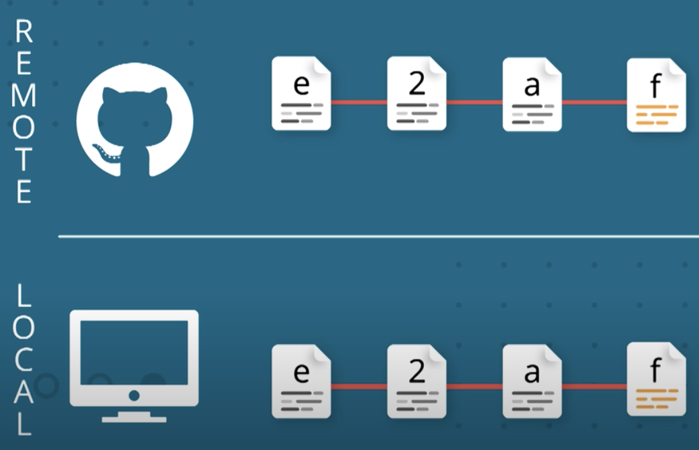

# Collaboration Setup

As a lone developer, you're probably comfortable working with a local repository. In this first lesson, we're going to talk about **remote repositories** and interacting with these remote repositories.

Let's say that you have a friend, we'll call her *Farrin*, and one day you two were together and you showed her what you've been working on. She had some ideas on features she could contribute to the project. But you don't want to give her your computer for her to make these changes, you want her to work on her computer. And, you don't want to have to wait for her to add these features, you want to keep working on the project and then just merge in her changes when she's finished. So how can we do that?

Well, let me tell you that emailing the project back and forth would be a maintenance nightmare after about two emails. **You're already tracking your project with Git, so we'll use it to manage everything**.

- So Farrin will work on the project on a specific branch and any changes she makes she'll add to that branch.

- While she's working in her branch, you'll work on the project but on your own specific branch.

- And then you can merge these branches together when you get the branch from Farrin.

:bulb: **Always use Topic Branch**

> Remember that it's incredibly helpful to make all of your commits on descriptively named topic branches. Branches help isolate unrelated changes from each other.

> So when you're collaborating with other developers make sure to create a new branch that has a descriptive name that describes what changes it contains.

We are using Git to keep track of our project. Now, that's great for working locally, but to be able to share this local repo with others we'll need another tool. The Tool we'll be using is **GitHub**.

**GitHub** is a **service for hosting version control repositories**. Now, even though their names are very similar, *Git* and *GitHub* are quite different.

**Git** is **the tool used to manage the repository** and you use Git primarily on the *command line*.

Now, **GitHub** is the **hosting service** which you typically interact with inside your *browser*.

We'll send a copy of our local repository up to **GitHub**. This copy is not on our local machine, so it's called a **remote repository**.

The main commands we'll be looking at in this lesson are:

- `git remote`: To **manage** the Remote Repository
- `git push`: To **Send** changes up to the Remote Repository
- `git pull`: To **Retrieve** updates from the Remote Repository

`git push` and `git pull` might not make a lot of sense at first, but think of these from the standpoint of your local machine.

### Git Push

You've got changes in your local repository that you want to be in the remote repository.

So, you'll **push** :arrow_up: the changes up to the Remote repository.

### Git Pull

But, if there are changes on the remote repository that you want in your local one,

You need to **pull** :arrow_down: those changes down.

## What is a Remote Repository?

**Git** is a **distributed version control system** which means there is not one main repository of information. **Each developer has a copy of the repository**. So you can have a copy of the repository (which includes the published commits and version history) and your friend can also have a copy of the same repository. Each repository has the exact same information that the other ones have, **there's no one repository that's the main one**.

Up until this point, you have probably been only working locally on a local repository. A **remote repository is the same Git repository like yours but it exists somewhere else**.

A **local repo** is the one that you work on in your local machine, **remote repositories** live elsewhere (e.g. a friend's computer, GitHub, etc).

### Ways to access a Remote

Remotes can be accessed in a couple of ways:

- with a **URL**
- **path to a file system**

Even though it's possible to create a remote repository on your file system, it's very rarely used. By far the most common way to access a remote repository is through a **URL to a repository that’s out on the web**.

The way we can interact and control a remote repository is through the Git remote command:

`$ git remote`

Let's say that our local repo has three branches in it `master`, `footer-fix` and `bugfix-login-form`. These branches are local, meaning they exist only on our machines and are not shared with other developers using the repo. **When we create a remote repo, it starts out empty, typically**.

To get the commits that are on these branches over the remote repository, we need to send them over. We can do this in two ways.

We can merge `footer-fix` and `bugfix-login-form` into `master` and just send `master` to the remote repo.

Or we can send all three branches to the remote repo. You're also not limited to just one remote. You can add as many remote repositories as you want!

A local repo can be connected to more than one repo.

## Why Multiple Remotes?

Why would you want to have multiple remote repositories? We'll look at this later but briefly, if you are working with multiple developers then you might want to get changes they're working on in their branch(es) into your project before they merge them into the master branch. You might want to do this if you want to test out their change before you decide to implement your changes.

Another example is if you have a project whose code is hosted on Github but deploys via Git to `Heroku`. You would have

- one remote for the `master` and
- one for the `deployment`.

**Make a Remote**

Now that we've learned about the purpose of remote repositories, let's add a remote repository to our own local one.
