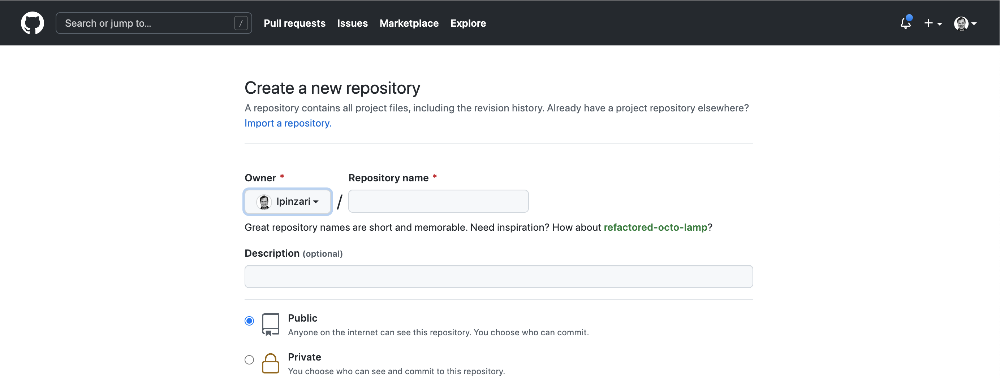
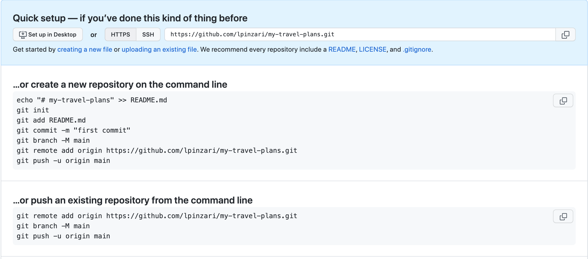

# Add a Remote Repository

**The Git remote command**

The `git remote` command will let you manage and interact with remote repositories.

`$ git remote`

Try running this command on a local repository that you haven't shared with anyone yet. What do you get?

```console
(base) ludo /new-git-project [master] $  git remote
(base) ludo /new-git-project [master] $
```
*No output is displayed since this repository does not have a connection to a remote*

If you haven't configured a remote repository then this command will display nothing. One caveat to this is if you have *cloned* a repository. If you have, then your repository *will automatically have a remote* because *it was cloned from the repository at the URL you provided*. Let's look at a repository that has been cloned.

**Example cloned repo**

`git clone https://github.com/GoogleChrome/lighthouse`

```console
(base) ludo /udacity-git-course  $  git clone https://github.com/GoogleChrome/lighthouse
Cloning into 'lighthouse'...
...
(base) ludo /udacity-git-course  $  ls
course-git-blog-project lighthouse              new-git-project
(base) ludo /udacity-git-course  $
```

After cloning the `lighthouse` repo. Let's change directory in the `lighthouse` repo folder and run the command `git remote`.

```console
(base) ludo /udacity-git-course  $  cd lighthouse/
(base) ludo /lighthouse [master] $  git remote
origin
(base) ludo /lighthouse [master] $
```

The project I'm in is a clone of a Google's project called [Lighthouse](https://github.com/GoogleChrome/lighthouse). This project was cloned from GitHub and is for auditing, performance metrics, and best practices for Progressive Web Apps.
The output is the word **origin**.

## Remote Shortnames

The output of git remote is just the word `origin`. Well that's weird. The word `"origin"`, here, is referred to as a "**shortname**". A shortname is just a short and **easy way to refer to the location of the remote repository**.

A shortname is local to the current repository (as in, your local repository). The word "`origin`" is **the defacto name that's used to refer to the main remote repository**. It's possible to rename this to something else, but typically it's left as "origin".

Why do we care about how easy it is to refer to a remote repositories location? Well as you'll soon find out we'll be needing the path to the remote repository in a lot of our commands. And **it's a lot easier to use just a name rather than the entire path to the remote repository**.

If you want to see the full path to the remote repository, then all you have to do is use the `-v` **flag** (verbose):

```console
(base) ludo /lighthouse [master] $  git remote -v
origin	https://github.com/GoogleChrome/lighthouse (fetch)
origin	https://github.com/GoogleChrome/lighthouse (push)
```
*The output includes the short name and the full URL that it refers to*

Here you can see that if the word origin is used, what actually is used is the path to `https://github.com/GoogleChrome/lighthouse.git` . It also might seem a little bit odd that there are now two remotes both of them "`origin`" and both going to the same URL. The only difference is right at the end: the (`fetch`) part and the (`push`) part

We'll be looking at both fetch and push in upcoming sections.

We've done enough looking for now. Let's do something active and create our own simple project and send it to a remote repository!

## Create A Simple Project

We're going to need a sample project to use during this course to test out
- working with remote repositories,
- sending updates to the remote repository,
- and getting changes from the remote repository, too.

If you don't have a project that you want to use then you can follow along with me!

- create a new directory for your project with the name `my-tavel-plans`
- use `git init` to turn the `my-travel-plans` directory into a git repository
- create a `README.md` file
- create a `index.html` file
- create a folder `css` with the file `app.css` file

```console
(base) ludo /udacity-git-course  $  mkdir my-travel-plans
(base) ludo /udacity-git-course  $  cd my-travel-plans/
(base) ludo /my-travel-plans  $  git init
Initialized empty Git repository in /Users/ludovicopinzari/Documents/Udacity/Git_version_control/exercises/02_repo/udacity-git-course/my-travel-plans/.git/
(base) ludo /my-travel-plans [master] $  touch README.md
(base) ludo /my-travel-plans [master] $  touch index.html
(base) ludo /my-travel-plans [master] $  mkdir css
(base) ludo /my-travel-plans [master] $  cd css
(base) ludo /css [master] $  touch app.css
```

Now the project directory is:

```console
my-travel-plans
  |
  |-index.html
  |-README.md
  |-css
    |-app.css
```

## README File Content

```
# Travel Destinations

A simple app to keep track of destinations I'd like to visit.
```

HTML File Content
Add the following content to the index.html file:

```html
<!doctype html>
<html lang="en">
<head>
    <meta charset="utf-8">
    <title>Travels</title>
    <meta name="description" content="">
    <link rel="stylesheet" href="css/app.css">
</head>
<body>

    <div class="container">
        <div class="destination-container">
            <div class="destination" id="florida">
                <h2>Florida</h2>
            </div>

            <div class="destination" id="paris">
                <h2>Paris</h2>
            </div>
        </div>
    </div>

</body>
</html>
```
## CSS File Content

Add the following information to the CSS file:

```css
html {
    box-sizing: border-box;
    height: 100%;
}

*,
*::before,
*::after {
    box-sizing: inherit;
}

body {
    display: flex;
    margin: 0;
    height: 100%;
}

.container {
    margin: auto;
    padding: 1em;
    width: 80%;
}

.destination-container {
    display: flex;
    flex-flow: wrap;
    justify-content: center;
}

.destination {
    background: #03a9f4;
    box-shadow: 0 1px 9px 0 rgba(0, 0, 0, 0.4);
    color: white;
    margin: 0.5em;
    min-height: 200px;
    flex: 0 1 200px;
    display: flex;
    justify-content: center;
    align-items: center;
    text-align: center;
}

h2 {
    margin: 0;
    transform: rotate(-45deg);
    text-shadow: 0 0 5px #01579b;
}

#florida {
    background-color: #03a9f4;
}

#paris {
    background-color: #d32f2f;
}
```

At this point this is what my project looks like but remember your project can be anything you want you just need to make sure you have a project with some commits in it. You can open the `index.html` file from the terminal.

```console
(base) ludo /my-travel-plans [master] $  open index.html
```

## Hosting on GitHub

There are several options for us to host Git projects. But one of the most popular hosting sites is a service called **GitHub** which you might have heard of before. Now the problem with GitHub is that the name is so similar to Git that people sometimes conflate Git and GitHub and think they're the same thing when they're actually quite different.

- **Git** is a version control tool
- **GitHub** is a **service to host Git projects**

If you are already familiar with GitHub and know how to create a repo without initializing a README, you can skip this part and go ahead and make your repo with the same name as your sample project, and **remember not to initialize a readme**.

If you don't have an account yet, sign up for one on [GitHub's join page](https://github.com/). There are different types of GitHub accounts you can sign up for but the free tier is all that we need for this course. And a free account is what most people use anyway. Once you create your account, sign in to GitHub and you'll be on the home page:


*This is what my profile page shows right after signing in. Your information will be different depending on the number of repositories you have and other users and repositories you follow*


GitHub has two locations where you can create a new repo. The **plus** icon located in the page's header and the `New` button in the repository section.

I use the button in the navigation bar because the navigation bar is available on every single page, which makes it easy to get to the new repo link.

Clicking on the `plus` icon in GitHub's header displays a dropdown of options. One option is the **New repository** link.

In the dropdown, the New repository link takes you to the repository creation page.


*GitHub's create a new repository page. The only required field is the `repository name` field.*

We only need to fill out just one field in this form - the repository name field.

Typically you want to use the name of your project as the name of the repository. Creating a repository, modifying it later, or deleting it is relatively easy so don't feel like you have to get the name perfect right here on this page. I'm going to create a repository called "`my-travel-plans`" that's the **same name as the sample project I created**.

It's okay to leave the description empty for now (although, you can provide one if you want). I'll make my repository public (which means my repository and all my code will be freely available for anyone to look at). If I want this to be a private repository, then I'd choose "Private".


I'm also going to leave the "Initialize this repository with the README" option unchecked because I don't want GitHub to add a README file for me.

:warning: Don't initialize with a README.md :warning:

Make sure that you leave the "Initialize this repository with the README" unchecked. We'll be providing our own README, so we don't want GitHub to provide one automatically.

Also, if we let GitHub auto-generate a new README file for us, then **we won't be provided with the setup commands to run in the terminal**. It's still possible to get that information, but it will be hidden away.

So just make sure to leave this field unchecked, and you'll be good to go!

Now just click that big "`Create Repository`" button to create your remote repository!



After creating a `new repository`, we're presented with this quick `setup page`. The first thing we see is that we can choose either the `HTTPS URL` or the `SSH` version. We select the `HTTPS` url.

The next section down is *what to do with a new repository*. However, we have an exisiting repository which will look at in just a second. But if you want to create your remote repository on GitHub you can do that first, and then follow these commands on the command line:

**.. or create a new repository on the command line**
```console
$ echo "# my-travel-plans" >> README.md
$ git init
$ git add README.md
$ git commit -m "first commit"
$ git branch -M main
$ git remote add origin https://github.com/lpinzari/my-travel-plans.git
$ git push -u origin main
```

The first line would create a README file with a simple heading, then we initialize the repo ...

We are not going to be looking at the `new repository section`, since **we have an existing repo**, so let's check that out.

**.. or push an exisitng repository from the command line**

```console
git remote add origin https://github.com/lpinzari/my-travel-plans.git
git branch -M main
git push -u origin main
```

So the first line **creates a connection to the remote repository upon GitHub**. We'll look at pushing in the next section, but for now, just copy the top line and run it in your terminal. The second line renames your principal branch with the name `main`, but I prefer to keep the name **master**. So **skip the second line**. We'll be looking at the last line in the next lesson.

:warning: **Remotes & Permissions** :warning:
Warning: It's important that you use the URL for the new repository that you created on your GitHub profile. Do not use the one above because that's for the project I just created on my account. Because this project is on my account you do not have access to send changes to it.

So make sure you use the URL from your project.

- `git remote add origin https://github.com/<your_url>`

Remember that the `git remote` command is used to create and manage remote repositories. So I'll use the following command to create a connection from my local repository to the remote repository I just created on my GitHub account:

```console
(base) ludo /my-travel-plans [master] $  git remote add origin https://github.com/lpinzari/my-travel-plans.git
```
*`git remote add` create a short name of `origin` that points to the project on GitHub*

There are a couple of things to notice about the command you just ran on the command line:

1. first, this command has the sub command add
the word origin is used - this is setting the shortname that we discussed earlier

2. Remember that the word `origin` here isn't special in any way.
If you want to change this to `repo-on-GitHub`, then (before running the command) just change the word "`origin`" to "`repo-on-GitHub`":

`$  git remote add repo-on-GitHub https://github.com/lpinzari/my-travel-plans.git`

3. third, the full path to the repository is added (i.e. the URL to the remote repository on the web)

Now I'll use `git remote -v` to verify that I've added the remote repository correctly:

```console
(base) ludo /my-travel-plans [master] $  git remote -v
origin	https://github.com/lpinzari/my-travel-plans.git (fetch)
origin	https://github.com/lpinzari/my-travel-plans.git (push)
(base) ludo /my-travel-plans [master] $
```
*Running `git remote -v` displays both the shortname and the URL*

Fantastic! Everything is looking good.

## Recap
A remote repository is a repository that's just like the one you're using but it's just stored at a different location. To manage a remote repository, use the git remote command:

`$ git remote`

- It's possible to have links to multiple different remote repositories.
- A shortname is the name that's used to refer to a remote repository's location. Typically the location is a URL, but it could be a file path on the same computer.
- `git remote add` is used to add a connection to a new remote repository.
- `git remote -v` is used to see the details about a connection to a remote.

## Further Research
- [Working with Remotes](https://git-scm.com/book/en/v2/Git-Basics-Working-with-Remotes#_showing_your_remotes) from the Git book
- [the git remote command](https://git-scm.com/docs/git-remote) from the Git docs
