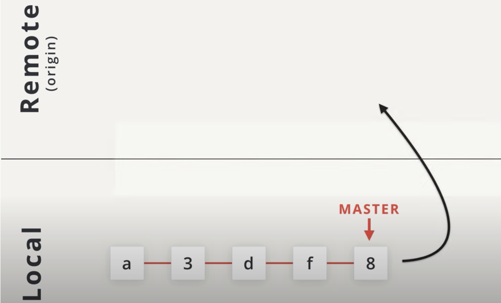
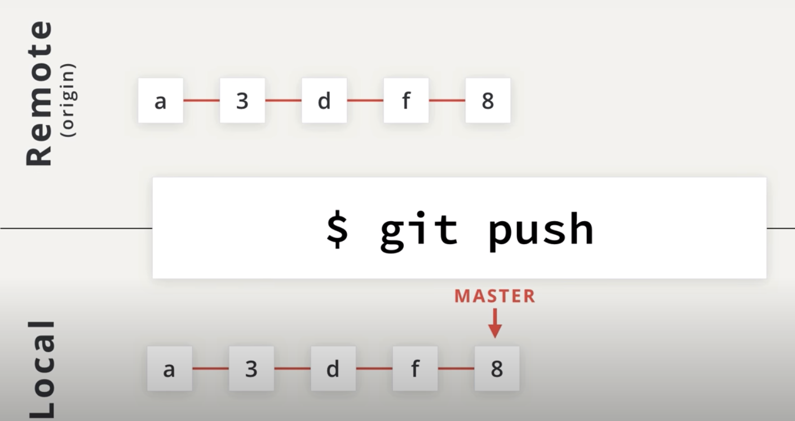
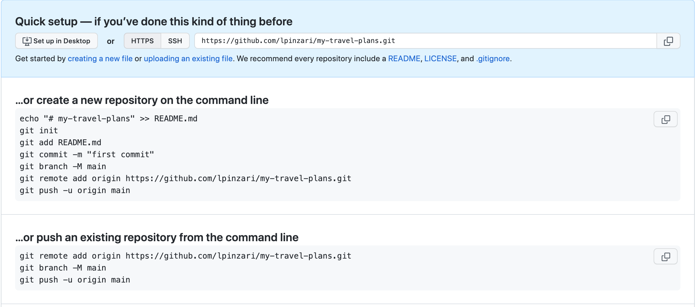

# Push changes to a Remote



We have our local repo down the image and a remote repo up. Our local repo has a number of commits on the master branch, but the remote repo is completely empty. Now, how do we get these commits from our local repo up into the remote repo?



We can do that with the `git push` command. That will take all of the commits from the local repo and **send** or **push them up** to the remote repo.

```console
(base) ludo /my-travel-plans [master] $  git add README.md
(base) ludo /my-travel-plans [master] $  git commit -m "Initial commit"
[master (root-commit) d9d3c80] Initial commit
 1 file changed, 3 insertions(+)
 create mode 100644 README.md
(base) ludo /my-travel-plans [master] $  git add index.html
(base) ludo /my-travel-plans [master] $  git commit -m "Set travel destination"
[master 2a03d73] Set travel destination
 1 file changed, 24 insertions(+)
 create mode 100644 index.html
(base) ludo /my-travel-plans [master] $  git add .
(base) ludo /my-travel-plans [master] $  git commit -m "Set colors to destinations"
[master f6aa907] Set colors to destinations
 1 file changed, 55 insertions(+)
 create mode 100644 css/app.css
```
Reviewing Commits
Let's take a look at the commits that I have in my Repository.

```console
(base) ludo /my-travel-plans [master] $  git log --oneline
f6aa907 (HEAD -> master) Set colors to destinations
2a03d73 Set travel destination
d9d3c80 Initial commit
```

These commits are only in the local repository, though. They haven't been sent up to the remote repository yet. When commits are sent to the remote a remote branch indicator will appear in the log. Since there aren't any remote branch indicators we can tell that there are no commits on the remote repository. But just to be 100% certain let's look at the remote repository on GitHub to see if there any commits.



Since we haven't sent any commits update to GitHub yet it's still showing us the setup screen to tell us how we can connect our local repository to the remote repository and send some commits. Since this is still the setup screen we can know that there are no commits in the remote repository.

## Sending Commits
To send local commits to a remote repository you need to use the `git push` command. You provide the remote short name and then you supply the name of the branch that contains the commits you want to push:

`$ git push <remote-shortname> <branch>`

- My remote's shortname is `origin`
- and the commits that I want to push are on the `master` branch.

So I'll use the following command to send my commits to the remote repository on GitHub:

`$ git push -u origin master`

```console
remote: Support for password authentication was removed on August 13, 2021. Please use a personal access token instead.
remote: Please see https://github.blog/2020-12-15-token-authentication-requirements-for-git-operations/ for more information.
```

If you get the above message, you must setup a token in your GitHub account.

To set up a token please follow the instructions on the following link.
- [creating a personal token](https://docs.github.com/en/authentication/keeping-your-account-and-data-secure/creating-a-personal-access-token)

```console
(base) ludo /my-travel-plans [master] $  git push -u origin master
Username for 'https://github.com': lpinzari
Password for 'https://lpinzari@github.com':
Enumerating objects: 10, done.
Counting objects: 100% (10/10), done.
Delta compression using up to 4 threads
Compressing objects: 100% (8/8), done.
Writing objects: 100% (10/10), 1.43 KiB | 1.43 MiB/s, done.
Total 10 (delta 0), reused 0 (delta 0)
To https://github.com/lpinzari/my-travel-plans.git
 * [new branch]      master -> master
Branch 'master' set up to track remote branch 'master' from 'origin'.
```

The terminal application showing the `git push` command. It asks for my *username*, *password* (now must be provided a token), and then displays information about what it's doing to send the commits.

There a couple of things to notice:

- Depending on how you have configured GitHub and the remote URL that's being used, you might have to enter your username and password.
this will happen if you use the `HTTP` version of the remote (rather than the ssh version)
If you have configured GitHub to use the SSH protocol and have supplied it with your SSH key then you don't need to worry about doing this step. Check the [Connecting to GitHub with SSH documentation page](https://docs.github.com/en/authentication/connecting-to-github-with-ssh) if you're interested in using SSH with GitHub.
- If you have to enter your username and password your username will show up after typing but your password will not. So just keep typing your password and press enter when you're done.
If you encounter any errors with your password don't worry it'll just ask you to type it in again.
- Git does some compressing of things to make it smaller and then sends those off to the remote.

A new branch is created - at the very bottom it says

```console
To https://github.com/lpinzari/my-travel-plans.git
 * [new branch]      master -> master
```
Now let's look at GitHub:


*The project main page on GitHub displays info about the repository*

Our project is up on GitHub - how awesome and easy was that! One cool feature that GitHub does is that it automatically shows the content of the README file which can be extremely helpful.

Now before we move on, let's just check the local repository to see how it changed after pushing.

Run the following command:

`$ git log --oneline --graph --decorate --all`

```console
(base) ludo /my-travel-plans [master] $  git log --oneline --graph --decorate --all
* f6aa907 (HEAD -> master, origin/master) Set colors to destinations
* 2a03d73 Set travel destination
* d9d3c80 Initial commit
(base) ludo /my-travel-plans [master] $
```
*The new origin/master tracking branch exists*

We now have a new marker in the output! This marker is `origin/master` and is called a **tracking branch**. A tracking branch's name includes the shortname of the remote repository as well as the name of the branch.

So the **tracking branch** `origin/master` is telling us that the remote origin has a master branch that points to commit `f6aa907`  (and includes all of the commits before f6aa907). This is really helpful because **this means we can track the information of the remote Repository right here in our local one!**

One very important thing to know is that this `origin/master` tracking branch **is not a live representation of where the branch exists on the remote repository**.

- If a change is made to the remote repository not by us but by someone else, the origin/master tracking branch in our local repository will not move.
- We have to tell it to **go check for any updates** and then it will move. We'll look at how to do this in the next section.

## Recap
The git push command is used to send commits from a local repository to a remote repository.

`$ git push origin master`

The git push command takes:

- the shortname of the remote repository you want to send commits to
- the name of the branch that has the commits you want to send
