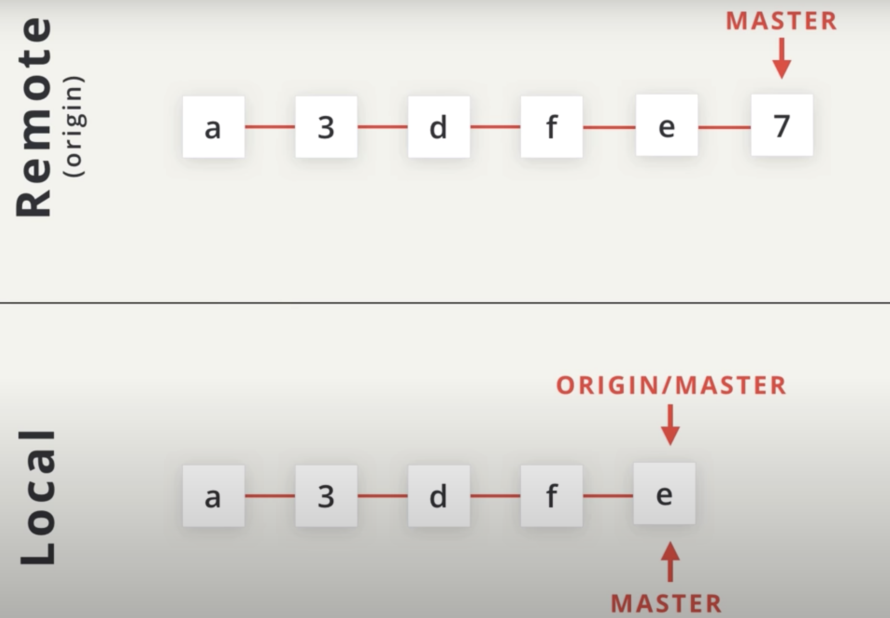
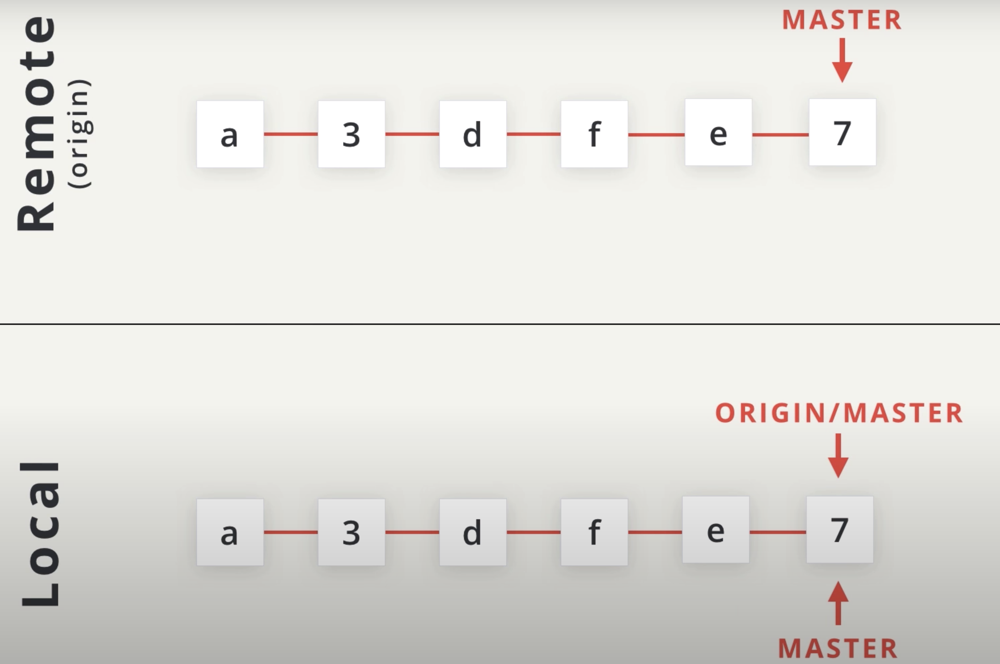
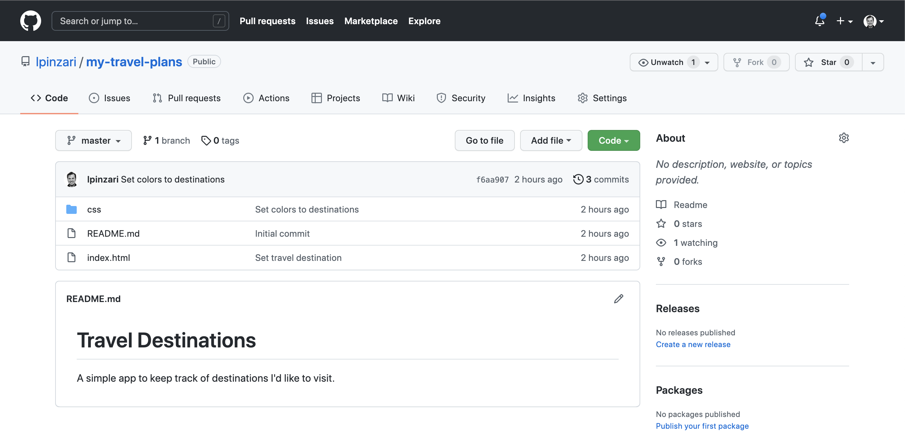
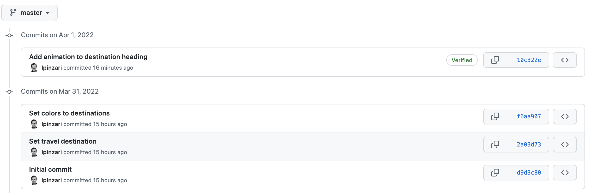

# Pulling Changes From A Remote

Let’s say that we are in a situation where there are commits on the *remote* repository that we do not have in our *local* repository. This can happen in several ways:

- You could be working on a team, and a co-worker has pushed new changes to the remote.
- Alternatively, you could be working on the same project but from different computers -- for example, say you have a work computer and a personal computer, and you contribute to the repo from both of them. If you push changes to the repo from your work computer, the local repo on your personal computer will not reflect those changes.

**How do we sync new changes that are on the remote into the local repository?**

That's exactly where we're going to be looking at now. Let's first look at how pulling in remote changes works in theory, then we'll actually do it ourselves!



Our *local* repo has five commits and the *remote* one has six commits. The *local* repo has the `origin/master` branch pointing to `e`, but in the *remote* the `master` branch is actually **one commit ahead of** `e`.

Since the remote's master is pointing to commit `7`, **these two repositories are out of sync**.

We need to **sync our local one with what's up on the remote**. To do that we can run `git pull`, the name of the remote, in this case `origin`, and then the branch to pull, `master`.



- `git pull origin master`

This **will pull down the commits on the origin's master branch and merge them into our local master branch**, which just moves it forward.

I said it before but I'll say it again, the branch that appears in the local repository is **actually tracking a branch in the remote repository** (e.g. `origin/master` in the local repository is called a **tracking branch** because it's **tracking the progress of the master branch on the remote repository that has the shortname "origin"**).

## Add remote changes

Since we don't have any commits on our remote repository yet and we're not collaborating with anybody we're going to fake it and **add some commits manually through GitHub's interface on the web**.



I'm here on my personal GitHub account and we're looking at the `my-travel-plans` repo. Now, this is the remote repo up on GitHub. And this remote repo has three commits. So we need manually to create some commits using the GitHub interface.

So we can create a new file with the `Add file` button or use the `Go File` button to edit existing files.

- Select the `css/app.css` file from the drop down menu.
- In the new page showing the file `css/app.css`, click on the pencil icon to edit the file.

Lastly add the following code.

**New CSS Content**

Add the following new ruleset:

```css
.destination:hover h2 {
    transform: rotate(0deg);
}
```

Add transition: transform 0.5s; to the h2 ruleset, so it should now be:

```css
h2 {
    margin: 0;
    transform: rotate(-45deg);
    transition: transform 0.5s;
    text-shadow: 0 0 5px #01579b;
}
```

Now, that we've added these changes we can actually go to the `Preview changes` button and then see the changes that we're about to commit. Then you can scroll down and actually make the commit with a commit message. Let's write the following commit message "Add animation to destination heading". Finally click on the commit changes button.


Go to the main page of the project and you can see there are now 4 commits.

:warning: **Prefer working locally** :warning:

> Because GitHub has a web interface, it allows you to add commits manually through its interface. But just because you can do a thing, doesn't mean you should. I've demoed making these changes this way so that we could simulate commits being on the remote repository but not in the local repository. But I recommend that you should always work locally on a project and then push those changes to the remote repository.

## Retrieve remote commits

Now let's compare our local repository and our remote repository. We only have three commits in our local repository:

```console
(base) ludo /my-travel-plans [master] $  git log --oneline --graph --decorate --all
* f6aa907 (HEAD -> master, origin/master) Set colors to destinations
* 2a03d73 Set travel destination
* d9d3c80 Initial commit
```
*Our local repo has only three commits*

While there are actually four commits in the remote repository:


*The remote repo on GitHub has four commits. The three from our local repo and the one we manually added on GitHub*


## Pulling Changes with git pull

The local commits end at commit `f6aa907` while the remote has one extra commit - commit `10c322e`.

Also, notice that in our local repository when we did the `git log the origin/master` branch is still pointing to commit `f6aa907`.

Remember that the `origin/master` branch **is not a live mapping of where the remote's master branch is located**. If the remote's master moves, the local origin/master branch stays the same. **To update this branch, we need to sync the two together**.

- `git push` **will sync the remote repository with the local repository**.
- `git pull`: To do the opposite (**to sync the local with the remote**), we need to use git pull.

The format for git pull is very similar to git push - you provided the shortname for the remote repository and then the name of the branch you want to pull in the commits.

`$ git pull origin master`


```console
(base) ludo /my-travel-plans [master] $  git pull origin master
remote: Enumerating objects: 7, done.
remote: Counting objects: 100% (7/7), done.
remote: Compressing objects: 100% (3/3), done.
remote: Total 4 (delta 1), reused 0 (delta 0), pack-reused 0
Unpacking objects: 100% (4/4), done.
From https://github.com/lpinzari/my-travel-plans
 * branch            master     -> FETCH_HEAD
   f6aa907..10c322e  master     -> origin/master
Updating f6aa907..10c322e
Fast-forward
 css/app.css | 5 +++++
 1 file changed, 5 insertions(+)
(base) ludo /my-travel-plans [master] $
```

*Running `git pull origin master` will retrieve the commits from the master branch on the origin remote repo*.

There's several things to note about running this command:

- the format is very similar to that of `git push` - there's counting and compressing and packing of items
it has the phrase "fast-forward" which means Git did a fast-forward merge (we'll dig into this in just a second)
- it displays information similar to `git log --stat` where it shows the files that have been changed and how many lines were added or removed in them

If **you don't want to automatically merge the local branch with the tracking branch** then you wouldn't use git pull you would use a different command called `git fetch`. **You might want to do this if there are commits on the repository that you don't have but there are also commits on the local repository that the remote one doesn't have either**.


## Recap

If there are changes in a remote repository that you'd like to include in your local repository, then you want to **pull in those changes**. To do that with Git, you'd use the git pull command. You tell Git the shortname of the remote you want to get the changes from and then the branch that has the changes you want:

`$ git pull origin master`

When git pull is run, the following things happen:

- the commit(s) on the remote branch are copied to the local repository
- the local tracking branch (`origin/master`) is moved to point to the most recent commit
- the local tracking branch (`origin/master`) is merged into the local branch (`master`)
- Also, changes can be manually added on GitHub (**but this is not recommended, so don't do it**).
