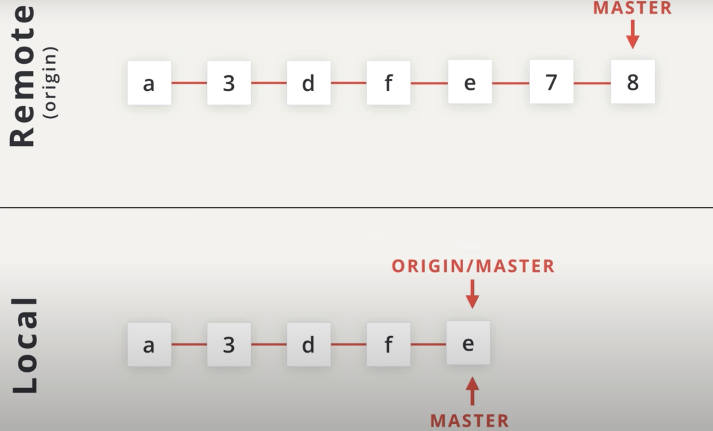
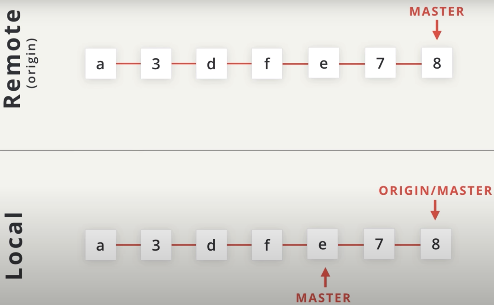
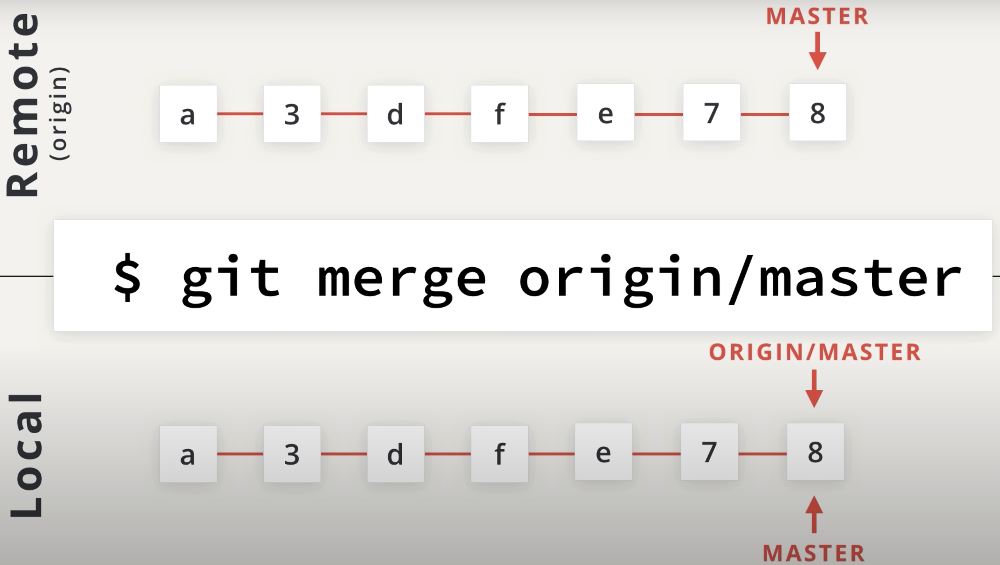
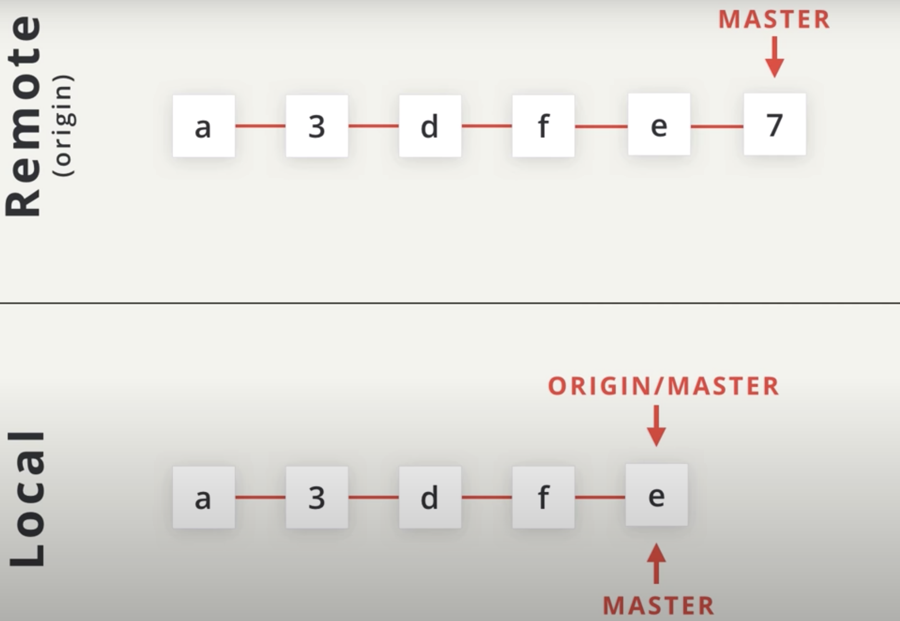
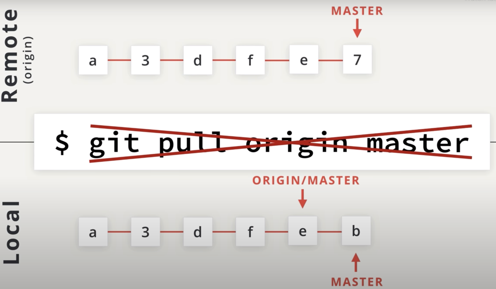
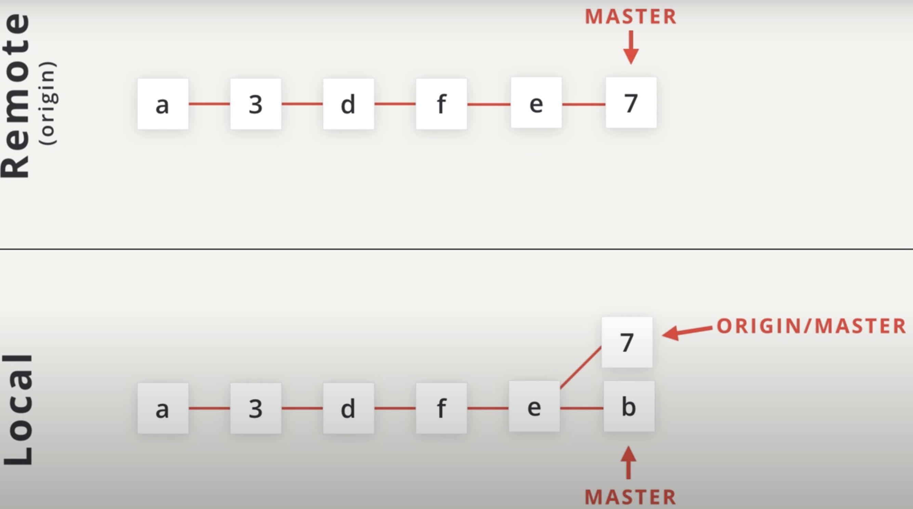
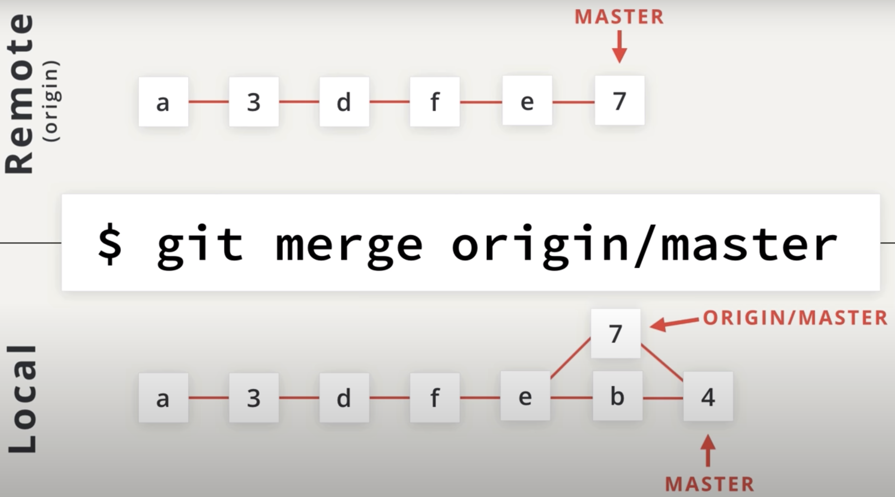
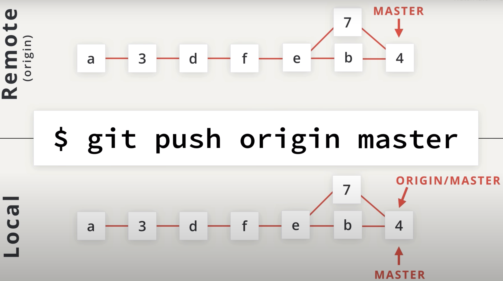

# Pull Vs Fetch

Let's consider the following scenario.

We have this setup where the remote repo has commits that the local one does not. we can use git to fetch those commits.

# git fetch origin master

now, if we run `git fetch origin master`, it will retrieve all of the commits on the remote **origin's master** branch (I remind you that the word `origin` it self means remote repo) and move the **origin/master** *tracking branch* to point to them. And that's all. **it doesn't make our local master branch move**.

If we want the commits that are in **origin/master** to be in our local master branch, then we just **do a merge**. If we're on the `master` branch then running the following command:

`[master] $ git merge origin/master`

will update our local master branch.

## Git fetch

Git fetch is used to retrieve commits from a remote repository's branch but it does not automatically merge the local branch with the remote tracking branch after those commits have been received.

The above paragraph is a little dense so why don't you reread it one more time.

You provide the exact same information to `git fetch` as you do for `git pull`. So you provide the shortname of the remote repository you want to fetch from and then the branch you want to fetch:

`$ git fetch origin master`

When **git fetch** is run, the following things happen:

- the commit(s) on the remote branch are copied to the local repository
- the local tracking branch (e.g. `origin/master`) is moved to point to the most recent commit
- The important thing to note is that the local branch does not change at all.

You can think of `git fetch` as *half of a* `git pull`. The other half of git pull is the merging aspect.

One main point when you want to use `git fetch` rather than `git pull` is if your remote branch and your local branch both have changes that neither of the other ones has. In this case, **you want to fetch the remote changes to get them in your local branch and then perform a merge manually**. Then you can push that new merge commit back to the remote.

Let's take a look at that.

This is the familiar starting point that we're used to, where our *local* repo is behind the *remote* repo.

now, let's pretend we didn't realize we were behind the remote repo and made a commit in our local repo (that's why is important to pull changes often before committing anything!). So now, we have two repositories that have the first some few commits but **their master branches are pointing at different things**. If we try running `git pull origin master` now, **it wouldn't work** because none of the repositories are out of sync.

But we know that we can use `git fetch` to just **retrieve the remote commits without merging**. So if we run `git fetch origin master`, that will bring down the commits on the remote repo and it'll make `orign/master` point to them.

Since we are on the master branch, we can just run `git merge origin/master` to bring the remote changes into our master branch. **Now our local repository has all the commits of the remote repo but the remote one doesn't have**.

So we need to push them. A quick `git push origin master` will update the remote repo with our local commits.

## Recap

You can think of the `git pull` command as doing two things:

- fetching remote changes (which adds the commits to the local repository and moves the tracking branch to point to them)
- merging the local branch with the tracking branch

The `git fetch` command is just the first step.

- It just retrieves the commits and moves the tracking branch.
- It does not merge the local branch with the tracking branch.

The same information provided to git pull is passed to git fetch:

- the shortname of the remote repository
- the branch with commits to retrieve

`$ git fetch origin master`
