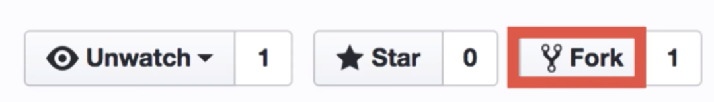
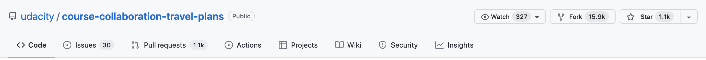
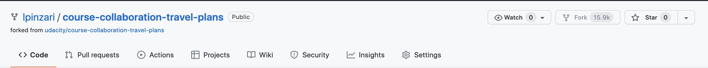
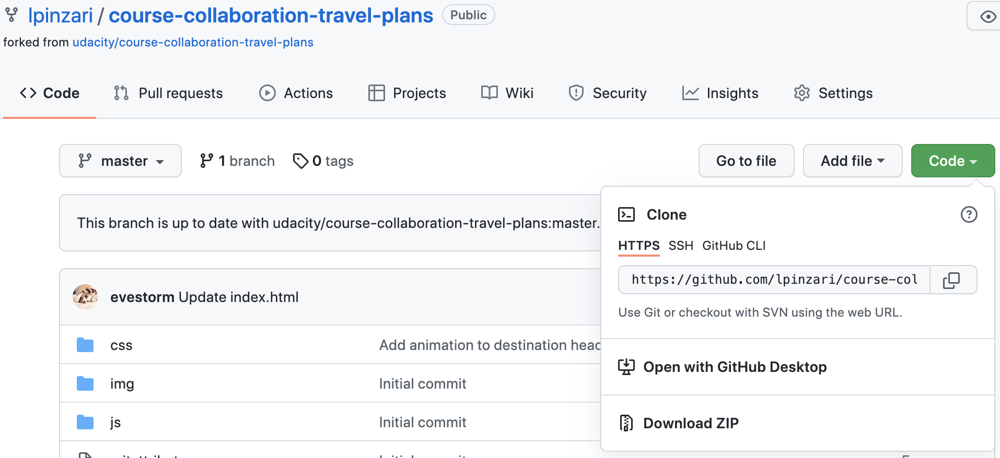
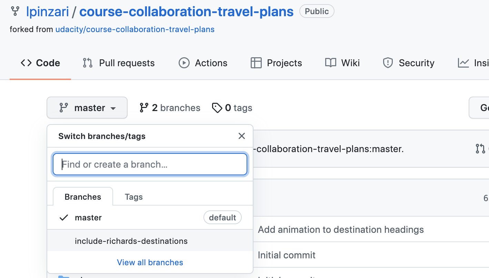
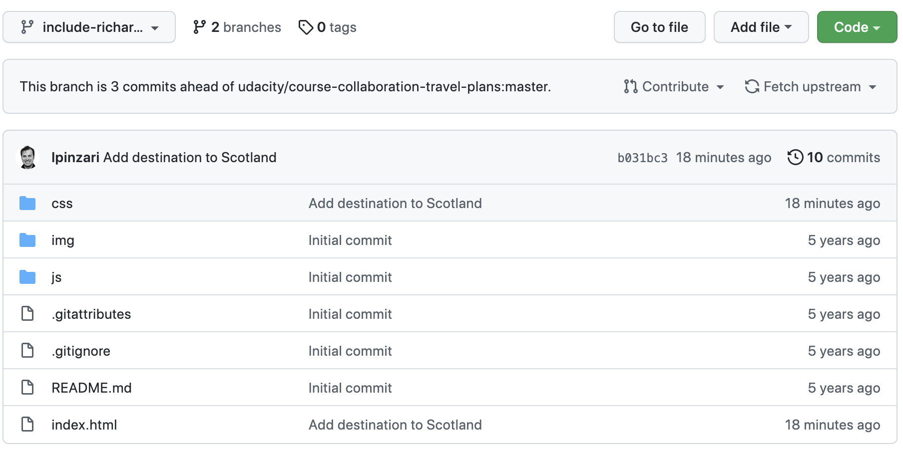

# Forking a Repository

When we talk about forks in version control, we're talking about the verb action version of the word.
Let's say you're hiking on a trail and all of a sudden, it splits into two paths. We'd say the road forked into two different paths.

In the *version control* worls, **forking** is a split, but **it's an identical split**.

**To fork a repo**: means to **split it into an identical copy**.

Now, forking is not a Git thing, you can't run *git fork* on the command line. There's no fork subcommand. **It's something provided by the hosting environment**.



GitHub is a hosting environment, so GitHub has a **fork button** that let's you fork a repo. If you are on a repo's page on GitHub and **click the fork button**, then **you make a copy of that repo and bring it over to your account**. So this is what it means to fork something.

**Forking a repo**: make an identical copy and become the owner of that copy.

Thus, in version control terminology if you "**fork**" a repository that means you **duplicate it**. Typically you fork a repository that belongs to someone else. So you make an identical copy of their repository and that duplicate copy now **belongs to you**.

### forking vs cloning

This concept of "forking" is also different from "cloning".

When you clone a repository, you get an identical copy of the repository. But cloning happens on your *local machine* and you clone a *remote* repository.

When you fork a repository, a new duplicate copy of the *remote* repository is created. This new copy is also a *remote* repository, **but it now belongs to you**.

The following example shows what I mean for a **duplicate copy that belong to you**.

## Alter a Cloned Repo

Do the following steps:

1. use the `git clone` command to clone [Lam's my-travel-plans-project](https://github.com/udacity/course-collaboration-travel-plans).

```console
(base) ludo /udacity-git-course  $  git clone https://github.com/udacity/course-collaboration-travel-plans
Cloning into 'course-collaboration-travel-plans'...
remote: Enumerating objects: 28, done.
remote: Total 28 (delta 0), reused 0 (delta 0), pack-reused 28
Unpacking objects: 100% (28/28), done.
```

2. make at least one change to it.

```console
(base) ludo /udacity-git-course  $  cd course-collaboration-travel-plans/
(base) ludo /course-collaboration-travel-plans [master] $  atom .
(base) ludo /course-collaboration-travel-plans [master] $  git diff
diff --git a/index.html b/index.html
index 0ae0e85..ed36e9f 100644
--- a/index.html
+++ b/index.html
@@ -13,7 +13,9 @@
             <div class="destination" id="belize">
                 <h2>Belize</h2>
             </div>
-
+            <div class="destination" id="roma">
+                <h2>Roma</h2>
+            </div>
             <div class="destination" id="barcelona">
                 <h2>Barcelona</h2>
             </div>
(base) ludo /course-collaboration-travel-plans [master] $
```

3. commit the change(s)

```console
(base) ludo /course-collaboration-travel-plans [master] $  git add index.html
(base) ludo /course-collaboration-travel-plans [master] $  git commit -m "Add roma destination"
[master 17b9709] Add roma destination
 1 file changed, 3 insertions(+), 1 deletion(-)
```

4. use `git push` to push your change back to Lam's project

```console
(base) ludo /course-collaboration-travel-plans [master] $  git remote -v
origin	https://github.com/udacity/course-collaboration-travel-plans (fetch)
origin	https://github.com/udacity/course-collaboration-travel-plans (push)
(base) ludo /course-collaboration-travel-plans [master] $  git push origin master
remote: Permission to udacity/course-collaboration-travel-plans.git denied to lpinzari.
fatal: unable to access 'https://github.com/udacity/course-collaboration-travel-plans/': The requested URL returned error: 403
```

We can see from this little experiment that if a repository doesn't belong to your account then it means you do not have permission to modify it.

This is where forking comes in! Instead of modifying the original repository directly, if you fork the repository to your own account then you will have full control over that repository.

Alternatively, you could create a new repo on your own account then change the URL of your `origin` in your local project. Lastly, push the cloned repo. Well, that's too much work and it won't let you collaborate on the project. How about forking.

## Forking Lam's Project
I'm going to clone Lam's project myself. **My account does not have permission to edit her repository directly, so I'll fork the repository to my own account**.

I want you to sign into your GitHub account and follow along with the rest of these steps:

- Go to [Lam's my-travel-plans project](https://github.com/udacity/course-collaboration-travel-plans) in your browser.



- click the **fork button** to copy over her repo to your account.

- Verify that you now have Lam's project listed in your repositories.


*Forking a project displays the new project name next to your GitHub profile name. Also, below that it says where the original project exists*.

See how this shows my account name (lpinzari) and the name of the repository? But then just beneath that it says "forked from udacity/course-collaboration-travel-plans". This shows that this project is in my account but that **it has a connection to the original project that it was copied from**.

That's pretty neat, right?!? You can fork any public repository that's up on GitHub right now - which means you can get a copy of that repository in your own account that you will have total control over.

## Push/Pull To The Fork
Because forking a repository gives you a copy of it in your account,

- you can clone the repo down to your computer,
- make changes to it,
- and then push those changes back to the forked repository.

But you need to keep in mind that it'll be pushing the changes back to your remote repository not to the original remote repository that you forked from.



I'm on a `course-collaboration-travel-plans` repo that I forked from Lam's project. Now, I want to make some changes on my local machine. I need to clone that down. So, let's get clonable URL. And now, we can switch over to the terminal and clone this project.

```console
(base) ludo /udacity-git-course  $  git clone https://github.com/lpinzari/course-collaboration-travel-plans.git
Cloning into 'course-collaboration-travel-plans'...
remote: Enumerating objects: 28, done.
remote: Total 28 (delta 0), reused 0 (delta 0), pack-reused 28
Unpacking objects: 100% (28/28), done.
(base) ludo /udacity-git-course  $  cd course-collaboration-travel-plans/
(base) ludo /course-collaboration-travel-plans [master] $  git remote -v
origin	https://github.com/lpinzari/course-collaboration-travel-plans.git (fetch)
origin	https://github.com/lpinzari/course-collaboration-travel-plans.git (push)
```
Now, the CD into my project and now I'm going to switch over to my code editor to make some changes.

```console
(base) ludo /course-collaboration-travel-plans [master] $  git checkout -b include-richards-destinations
Switched to a new branch 'include-richards-destinations'
(base) ludo /course-collaboration-travel-plans [include-richards-destinations] $
```
Before we switch to the code editor, let's switch to a new branch, so that all of our changes will be added to that branch instead of the master branch. So, I've switched to a new branch called `include-richards-destinations`.

I'm going to add my travel destinations to Lam's project. So, I'm going to add these as 3 different commits because we're going to be using those 3 separate commits later in the course.

**index.html**
```html
<div class="destination" id="barcelona">
  <h2>Barcelona</h2>
</div>

<div class="destination" id="florida">
  <h2>Florida</h2>
</div>
```

So, open the *index.html* file in your text editor and add Florida to the list.

**css/app.css**
```css
#barcelona {
    background-color: #800000;
}

#florida {
    background-color: #03a9f4;
}
```
And now add the styling for Florida in the css file. So, I have these two set of changes, let's commit them.

```console
+++ b/css/app.css
@@ -58,3 +58,7 @@ h2 {
 #barcelona {
     background-color: #800000;
 }
+
+#florida {
+    background-color: #03a9f4;
+}
diff --git a/index.html b/index.html
index 0ae0e85..fee1c3f 100644
--- a/index.html
+++ b/index.html
@@ -17,6 +17,10 @@
             <div class="destination" id="barcelona">
                 <h2>Barcelona</h2>
             </div>
+
+            <div class="destination" id="florida">
+                <h2>Florida</h2>
+            </div>
         </div>
     </div>
```
Before committing, I always like to run a quick `git diff` to make sure I'm adding everything. Everything looks good.

```console
(base) ludo /course-collaboration-travel-plans [include-richards-destinations] $  git add .
(base) ludo /course-collaboration-travel-plans [include-richards-destinations] $  git commit -m "Add destination to Florida"
[include-richards-destinations 6aec602] Add destination to Florida
 2 files changed, 8 insertions(+)
```
So let's add those files and commit them. So, now let's have the destination to Paris.

**index.html**
```html
<div class="destination" id="paris">
  <h2>Paris</h2>
</div>
```
**css/app.css**
```css
#paris {
    background-color: #d32f2f;
}
```

Now, back to the terminal to make another commit.

```console
(base) ludo /course-collaboration-travel-plans [include-richards-destinations] $  git add .
(base) ludo /course-collaboration-travel-plans [include-richards-destinations] $  git commit -m 'Add destination to Paris'
[include-richards-destinations 11e7e59] Add destination to Paris
 2 files changed, 8 insertions(+)
```

And finally, let's add the destination to Scotland.

**index.html**
```html
<div class="destination" id="scotland">
  <h2>Scotland</h2>
</div>
```
**css/app.css**
```css
#scotland {
    background-color: #388e3c;
}
```

Now back to the terminal and commit these changes.

```console
(base) ludo /course-collaboration-travel-plans [include-richards-destinations] $  git add .
(base) ludo /course-collaboration-travel-plans [include-richards-destinations] $  git commit -m 'Add destination to Scotland'
[include-richards-destinations b031bc3] Add destination to Scotland
 2 files changed, 8 insertions(+)
```

Let's get a quick look at the git log.

```console
(base) ludo /course-collaboration-travel-plans [include-richards-destinations] $  git log --oneline --graph --decorate --all
* b031bc3 (HEAD -> include-richards-destinations) Add destination to Scotland
* 11e7e59 Add destination to Paris
* 6aec602 Add destination to Florida
* 650a8de (origin/master, origin/HEAD, master) Update index.html
* 574c456 changed travel destinations
* 9039cf9 changed to Sao Paolo
* b2d0353 Add animation to destination headings
* 1204be0 Style destinations
* 7562e21 Add starting destinations
* 5e9b201 Initial commit
```

We can see that our new `include-richards-destinations` branch is in the last commit, while the `master` branch is down on the commit `650a8de`, but especially the remote `origin/master` branch is right on the commit `650a8de` as well. So we just need to `push` the **new branch up to our remote repo to get the last three commits on the remote**.

```console
(base) ludo /course-collaboration-travel-plans [include-richards-destinations] $  git push origin include-richards-destinations
....
To https://github.com/lpinzari/course-collaboration-travel-plans.git
 * [new branch]      include-richards-destinations -> include-richards-destinations
```
That created this new branch `include-richards-destinations` up on the remote repo.

Let's check that out.



Now, I need to switch over the other branch that I just pushed, so that we can see those changes.



We see that on this branch we are three commits ahead Lam's project. If I check the Lam's project on her repo and scroll down the *index.htm*, we could see that those changes are not added to them.

## Recap
Forking is an action that's done on a hosting service, like GitHub. Forking a repository creates an identical copy of the original repository and moves this copy to your account. You have total control over this forked repository. Modifying your forked repository does not alter the original repository in any way.
