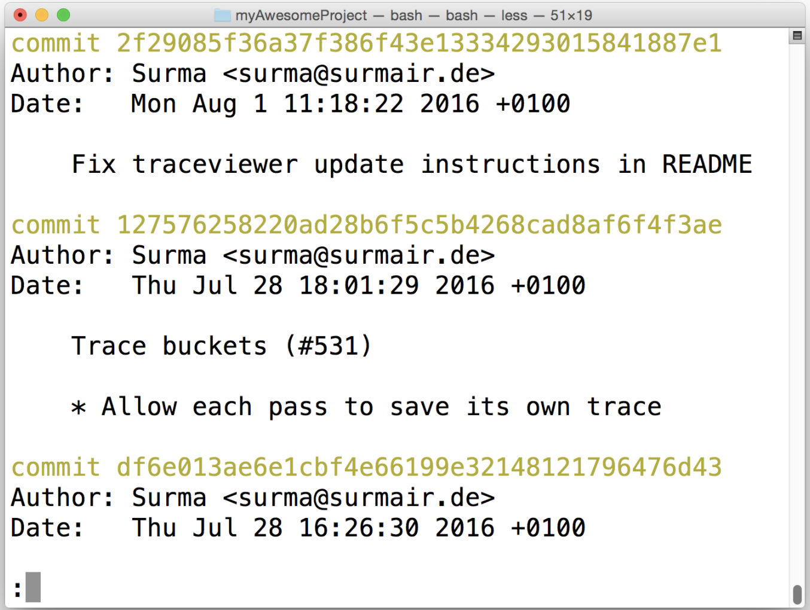

# Reviewing existing work

Reviewing Existing Work
When you're the sole developer on a project, it's easy to know what progress has been done on the project because you did everything yourself. Things can become a bit more complicated, though, when you're working on a team - whether that team is local in an office or if you are developing with someone just across the internet.

Sometimes it can be hard to see what the other developers have been doing on the project. Especially if developers are working across multiple different branches. How can I see all of the commits that Deepesh made? Or what if Christine made a change and said that her commit resolves issue 47 in our project's ticket tracking system. How can we discover the all of this information in the repository?

We can discover details about what other developers have done by using the extremely powerful `git log` command.

## Clone Lighthouse Project
We first need to download a project that is being worked on by multiple different people. Let's download the Lighthouse project by Google that's an app for auditing, performance metrics, and best practices for Progressive web apps.

Here's the [Lighthouse project](https://github.com/GoogleChrome/lighthouse) on GitHub.

## Filtering Collaborator's Commits
Being able to narrow down the commits to just the ones you're looking for can be a chore. Let's look at the different ways we can discover information that our collaborators have done!

### Group By Commit Author
This is not a massive project, but it does have well over 1,000 commits. A quick way that we can see how many commits each contributor has added to the repository is to use the `git shortlog` command:

`$ git shortlog`

*The terminal showing the results of running the `git shortlog` command. It displays all commits sorted by author*

In the screenshot above we can see that:

- Abby Armada has made one commit in the repository
- Addy Osmani has made seven commits
- Adriano Caheté has made one commit
- André Cipriani Bandarra has made one commit

`git shortlog` **displays an alphabetical list of names and the commit messages that go along with them**. If we just want to see just the number of commits that each developer has made, we can add a couple of flags:
- `-s` to show just the number of commits (rather than each commit's message) and
- `-n` to sort them numerically (rather than alphabetically by author name).

`$ git shortlog -s -n`

*`git shortlog` with the -s and -n flags to show only the numebr of commits each author has made, sorted numerically*

We can see in the image above that Surma has added five commits to the Lighthouse project. These five commits are spread out throughout the repository. What if we want to see just these five commits by Surma, though?

## Filter By Author
Another way that we can display all of the commits by an author is to use the regular `git log` command but include the `--author` flag to filter the commits to the provided author.

`$ git log --author=Surma`

*The terminal application showing the result of running `git log --author=Surma`. The output displays only the commits that Surma made*

**Question1**

If you run `git shortlog -s -n`, again, you'll see that there is a "Paul Irish" and a "Paul Lewis". If the following command were run:

`$ git log --author=Paul`

What would it display?

Answer: commits by both Paul Irish and Paul Lewis

## Reverse order

To display the commits in reverse order

`$ git log --reverse --oneline`

## Filter Commits By Search

Before going through this section on filtering by searching, I feel like I need to stress how important it is to write good, **descriptive commit messages**. If you write a descriptive commit message, then it's so much easier to search through the commit messages, later, to find exactly what you're looking for.

And remember, if the commit message is not enough for you to explain what the commit is for, you can provide a detailed description of exactly why the commit is needed in the description area.

Let see an example of extra details in a commit in the lighthouse project by looking at commit `5966b66`:

`$ git show 5966b66`

*The terminal application showing commit `5966b66` from the Lighthouse project. The author has provided additional information about the commit*

The commit message is `Configure Lighthouse run by whitelisting aggregations (#1830)`. But there's a lot more text than just that. Beneath the commit message, you'll find a couple of lines with additional information about the commit. This section provides further information on the why this commit was needed.

So why do we care about all of this detail? For one thing, it's easier for you to go back and review the changes made to the repository, and it easier for others to review the changes to. Another thing is filtering commits by information in the current message or description area.

We can filter commits with the `--grep` flag.

How about we filter down to just the commits that reference the word "**bug**". We can do that with either of the following commands:

- `$ git log --grep=bug`
- `$ git log --grep bug`

:warning: **Watch out for spacing** :warning:

> Remember that spacing is an issue, here, too. If you're trying to search for something that is multiple words and has spaces between the words, you need to wrap everything in quotes. For example, to search for unit tests you would need to use the following command, `git log --grep="unit tests"`.

:bulb: **More on grep** :bulb:

> If you don't know what grep is then the `--grep` flag might not seem like a logical choice for the flag's name. Grep is a pattern matching tool. It is way beyond the scope of this course to cover grep. But as a brief intro, if you were to run `git log --grep "fort"`, then Git will display only the commits that have the character `f` followed by the character `o` followed by `r` followed by `t`.

## Recap
The `git log` command is extremely powerful, and you can use it to discover a lot about a repository. But it can be especially helpful to discover information about a repository that you're collaborating on with others. You can use git log to:

- group commits by author with **git shortlog**
  - `$ git shortlog`

- filter commits with the **--author** flag:
  - `$ git log --author="Richard Kalehoff"`

- filter commits using the **--grep** flag
  - `$ git log --grep="border radius issue in Safari"`
