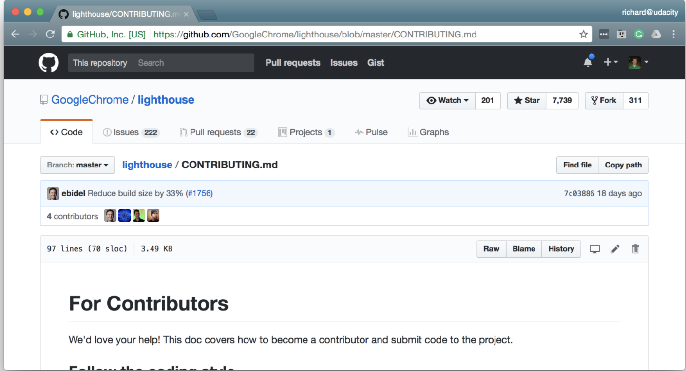
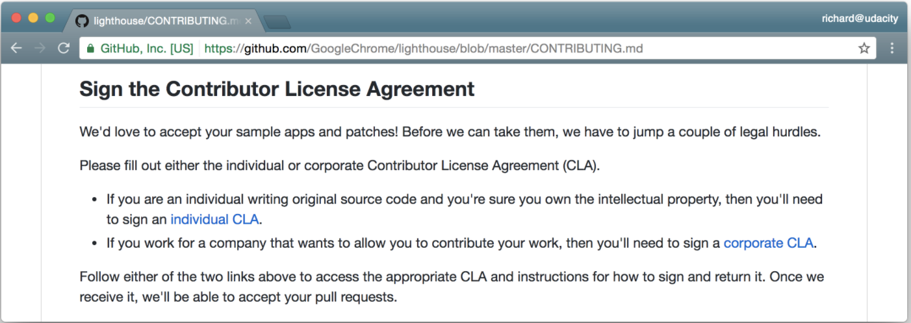
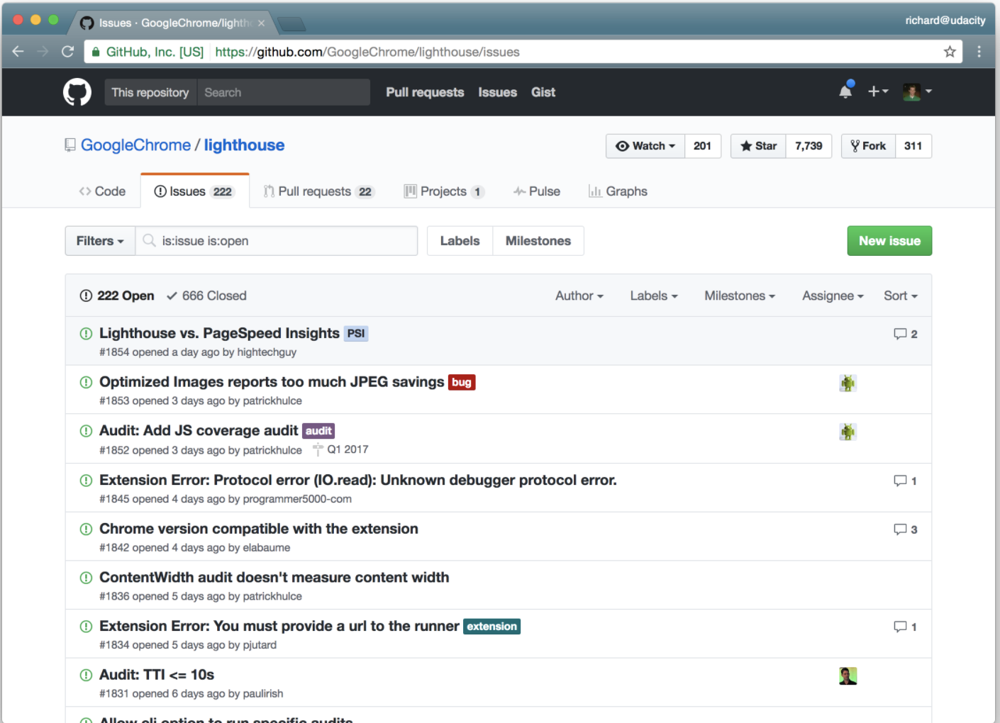
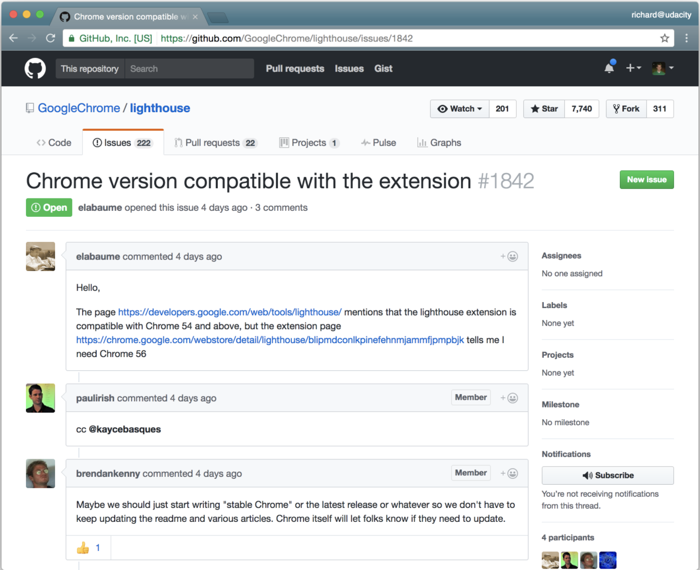
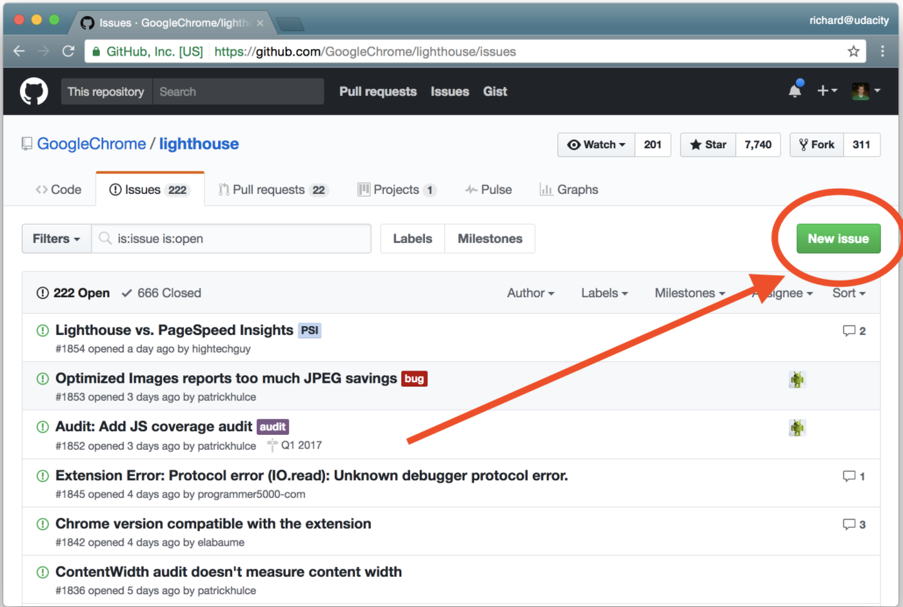
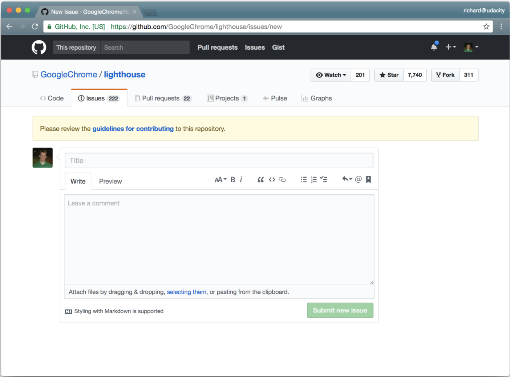

# Determing What To Work On

Let's say you're using some third-party library to help you build a project. What happens if, while you're using this third-party library, you come across a bug or a misspelling? You have the skill to be able to fix it, but you don't have direct access to make modifications to the original library. Well that's not a problem because you know that forking another developer's repository copies it to your account and gives you full access to `git pull` and `git push` to it!

But what are you supposed to do now that you've got full access to a duplicate of the other developer's project. We'll look at this in the next section but if you have forked a project and you have code in your fork that's not in the original project, **you can get code into the original project by sending the original project's maintainer a request to include your code changes**. This request is known as a **"Pull Requests"**. Again, we'll look at sending and working with pull requests in the next lesson.

So you know it's possible to get your code in the original project and you know you want to help and fix this spelling/code mistake. So you got something to work on!

But how do you go about actually contributing to the project in the way that the original project maintainer will be happy with and will end up actually incorporating your changes?

The first thing you should always look for in a project is a file with the name `CONTRIBUTING.md`.

## CONTRIBUTING.md File

The name of the `CONTRIBUTING.md` file is typically written in all caps so that it's easily seen. As you could probably tell by its name, this file lists out the information you should follow to contribute to the project. You should look for this file before you start doing development work of any kind.

Let's look at the lighthouse project's contributing file:

You can see that the top line of the file says:

> We'd love your help! This doc covers how to become a contributor and submit code to the project.

There are two main sections to this file:

- the "For Contributors" section
- the "For Maintainers" section

Each one of these sections has subsections of its own to instruct readers on how to contribute to and work with this project.

Let's take a look at the section on signing the contributors license. Here's what it looks like at the time of making the course:

You can see that to be able to contribute to this project you need to sign Google's Contributor License Agreement.

As you can see this contributor file has a ton of information in it. So you should definitely look for a `CONTRIBUTING.md` file when you want to contribute to a project.

## GitHub Issues

If your code change is a simple spelling mistake then you can probably just go ahead and make that change. But if your change is more substantial where it modifies a number of files in a significant way, then you probably want to get approval by the project's maintainer(s) before you start working on it. You definitely don't want to spend a couple hours making changes to the project only to find out that someone else is doing the exact same thing. You'd just be wasting a lot of time and energy duplicating work.

In a `CONTRIBUTING.md` file it explains how your code should be formatted and the steps you should go about to contribute, but how do you know what you should contribute? You should talk to the project maintainers directly. **GitHub has a fantastic interface for asking questions of the project maintainer in an open way that lets everyone see what's being done with the project**.

This is the GitHub Issues interface:

*The issues page of the Lighthouse project*

Now, "issues" doesn't mean that there's actually a bug, it can just be any change that needs to be made to the project. GitHub's issue tractor is quite sophisticated. Each issue can:

- have a label or multiple labels applied to it
- can be assigned to an individual
- can be assigned a milestone (for example the issue will be resolved by the next major release)

But probably one of the most important aspects of the issue tracker is that each issue **can have its own comments, so a conversation can form around the issue**.

Check out this issue that has a number of comments:

Another thing that's nice about issues is:

they let you subscribe to an issue so you'll be notified of new comments and code changes
you can communicate back and forth with a project maintainer on a specific change
Before you contribute anything to a file, check out the instructions in `CONTRIBUTING.md`. Then check out the project's issues and look to see if there's anything that's similar to what you want to contribute. If there is, then subscribe to that issue and read the existing conversation to see if you can help.

If you've looked through the list of issues and don't see one that similar to what you want to do, then you can create a new issue of your own. On every page of the GitHub issues interface, you'll find the **new issue button**:

*The new issue button on the Lighthouse project's issue page*

Clicking on that button brings you to create a new issue

*The new issue page for the Lighthouse project. A notice about reviewing the guidelines for contributing displays above the form*

## New Issue Page
One really cool thing about the new issue page is that, if the project has a `CONTRIBUTING.md` file, it will display a notification at the top of the page recommending that you check out the guidelines on how to contribute to the project. Clicking on the "guidelines for contributing" link takes you to the `CONTRIBUTING.md` file.

The GitHub issues interface support markdown so when you create your issue you can use Markdown to format it and exactly the way you want by including links, images, bulleted lists, and code blocks.

Just like crafting a descriptive commit message, you want to create an issue with an informative title that explains briefly what you want to do. Then, in the comments section, provide plenty of detail on what the change is, or why you think it's needed, or how this will make the project better.

Typically, the project's maintainer has a full-time job and works on their project on the side, so give them some time to respond to your issue before you dive in and start making your changes. Once the project maintainer has given you the go-ahead it's time to start working on the changes you want to contribute back to the project.

## Topic Branches
The best way to organize the set of commits/changes you want to contribute back to the project is to put them all on a **topic branch**.

Now what do I mean by a topic branch?

Unlike the master branch which is the default branch that holds all of the commits for your entire project, **a topic branch host commits for just a single concept or single area of change**.

For example if there is a problem with the login form for logging into the website, then a branch name to address this specific issue could be called:

- `login`
- `login-bug`
- `signup-bug`
- `login-form-bug`
- etc.

There are plenty of names that can be used for a topic branch's name. You just want to use a clear descriptive name for the branch so that if, for example, you list out all of the branches you can immediately see what changes are supposed to be in a branch just by its name.

One thing to keep in mind is that sometimes a project has specific requirements on what to name your topic branch. For example, if a branch is going to be addressing bug fixes, then many projects require a `bugfix-` prefix. Going back to our branch that was dealing with a bug with the login form, it would have to be named something like `bugfix-login-form`. So definitely check out the `CONTRIBUTING.md` file to see if they provide instructions on what you should name your topic branches.

## Best Practices

There are basic rules to follow:

### Write Descriptive Commit Messages

While we're talking about naming branches clearly that describe what changes the branch contains, I need to throw in another reminder about how critical it is to write clear, descriptive, commit messages. The more descriptive your branch name and commit messages are the more likely it is that the project's maintainer will not have to ask you questions about the purpose of your code or have dig into the code themselves. The less work the maintainer has to do, the faster they'll include your changes into the project.

### Create Small, Focused Commits

This has been stressed numerous times before but make sure when you are committing changes to the project that you make smaller commits. Don't make massive commits that record 10+ file changes and changes to hundreds of lines of code. You want to make smaller, more frequent commits that record just a handful of file changes with a smaller number of line changes.

Think about it this way: if the developer does not like a portion of the changes you're adding to a massive commit, there's no way for them to say, "I like commit A, but just not the part where you change the sidebar's background color." A commit can't be broken down into smaller chunks, so make sure your commits are in small enough chunks and that each commit is focused on altering just one thing. This way the maintainer can say I like commits A, B, C, D, and F but not commit E.

### Update The README

And lastly if any of the code changes that you're adding drastically changes the project you should update the README file to instruct others about this change.

## Recap
Before you start doing any work, make sure to look for the project's `CONTRIBUTING.md` file.

Next, it's a good idea to look at the GitHub issues for the project

- look at the existing issues to see if one is similar to the change you want to contribute
- if necessary create a new issue
- communicate the changes you'd like to make to the project maintainer in the issue

When you start developing, commit all of your work on a topic branch:

- do not work on the master branch
- make sure to give the topic branch clear, descriptive name

As a general best practice for writing commits:

- make frequent, smaller commits
- use clear and descriptive commit messages
- update the README file, if necessary
