# Create a Pull Request

A `pull request` is a request to the original or `source repository's maintainer` to include changes in their project that you made in your `fork` of their project.

**You are requesting that they pull in changes you've made**.

Let's get a high-level overview of what this entails and then we'll dig into the details.

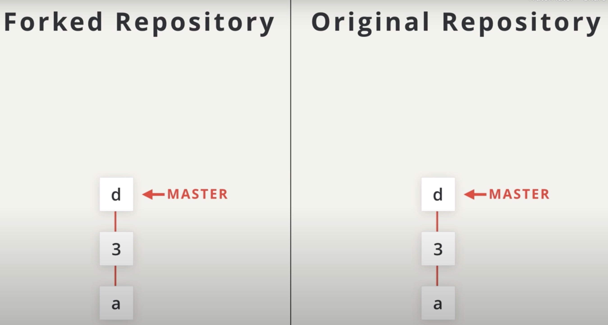

Let's say the repo on the right exists with three commits `a`,`3` and `d`, and master branch pointing at the last commit that was made.

Now, one thing to note: the orientation of these commits doesn't really matter. Typically, I've been showing them as going horizontally, but I had to switch them to a vertical line so that I could display all of the necessary information.

Now, this repo isn't ours. **It's some other developer's**. So **we decided to fork it**. Remember that when you fork a repo, you create an identical copy. So, these two repos will have the exact same commits and their branches will be pointing at the same commits.

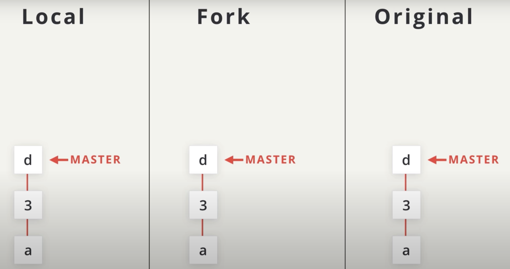

Now, to create a `pull request`, we need some new commits in our forked repo.
So, we **clone our fork down to our local machine**.

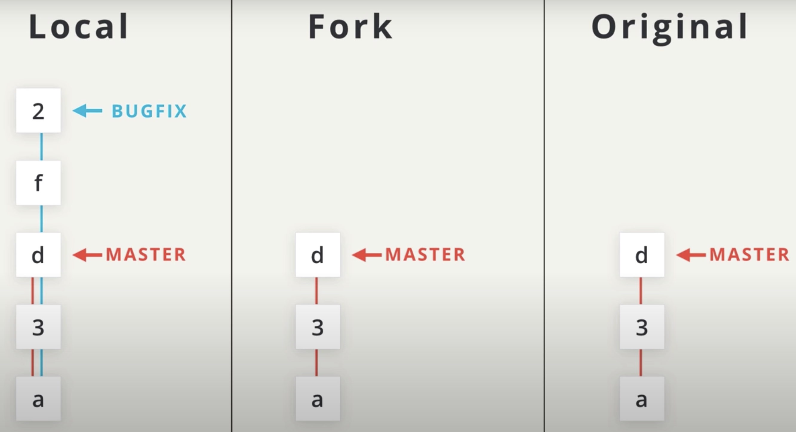

Let's create a `bug-fix` branch and make a few commits to clean things up.

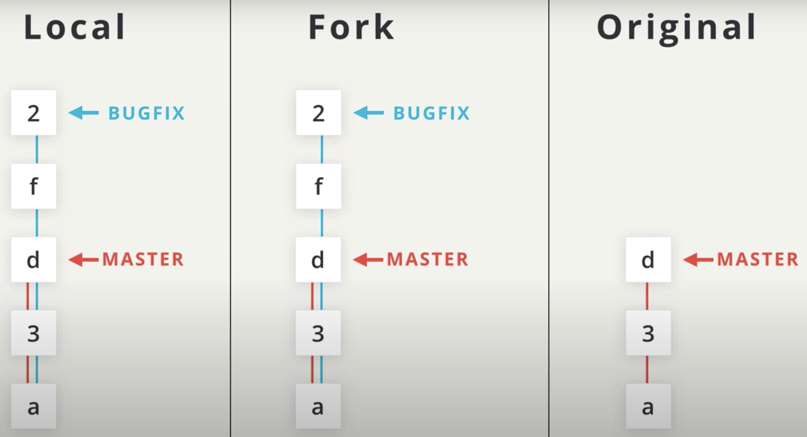

Now, let's push the `bug-fix` branch back to our forked repo, to get these new commits up on our remote repo.

We've done all the prep work needed for a `pull request` by pushing changes to our forked repo, and now is when we'd actually create a pull request.

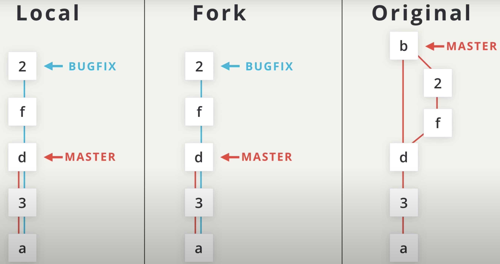

We'll look at how to do this on GitHub in just a second. **If the pull request is accepted by the original repository's maintainer, the commits will be added to their repository**.

A merge commit will be created combining our new commits with their existing commits and their master branch will move to point to this new merged commit.

## Example

Let's walk through the steps **to issue a pull request of our own**! If you've been following along then you've forked Lam's travel plans repository to your own account, and you've made one or two additional commits to your forked version.

In the previous lesson, I created a **topic branch** called `include-richards-destinations`, added a few commits to it, and pushed that branch to GitHub.

Remember that when you're creating a good pull request **you want to have changes on a branch that's sole reason to exist is for these changes**. Remember the name for these types of branches?...`topic branches`!

We're about to create a pull request (how exciting!), so let's make sure we've both got the same setup.

- I have forked [Lam's project](https://github.com/udacity/course-collaboration-travel-plans)
- I have created a topic branch with a descriptive name.
- I have made at least one commit on my topic branch
- I have pushed my changes back to my GitHub repo.

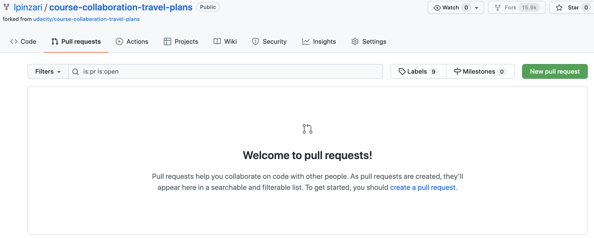

I'm on my `course-collaboration-travel-plans` page that I forked from Lahm's project. And so, I want my changes to be in her project `udacity/course-collaboration-travel-plans`. So I need to send a `pull request`.
Good thing there's a new `pull request tab` and a green button to create a `New pull request`.

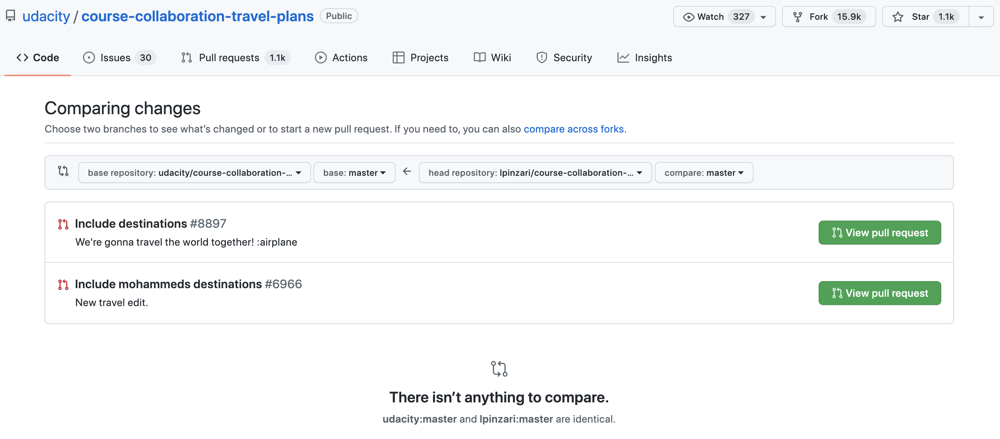

By clicking the `New pull request` button, GitHub redirects to the `original` repo's page. Notice though, we have now switched away from my project and my page, I'm now on Lahm's project page, `udacity/course-collaboration-travel-plans`.

This is the page where we were able to start a new pull request. So this is showing us the original repo. Notice the following section:

- original repo:
  - **base repository**: `udacity/course-collaboration-travel-plans`
  - **base**: `master`

- my repo:
  - **head repository**: `lpinzari/course-collaboration-travel-plans`
  - **compare**: `master`

So this is showing us the original repo with the compare button `compare:master`, my master branch on my repo, compared to the `base:master` branch on Lahm's project.

For now, we have other developer's pull requests. But for me **There isn't anything to compare**, because both of the master branches are pointing to the same commits.

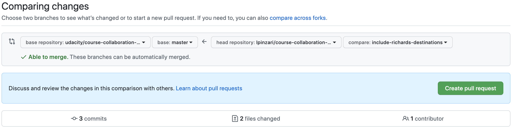

So let's switch my branch to the new topic branch that I just pushed `include-richrds-destinations`. So, there are three commits on my branch that aren't in her master branch and two files have changed. So, let's go over this one more time. We are comparing the commits on my topic branch with the commits on the master branch in Lahm's project.

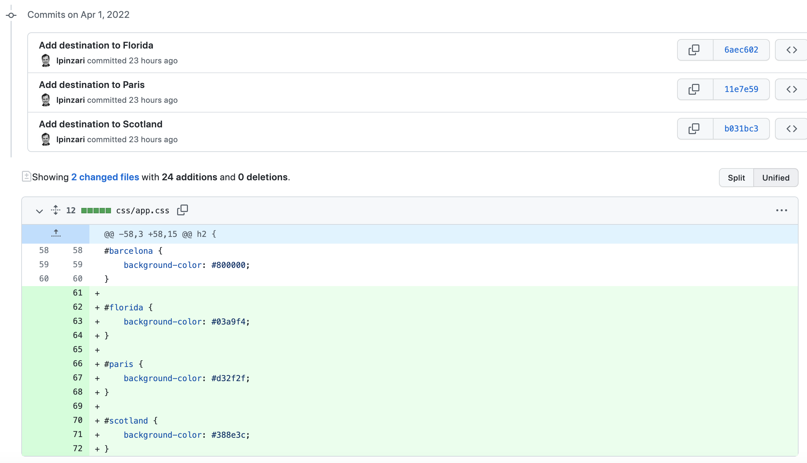

If you scroll down you could see the commits and the files that have changed. Now, click on the green button `create pull request`.

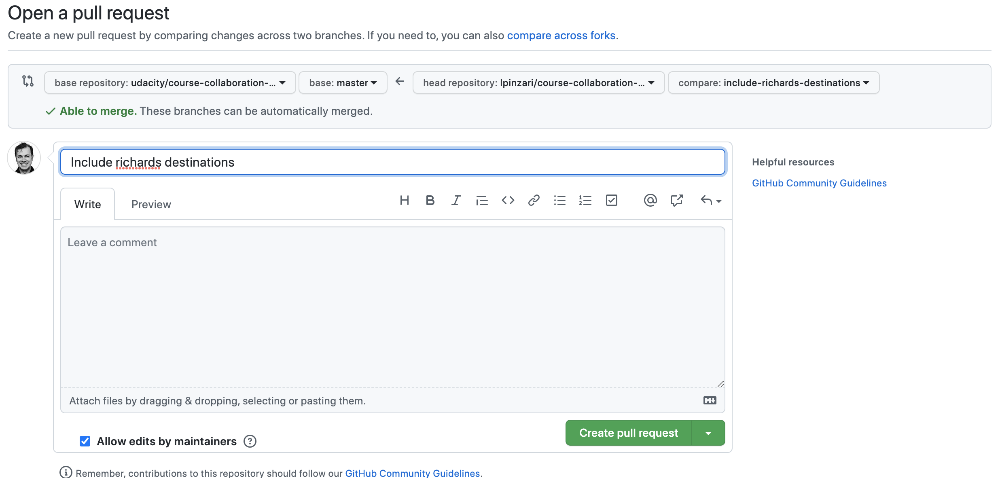

So, the view has changed a little bit. Now, we present with a form where we can actually send the pull request. We have the pull request title, which you can see is populated from the same name as the topic branch name.

So, this another reason why you'd want to name your branches with descriptive names. I think this is a good pull request title so I'll leave that as is, and I'm going to write a little message. Now, the box area also support markdown. Then click on the **create pull request button**.

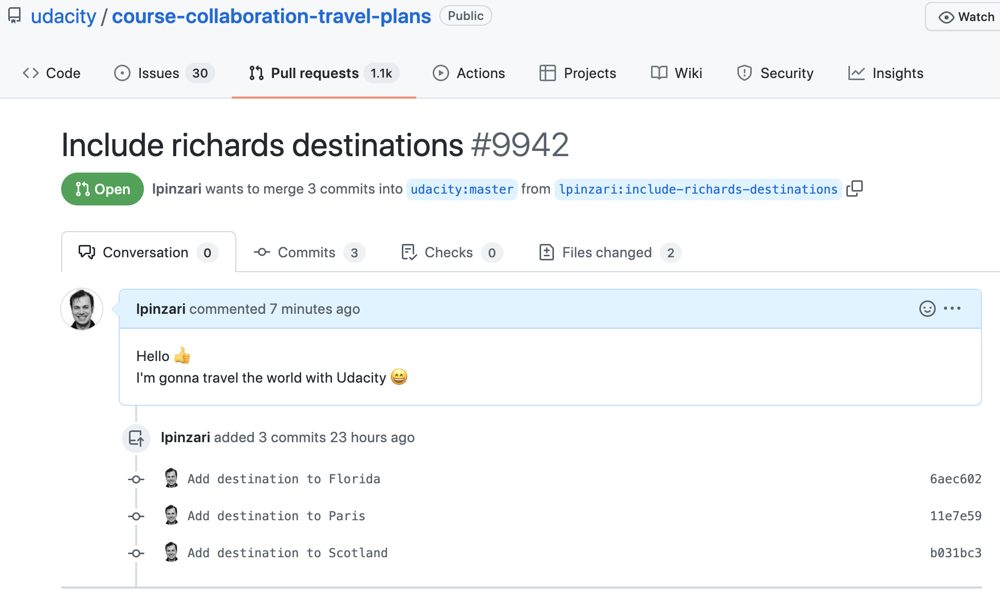

The figure is showing us the conversation. Now, the **conversation** includes a little bit of information, *the message* I've provided and the *commits* in detail.

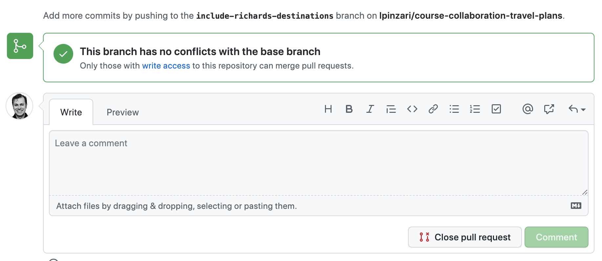

Scrolling down, we can see that this branch has no conflicts with Lahm's base master branch, but we cannot do anything with this, we need Lahm to be able to include these changes in her master branch because she owns this repository.

You just created a pull request! Congratulations! :raised_hands:

As you can see, it's actually not too difficult to create a pull request. When I was first learning Git, GitHub, and how to collaborate, I was extremely nervous about making commits, and working with remote repos, but especially submitting a pull request to another developer's project! As long as you following the steps we covered in the previous section on:

- reviewing the project's `CONTRIBUTING.md` file
- checking out the project's existing issues
- talking with the project maintainer
...**your pull request is sure to be included!**

## Recap

A pull request is a request for the source repository to pull in your commits and merge them with their project. To create a pull request, a couple of things need to happen:

- you must fork the source repository
- clone your fork down to your machine
- make some commits (ideally on a topic branch!)
- push the commits back to your fork
- create a new pull request and choose the branch that has your new commits
