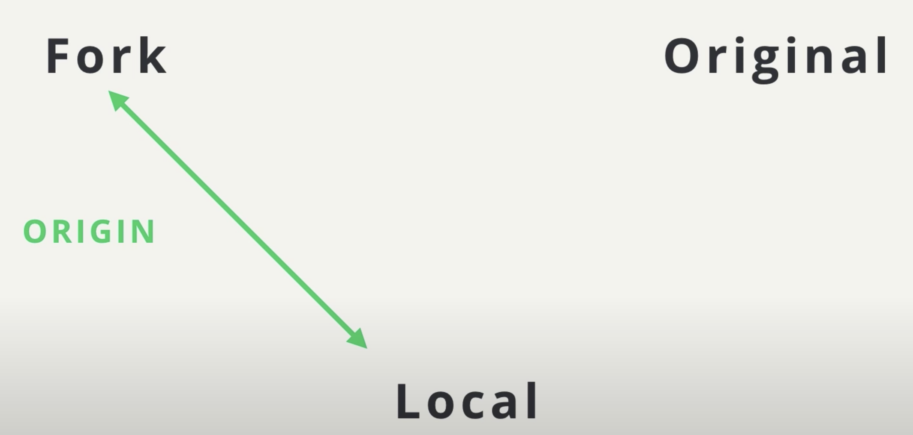

# Stay in sync with source project

While you're working on a topic branch of changes that you want to make to a repository, that repository will probably be receiving updates of its own from the original authors.

## Stars & Watching

If you want **to keep up-to-date with the Repository**, GitHub offers a convenient way to keep track of repositories - it lets you **star repositories**:


*The star button and level for a repository*

You can go to [https://github.com/stars](https://github.com/stars) to list out and filter all of the repositories that you have starred.

**Starring is helpful if you want to keep track of certain repositories**. But it's not entirely helpful if you need to actively keep up with a repositories development because you have to manually go to the stars page to view the repositories and see if they've changed.

:bulb: **Starts and Popularity** :bulb:

> Starring can be a useful feature to help you keep track of repositories you're interested in. But stars have also turned into a means of measuring a repo's popularity.

If you'd rather not increase a repository's stars, then check out "**watching**" a repository. Let's look at that right now!

## Watching A Repository

If you need to keep up with a project's changes and want to be notified of when things change, GitHub offers a "**Watch**" feature:


If you're working on a repository quite often, then I'd suggest setting the watch setting to "Watching". This way GitHub will notify you whenever anything happens with the repository like people pushing changes to the repository, new issues being created, or comments being added to existing issues.

## Including Upstream Changes

Now that you know about watching your repository let say that you're watching it and you get notified that some commits have been pushed to the original, source repository. How do you go about getting those changes into your fork of the repository? If you want to keep doing development on your fork then you'd need your fork to stay in sync with the source repository as much as possible.

**Let's see how we can get these changes from the remote repository into our repository**.


We have our `original` repo, our `fork` of the original repo, and then the `clone` of our fork.


Let's say that we forked the original repo to fix up a few mistakes. So, we have the `BUGFIX` branch that we've worked on locally and then pushed to our fork.


But, while we've been working on these changes, the original project's maintainers have added some commits of their own to their repository. So now, **our fork and the local repository's master branches are out of sync with the original repository.**



To get these new changes in our local machine, we need to fetch them from the original repository. Now, remember that we have a link to our remote repository because when we cloned it, Git created a connection for us automatically and gave this connection a short name or alias of `origin`.

**We can manually set up a connection to the** `original` or `source` **remote repository** though.


Typically, we'd name the short name `upstream`.


Let's add the short names `origin` and `upstream` so we can easily refer to them. Now, that we have this new `upstream` connection to the `original` remote repository.


Let's display the remote branches that exist in our local repository. `origin/master` and `origin/bugfix`.


Now, if we fetch commits from the upstream repository, we'll end up with these two commits `c`, `1` and an `upstream/master` branch.


There, colour's might be a bit misleading. So, let's show how each branch relates to each remote. Let's set **local** to `red`, **fork** to `yellow`, and **original** to `blue`. Both the `bugfix` branch and the `master` branch are in our local repository. We've also pushed them to our fork.


Git knows where our remote branches are, so the `origin/bugfix` and the `oriogin/master` branches display in our local repository.


The `original` repository has just its `master` branch. Because, we've retrieved the `upstream` changes, `upstream/master` displays in our local repository.


So, let's go back to our original colour scheme, that's based on the branches.


Now, if we're on our `master` branch and merge in the `upstream/master` branch, our `master` branch will perform a fast-forward merge to point to commit `c`.


Then, if we wanted to merge in the `bugfix` branch, that would create a new merge commit and move `master` to point to it.

Incase Lam starts making changes to her project that I won't have in my fork of her project, **I'll add her project as an additional remote so that I can stay in sync with her**.

In my local repository, I already have one remote repository which is `origin` **remote**.

```console
(base) ludo /course-collaboration-travel-plans [master] $  git remote -v
origin	https://github.com/lpinzari/course-collaboration-travel-plans.git (fetch)
origin	https://github.com/lpinzari/course-collaboration-travel-plans.git (push)
```
*The Terminal application showing the exisiting connect to the remote repository. This is my repository and has the short name origin*

Remember that the word `origin` is just the **default name** that's **used when you git clone a remote repository for the first time**.

We're going to use the `git remote command` **to add a new shortname and URL to this list**.

This will give us a **connection to the source repository**.

```console
(base) ludo /course-collaboration-travel-plans [master] $  git remote add upstream https://github.com/udacity/course-collaboration-travel-plans.git
```
The link `https://github.com/udacity/course-collaboration-travel-plans.git` for the remote connection can be retrieved by clicking on the code button of the original project's repo and copying the HTTPS link.

Notice that I've used the name `upstream` as the shortname to reference the source repository. As with the `origin` shortname, the word `upstream` here is not special in any way; It's just a regular word. This could have been any word... like the word "banana". But the word "upstream" is typically used to refer to the source repository.

Let's check out what the list of remotes looks like now after adding this new remote:

```console
(base) ludo /course-collaboration-travel-plans [master] $  git remote -v
origin	https://github.com/lpinzari/course-collaboration-travel-plans.git (fetch)
origin	https://github.com/lpinzari/course-collaboration-travel-plans.git (push)
upstream	https://github.com/udacity/course-collaboration-travel-plans.git (fetch)
upstream	https://github.com/udacity/course-collaboration-travel-plans.git (push)
```
*The terminal application show both information about both remotes - `origin` and `upstream`*

## Origin vs Upstream Clarification
One thing that can be a tiny bit confusing right now is the difference between the `origin` and `upstream`. What might be confusing is that `origin` does not refer to the source repository (also known as the "original" repository) that we forked from. Instead, it's pointing to our forked repository. So even though it has the word origin is not actually the original repository.

Remember that the names `origin` and `upstream` are just the default or de facto names that are used. If it's clearer for you to name your **origin remote** `mine` and the **upstream remote** `source-repo`, then by all means, go ahead and rename them. What you name your remote repositories in your local repository does not affect the source repository at all.

```console
(base) ludo /course-collaboration-travel-plans [master] $  git remote rename origin mine
(base) ludo /course-collaboration-travel-plans [master] $  git remote rename upstream source-repo
(base) ludo /course-collaboration-travel-plans [master] $  git remote -v
mine	https://github.com/lpinzari/course-collaboration-travel-plans.git (fetch)
mine	https://github.com/lpinzari/course-collaboration-travel-plans.git (push)
source-repo	https://github.com/udacity/course-collaboration-travel-plans.git (fetch)
source-repo	https://github.com/udacity/course-collaboration-travel-plans.git (push)
```
*Using the `git remote rename` command to rename `origin` to `mine` and `upstream` to `source-repo`.*

:warning: **Resetting Remote Names** :warning:

> The code above demos the renaming of the remotes, but I have returned them to their default/defacto names of origin and upstream with the following commands:

```console
(base) ludo /course-collaboration-travel-plans [master] $  git remote rename mine origin
(base) ludo /course-collaboration-travel-plans [master] $  git remote rename source-repo upstream
(base) ludo /course-collaboration-travel-plans [master] $  git remote -v
origin	https://github.com/lpinzari/course-collaboration-travel-plans.git (fetch)
origin	https://github.com/lpinzari/course-collaboration-travel-plans.git (push)
upstream	https://github.com/udacity/course-collaboration-travel-plans.git (fetch)
upstream	https://github.com/udacity/course-collaboration-travel-plans.git (push)
```

## Retrieving Upstream Changes
Now to get the changes from `upstream` remote repository, all we have to do is run a `git fetch` and use the `upstream` shortname rather than the `origin` shortname:


- `$ git fetch upstream master`

```console
(base) ludo /course-collaboration-travel-plans [master] $  git fetch upstream master
From https://github.com/udacity/course-collaboration-travel-plans
 * branch            master     -> FETCH_HEAD
 * [new branch]      master     -> upstream/master
```
*The Terminal application showing the results of doing `git fetch upstream master`. A new branch is added to the local repo*.

Now that we've fetched all of the changes from the `upstream` remote repository, let's do a `log` to see what new information we have in our local repository. I'm using the following `git log` command to make sure I display all commits from all branches (including remote and tracking branches!):


It can be a bit difficult to read with the wrapping of the commit messages but you should be able to see that there is now an `upstream/master` remote branch that is synched with the local master branch.

We can use the `upstream/master` branch to keep track of where the source repository's master branch is. We can now get any changes that are made to the source repository's master branch by just running `git fetch upstream master`.

Question: What single command would we use if we want to fetch the upstream/master changes and merge them into the master branch?

Answer: `git pull upstream master`

To push these new changes from the Lam's repository, we don't want to run `git push origin upstream/master` because `upstream/master` **is not a local branch**.

To **get these changes into my forked version of her project**,

- I could **merge** `upstream/master` into an existing branch (like the local master branch) and
- **push** that.

> to make sure I'm on the correct branch for merging

`$ git checkout master`

>  merge in Lam's changes

`$ git merge upstream/master`

> send Lam's changes to *my* remote

`$ git push origin master`


**Note**

Since the two repos are synched:

```console
(base) ludo /course-collaboration-travel-plans [master] $  git merge upstream/master
Already up to date.
```

## Recap
When working with a project that you've forked. The original project's maintainer will continue adding changes to their project. You'll want to keep your fork of their project in sync with theirs so that you can include any changes they make.

To get commits from a source repository into your forked repository on GitHub you need to:

- **get** the cloneable URL of the source repository
- **create** a new remote with the `git remote add` command
- **use** the shortname `upstream` to point to the source repository
- **provide** the **URL** of the *source repository*
- **fetch** the new `upstream` remote
- **merge** the upstream's branch into a local branch
- **push** the newly updated local branch to your origin repo
