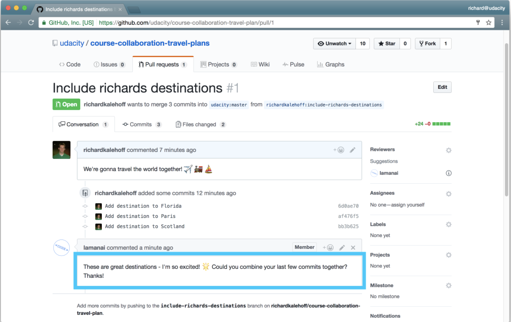

# Manage an active Pull Request

The project maintainer may decide not to accept your changes right away. They might request you to make some additional changes to your code before accepting your request and merging in your changes. Most likely they will communicate their desired changes through the conversation on the pull requests page.

*The project maintainer is requesting some changes be made in the pull request*

We can see that the source repository's owner has commented and asked us to combine the commits together.

One thing that I've grown to love about both the Git command line tool and the GitHub interface is how helpful they are with recommendations on what to do next. Near the bottom of the comments, there's a suggestion by GitHub that tells us how to add more commit; we need to add them to the same branch and push to my fork:

> Add more commits by pushing to the **include-richards-destinations** branch on **richardkalehoff/course-collaboration-travel-plan**.

When you submit a pull request, remember that you're asking another developer to add your code changes to their project. If they ask you to make some minor (even major!) changes to your pull request, that doesn't mean they're rejecting your work! It just means that they would like the code added to their project in a certain way.

The CONTRIBUTING.md file should be used to list out all information that the project's maintainer wants, so make sure to follow the information there. But that doesn't mean there might be times where the project's maintainer will ask you to do a few additional things.

So what should you do? Well, if you want your pull request to be accepted, then you make the change! Remember that the tab in GitHub is called the "Conversation" tab. So feel free to communicate back and forth with the project's maintainer to clarify exactly what they want you to do.

It also wouldn't hurt to thank them for taking the time to look over your pull request. Most of the developers that are working on open source projects are doing it unpaid. So remember to:

be kind - the project's maintainer is a regular person just like you
be patient - they will respond as soon as they are able
So Lam is asking that I combine my changes together before she'll merge in my pull request. Combining commits together is a process called squashing. Let's look at how to do that!

## Recap
As simple as at may seem, working on an active pull request is mostly about communication!

If the project's maintainer is requesting changes to the pull request, then:

- make any necessary commits on the same branch in your local repository that -your pull request is based on
- push the branch to the your fork of the source repository

The commits will then show up on the pull request page.
