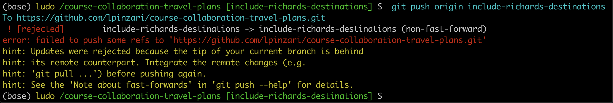

# Squashing Commits and Git Rebase

The `git rebase` command is a tricky beast. If you do search for it on the web, you will see a lot of warnings about how this command is dangerous and can destroy your repository. And that isn't a surefire way to prevent you from trying it out.

The truth is the tool is powerful and can wipe out a chunk of your repository in just a few steps, but it's not as dangerous as you've been let to believe. It's almost impossible to destroy a git repository when you are using the git commands.

We'll be using `git rebase` to do something called **Squashing**.

**Squashing** is just **taking a number of commits and combining them into one single commit**. Let's say that you've been working on a new feature in the last three commits you had were all little typo changes.
- With `git rebase`, **you can combine three commits into one single larger commit**.

To squash commits together, we're going to use the extremely powerful `git rebase` command. This is one of my favorite commands, but it did take me quite a while to become comfortable with it. At first, it was somewhat challenging for me to get a handle on how it works, and then (after reading countless warnings online) I was scared to actually use it for fear of irreparably damaging my project's Git history.

But I'm here to tell you that git rebase isn't really all that difficult, and that you can bravely make changes to your repository without fear of doing any damage! (<-- quite the claim, isn't it!?!)

Let's first get a big picture idea of how **squashing** works, and then we'll actually do some squashing with the `git rebase` command:

`$ git rebase -i HEAD~3`


Let's say we have this git repository, but we realized that these last few commits are all minor changes, like typo fixes (`2`,`c`,`d`). It would make for a much cleaner `git log`, if these commits can be combined to do just one commit.

We could run `git rebase -i HEAD~3` to combine or **squash** the last three commits into one. Remember that the HEAD points to the current location. For us were on the `master` branch, so HEAD points to `master`.

`HEAD~1` is one before HEAD, and is the previous or parent commit to the one wrong, `HEAD~2` is two before HEAD, and is the grandparent commit. `HEAD~3`, you guessed is three before HEAD, and is the great grandparent commit we're on.

Now, we don't want to get rid of commit `8`, that `HEAD~3` points to. But this is the `git rebase` command, so we're using `HEAD~3` as the base that the other commits will be placed on to.

This can be a little bit tricky. So, the easiest way to rememeber it, is that if you want to squash let's say **17 commits**, just use that number 17, in this example as the number, so it will be `HEAD~17`.


So, running `git rebase -i HEAD~3` will take the commit were on and the previous two commits and let's us squash them into one. This will create a new commit SHA, and it moves the master branch to point to this new commit.

Notice though, that the branch is pointing to the original commits,


So they won't appear in a `git log` and git will eventually completely erase them.

Now, if you're worried about damaging your repo and want a backup, well, then creating a backup is actually what you've got to do.


Let's start over for a second.


When I rebase, I just create a branch called `backup`, that I place at the same location as the branch I'm rebasing. I'm still on `master`, so I haven't checkout the `backup` branch and I'll just run the same command `git rebase -i HEAD~3`.


This squashes the commits into one and moves `master` to point to this new commit `4`, biut the original commits haven't been deleted and will still appear in `git log`, because a branch is pointing at them.

The command I used is:

`$ git rebase -i HEAD~3`

## The Rebase Command
The `git rebase` command will move commits to have a new base. In the command `git rebase -i HEAD~3`, we're telling Git to use HEAD~3 as the base where all of the other commits (HEAD~2, HEAD~1, and HEAD) will connect to.

The `-i` in the command stands for "**interactive**". You can perform a rebase in a non-interactive mode. While you're learning how to rebase, though, I definitely recommend that you do interactive rebasing.

## Ancestry References
As a brief refresher, `HEAD` indicates your current location (it could point to several things, but typically it'll either point to a branch name or directly to a commit's SHA). The `~3` part means "**three before**", so HEAD~3 will be the commit that's three before the one you're currently on. **We're using this relative reference to a commit in the git rebase command**.

Let me demonstrate how to use this command to combine the three destination commits into one.

## Example

Let's squash the last three commits together with

- `git rebase -i HEAD~3`

```console
(base) ludo /course-collaboration-travel-plans [master] $  git checkout include-richards-destinations
Switched to branch 'include-richards-destinations'
(base) ludo /course-collaboration-travel-plans [include-richards-destinations] $  git rebase -i HEAD~3
Waiting your editor to be closed ...
```


Now this displays the last three commits that we made in our project. One thing to notice is that these commits are in reverse order. So the one one the bottom `b031bc3` is actually our most recent commit.

Now, lets' look at each of the columns. The last column is the commit message. The middle column is the commit's SHA. Now, the `first column` is **where you type the command that you want** `git rebase` **to actually perform**.

`git rebase` is actually a very powerful tool and has a number of commands. These commands are listed below in the editor. We can see that right now the three commits are all listed as `pick`.

So, `pick` means **use this commit**. So, if we save the file and close the editor right now, each one of these commits would be saved. So even though we are rebasing and wanted to squash our commits, if we left these as `pick`, all three of these would exist but *they would actually have different SHAs*.

Now, Lam wants us to squash our last three commits into one, and that's actually one of the commands:

> s,squash = use commit, but meld into previous commit.

Squashing uses the commit but combines it into the previous commit.


So, the last two on the bottom will be `s` for squash and the one on the top ,`6aec602`, cannot be a squash either because there is no previous commit to this one. So, this would cause an error, so we actually have to leave this one as `pick` or `p`. Now, if we used these commands save and quit the editor, then it would take the last two commits and squash them into the commit `6aec602` **but it would use the commit message** `Add destination to Florida`. That's going to be a bit misleading since it's actually adding destination for Florida, Paris and Scotland.

So, instead of using this commit message we want to be able to reword the commit message and there's actually a command for that, that's **reword** or just `r`.


So, I'm going to switch `pick` to just `r`. So we're going to keep this commit, but we're going to change the commit message. So, the last commit will be squashed to the previous commit which will be squashed to the commit on the top.

So, let's save the file and quit the editor to actually do the rebase.


Now, the rebase we are doing is an interactive multi-step process. So, the next step we have to do is rewording the commit message. `Add Richards destinations`.
I'll save the file and quit the editor.


So, this is the last step of the rebasing. Here it's a kind of summary but we just keep the message of the commit `Add Richards destinations`.


Save and quit the editor.

```console
(base) ludo /course-collaboration-travel-plans [include-richards-destinations] $  git rebase -i HEAD~3
[detached HEAD 38e7cb7] Add Richard's destinations
 Date: Fri Apr 1 17:36:16 2022 +0200
 2 files changed, 8 insertions(+)
[detached HEAD 4e3ee90] Add Richard's destinations
 Date: Fri Apr 1 17:36:16 2022 +0200
 2 files changed, 24 insertions(+)
Successfully rebased and updated refs/heads/include-richards-destinations.
```
Let's checkout the `git log` output.


We can see here our `include-richards-destinations` branch has just one commit ahead of the `master` branch, while on the `remote` repository `origin/include-richards-destinations` we actually have these three commits:

```console
* b031bc3 (origin/include-richards-destinations) Add destination to Scotland
* 11e7e59 Add destination to Paris
* 6aec602 Add destination to Florida
```

So these three commits are the ones that got squashed into this single one:

```console
* 4e3ee90 (HEAD -> include-richards-destinations) Add Richard's destinations
```

So, let's try pushing this branch to the `remote` repository.

- `git push origin include-richards-destinations`



We can see that this push was rejected, because the remote repository has commits that this one has not and therefore we cannot perform a fast-forward merge. So, we need to **force** this change though.

- `git push -f origin include-richards-destinations`


```console
(base) ludo /course-collaboration-travel-plans [include-richards-destinations] $  git push -f origin include-richards-destinations
Enumerating objects: 9, done.
...
To https://github.com/lpinzari/course-collaboration-travel-plans.git
 + b031bc3...4e3ee90 include-richards-destinations -> include-richards-destinations (forced update)
```

So, let's checkout the `git log` output again:


The output shows that the three commits are now gone and there is only the squashed commit on the remote repo.


Now, let's checkout the **Pull request page** on the original source repo that I haven't refreshed yet. We can actually see that I've made a new commit on this pull request, the `forced pushed commit`.


If I refresh the page I can see that the three commits that were listed are gone and the pull request now shows that there's only one commit in the pull request.

> QUIZ QUESTION
In the command:

- `$ git rebase -i HEAD~3`

...the HEAD~3 is an ancestry reference to a commit that will act as the new base for the commits that are being rebased.

Which of the following could be used as a reference to a base?

- SHA, branch name and a Tag.

## Force Pushing

In the lesson, I had to force push the branch. I had to do this because **GitHub was trying to prevent me from accidentally deleting commits**. Because I used the git rebase command, I effectively erased the three separate commits that recorded my addition of Florida, Paris, and Scotland. I used git rebase to combine or squash all of these commits into one, single commit.

Using `git rebase` **creates a new commit with a new SHA**. When I tried using `git push` to send this commit up to GitHub, GitHub knew that accepting the push would erase the three separate commits, so it rejected it. So I had to force push the commits through using `git push -f`.

:warning: **Force pushing** :warning:

> In this instance, force pushing my commits was necessary. But if you try to push commits and GitHub rejects them, it's trying to help you, so **make sure to review what commits you're pushing** and the commits that are on GitHub to verify **you're not about to overwrite content** on your remote repository accidentally!

## Rebase Commands

Let's take another look at the different commands that you can do with git rebase:

- use `p` or `pick` – to keep the commit as is
- use `r` or `reword` – to keep the commit's content but alter the commit message
- use `e` or `edit` – to keep the commit's content but stop before committing so that you can:
  - add new content or files
  - remove content or files
  - alter the content that was going to be committed
- use `s` or `squash` – to combine this commit's changes into the previous commit (the commit above it in the list)
- use `f` or `fixup` – to combine this commit's change into the previous one but drop the commit message
- use `x` or `exec` – to run a shell command
- use `d` or `drop` – to delete the commit

## When to rebase
As you've seen, the git rebase command is incredibly powerful. It can help you edit commit messages, reorder commits, combine commits, etc. So it truly is a powerhouse of a tool. Now the question becomes "When should you rebase?".

Whenever you rebase commits, Git will create a new SHA for each commit! This has drastic implications. To Git, the SHA is the identifier for a commit, so a different identifier means it's a different commit, regardless if the content has changed at all.

:warning: When not to rebase :warning:

**So you should not rebase if you have already pushed the commits you want to rebase**.

If you're collaborating with other developers, then they might already be working with the commits you've pushed. If you then use git rebase to change things around and then force push the commits, then the other developers will now be out of sync with the remote repository. They will have to do some complicated surgery to their Git repository to get their repo back in a working state...and it might not even be possible for them to do that; **they might just have to scrap all of their work and start over with your newly-rebased, force-pushed commits**.

## Recap
The git rebase command is used to do a great many things.

**interactive rebase**

`$ git rebase -i <base>`

**interactively rebase the commits to the one that's 3 before the one we're on**

`$ git rebase -i HEAD~3`

Inside the interactive list of commits, all commits start out as `pick`, but you can swap that out with one of the other commands (`reword`, `edit`, `squash`, `fixup`, `exec`, and `drop`).

I recommend that **you create a backup branch before rebasing**, so that it's easy to return to your previous state. If you're happy with the rebase, then you can just delete the backup branch!

### Further Research
- [Git Branching](https://git-scm.com/book/en/v2/Git-Branching-Rebasing) - Rebasing from the Git Book
- [git-rebase](https://git-scm.com/docs/git-rebase) from the Git Docs
- [https://www.atlassian.com/git/tutorials/rewriting-history#git-rebase](https://www.atlassian.com/git/tutorials/rewriting-history#git-rebase) from the Atlassian blog
